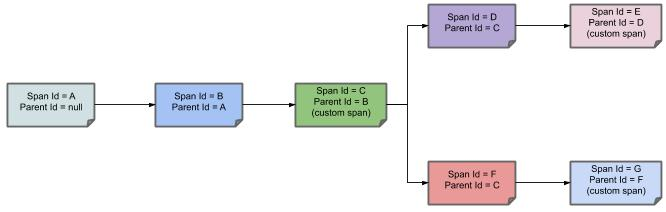

---

Micrometer Tracing에는 계측<sup>instrumentation</sup> [SPI](https://en.wikipedia.org/wiki/Service_provider_interface)가 들어있는 코어 모듈과, 다양한 트레이서<sup>tracer</sup>에 대한 브릿지들이 포함된 모듈 셋, 전용 span 보고 메커니즘이 포함된 모듈 셋과, 테스트 키트가 들어있다. Micrometer Tracing을 사용하려면 분산 트레이싱<sup>distributed tracing</sup>과 관련된 아래 정의들을 이해하고 있어야 한다:

Micrometer Tracing에서 사용하는 용어들은 [Dapper](https://research.google.com/pubs/pub36356.html)에서 빌려왔다.

**Span**: 작업의 기본 단위를 의미한다. 예를 들어, RPC를 전송하는 것은 하나의 새로운 span으로 볼 수 있으며, 마찬가지로 RPC에 응답을 전송하는 것 또한 하나의 새로운 span이다. span은 다른 데이터들도 가지고 있는데, 단순한 설명부터, 시간별 이벤트, 키-값 애노테이션(tag), 해당 span을 발생시킨 span의 ID, 프로세스 ID(보통은 IP 주소) 등이 있다.

span은 시작하고 중단할 수 있으며, span은 시간별 정보를 지속적으로 추적한다. span을 하나 생성했다면, 이후 어느 시점에는 반드시 종료해줘야 한다.

**Trace**: 트리와 유사한 구조를 이루고 있는 일련의 span들. 예를 들어, 분산형 빅데이터 저장소를 운영하고 있다면, PUT 요청에 의해 트레이스가 하나 만들어질 수 있다.

**Annotation/Event**: 어떠한 시간에 어떠한 이벤트가 있었음을 기록하는 데 사용한다.

**Tracer**: span의 수명 주기를 다루는 라이브러리. reporter / exporter를 통해 span을 생성, 시작, 중지하고, 외부 시스템으로 보고할 수 있다.

**Tracing context**: 분산 환경에서 애플리케이션을 추적하려면, 트레이싱 컨텍스트(trace 식별자, span 식별자 등)를 프로세스(ex. 스레드로)와 네트워크를 통해 전파<sup>propagation</sup>해야 한다.

**Log correlation**: 트레이싱 컨텍스트에 담겨있는 정보(trace 식별자나 span 식별자)를 애플리케이션 로그에 함께 남길 수 있다. 그러면 모든 로그를 단일 스토리지로 수집해서, 트레이스 ID를 통해 연관 로그들을 그룹으로 묶을 수 있다. 이렇게 하면 하나의 비지니스 작업(trace)과 관련해서, 전체 서비스에서 남긴 모든 로그를 발생한 순서대로 조회할 수 있다.

**Latency analysis tools**: 외부로 전송<sup>export</sup>한 span을 수집하고, 전체 트레이스<sup>trace</sup> 정보를 시각화하는 도구. 이런 도구의 도움을 받으면 지연 시간을 쉽게 분석할 수 있다.

다음 이미지는 시스템 상에서 **Span**과 **Trace**가 어떻게 구성되어 있는지를 보여준다.


메모지(각진 네모 모양)는 각 색깔별로 하나의 span을 나타낸다 (**A**부터 **G**까지 총 7가지 span이 있다). 다음 메모를 한 번 살펴보자:

```
Trace Id = X
Span Id = D
Client Sent
Copied!
```

이 메모는 현재 span의 **Trace Id**는 **X**로, **Span Id**는 **D**로 설정되어 있음을 의미한다. 동시에 RPC 관점에서는 `Client Sent` 이벤트가 발생했음을 의미한다.

다른 노트들도 살펴보자:

```
Trace Id = X
Span Id = A
(no custom span)

Trace Id = X
Span Id = C
(custom span)
Copied!
```

여기에는 두 가지 선택이 있는데, 만들어뒀던 span을 계속해서 사용하거나 (`no custom span`이라고 적어둔 예시), 수동으로 하위<sup>child</sup> span을 만들 수 있다 (`custom span`이라고 적어둔 예시).

다음 이미지는 span의 부모-자식 관계를 보여주고 있다:

{: .center-image }