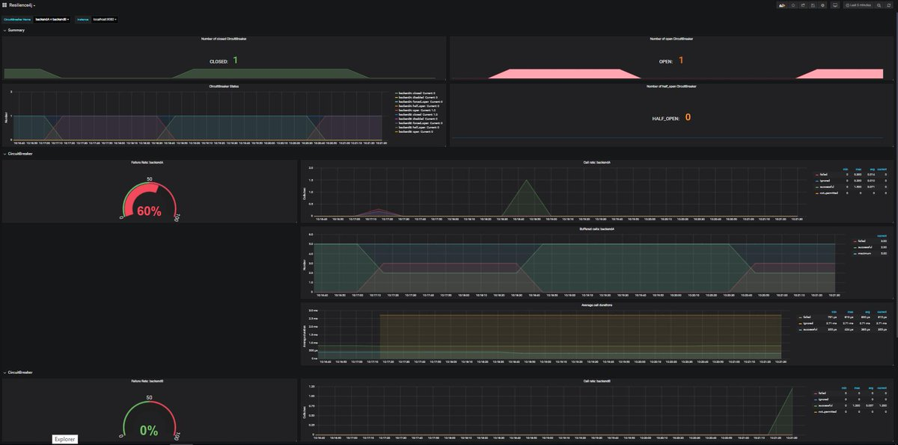
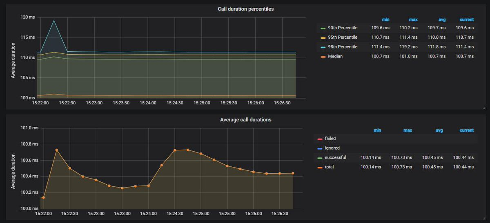
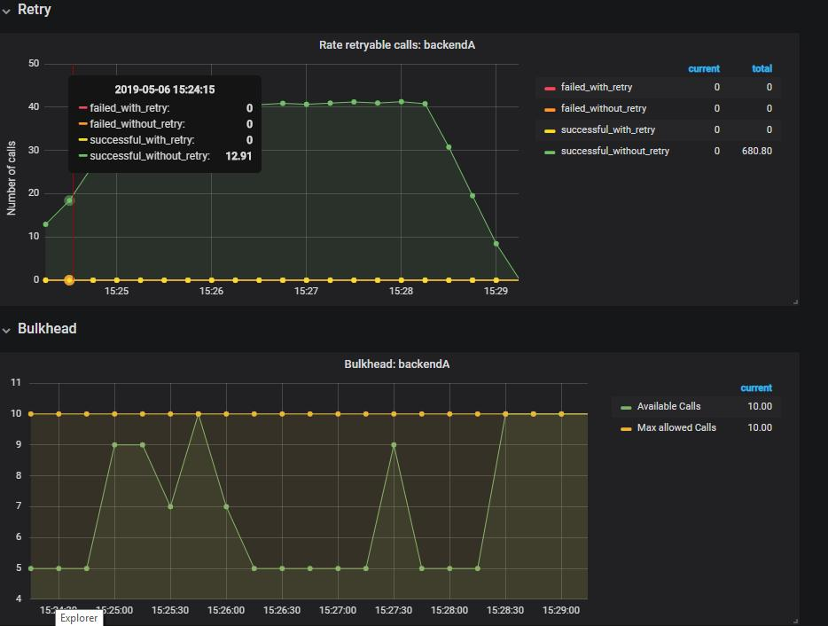

### 목차

- [CircuitBreaker Dashboard](#circuitbreaker-dashboard)
- [Call duration percentiles](#call-duration-percentiles)
- [Retry Dashboard](#retry-dashboard)

---

Resilience4j는 그라파나로 바로 임포트해서 활용할 수 있는 [그라파나 대시보드](https://github.com/resilience4j/resilience4j/blob/master/grafana_dashboard.json)를 제공한다.

---

## CircuitBreaker Dashboard

---

## Call duration percentiles

---

## Retry Dashboard

