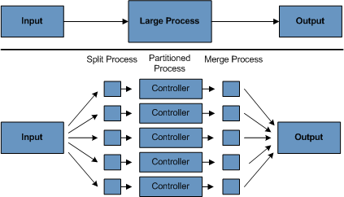

### 목차

- [1.1 Background](#11-background)
- [1.2. Usage Scenarios](#12-usage-scenarios)
- [1.3. Spring Batch Architecture](#13-spring-batch-architecture)
- [1.4. General Batch Piplelines and Guidlines](#14-general-batch-piplelines-and-guidlines)
- [1.5. Batch Processing Strategies](#15-batch-processing-strategies)

---

엔터프라이즈 도메인 어플리케이션에선 비지니스 운영에 필수적인 작업을 종종 벌크 프로세싱으로 개발한다.
예를 들어,

- 다량의 정보를 사용자 인터랙션 없이 자동으로, 효율적으로 처리하는 복잡한 프로세싱. 주로 시간 기반 이벤트(월말 정산 처리, 통지 등)
- 매우 큰 데이터 셋을 반복적, 주기적으로 처리하는 어플리케이션(보험 혜택을 정하거나 보험료를 조정하는 일) 
- 내/외부 시스템에서 받은 데이터를 통합하는 일. 보통 포맷팅, 유효성 검사, 트랜젹션 처리가 필요하다. 이미 많은 기업에서 배치 처리로 매일 수십억 건의 트랜잭션을 처리하고 있다.

스프링 배치는 포괄적인 경량 배치 프레임워크로, 엔터프라이즈 시스템 운영에 일상적으로 꼭 필요한 견고한 배치 어플리케이션 개발을 위해 설계되었다. 
스프링 배치는 사람들이 기대하는 Spring Framework의 특성(생산성, POJO 기반 접근, 사용 편의성)을 기반으로 만들어져, 
개발자가 다루기 편하며 필요하다면 고급 기술 또한 쉽게 활용할 수 있다. 
스프링 배치는 스케줄링 프레임워크가 아니다. 
상업용이나 오픈 소스로 공개된 엔터프라이즈 수준 스케줄러는 여러 가지가 있다 (Quartz, Tivoli, Control-M 등). 
스프링 배치는 스케줄러를 대체하는 개념이 아니라, 스케줄러와 함께 동작하도록 설계되었다.

스프링 배치는 로깅/추적, 트랜잭션 관리, job 프로세싱 통계, job 재시작, 스킵, 리소스 관리 같은 
대용량 데이터 처리에 필수적인 기능을 재사용할 수 있는 형태로 제공한다. 
다른 고급 기술도 제공하는데, 최적화나 파티셔닝 같은 기법을 사용하면 
극단적으로 큰 데이터 처리나 고성능 배치도 쉽게 구현할 수 있다. 
스프링 배치는 단순한 유스케이스(데이터베이스로 파일을 읽거나 저장 프로시저(stored procedure)를 실행하는 일)와 
복잡한 대용량 처리(데이터베이스 간 대용량 데이터를 이동시키고 변형하는 일 등)를 모두 지원한다.
프레임워크를 활용하면 배치 작업을 손쉽게 확장할 수 있으므로 많은 양의 데이터도 처리할 수 있다. 

---

## 1.1. Background

엔터프라이즈 IT 환경에서 이전부터 배치 처리를 사용해 왔는데도,
오픈 소스 프로젝트와 관련 커뮤니티에선 웹 기반 프레임워크와 마이크로 서비스 아키텍처에 관심을 쏟는 반면
자바 기반 배치 처리에서 요구되는 재사용 가능한 아키텍처 프레임워크에는 관심이 부족했다.
재사용 가능한 배치 아키텍처는 표준이 없어서 일회성으로 사내 솔루션을 개발하는 경우가 많았다.

이를 바꿔보고자 SpringSource(현재는 Pivotal)와 Accenture가 뭉쳤다.
Accenture의 hands-on industry와 배치 아키텍처를 구현하면서 쌓은 기술적인 경험, 그리고 
SpringSource의 깊이 있는 기술적 기반과
스프링의 입증된 프로그래밍 모델이 모여 자연스럽고 강력한 파트너십을 만들어냈고,
엔터프라이즈 자바와의 격차를 메우는 것을 목표로 하는, 시장 상황에 맞는 고품질 소프트웨어를 만들었다.
두 회사 모두 스프링 기반 배치 아키텍처 솔루션으로 유사한 이슈를 해결하고 있는 여러 클라이언트와 함께 했다.
이를 통해 유용한 세부 구현과 현실의 제약조건을 제공할 수 있었고,
이 솔루션으로 클라이언트가 실제로 겪는 문제를 해결할 수 있었다.

Accenture는 이전에 소유했던 배치 처리 아키텍처 프레임워크를 Spring Batch 프로젝트에 기증하면서
프로젝트를 지원하고 개선시킬 수 있는 커미터 리소스도 함께 넘겼다.
Accenture가 기증한 프로젝트는 지난 몇 세대의 플랫폼(COBOL/Mainframe, C++/Unix, 지금은 Java/anywhere)으로 
배치 아키텍처를 만들며 쌓은 수십 년 간의 경험을 바탕으로 만들어졌다.

Accenture와 SpringSource는 엔터프라이즈 수준의 배치 어플리케이션에 지속적으로 활용할 수 있는
소프트웨어 처리 방법, 프레임워크, 툴 표준화를 공동 목표로 삼았다.
엔터프라이즈 IT 환경에 신뢰할 수 있는 표준 솔루션을 제공하고자 하는 회사, 정부 기관은 
Spring Batch가 도움이 될 것이다.

---

## 1.2. Usage Scenarios

전형적인 배치 프로그램은 보통:

- 데이터베이스, 파일, 큐에서 다량의 데이터 조회한다.
- 특정 방법으로 데이터를 가공한다.
- 데이터를 수정된 양식으로 다시 저장한다.

스프링 배치는 유사한 트랜잭션을 하나로 묶어 처리해줌으로써 (특히 사용자 인터랙션 없는 오프라인 환경)
이런 반복적인 작업을 자동화한다.
IT 프로젝트라면 대부분 배치 처리를 사용하는데,
스프링 배치는 강력한 엔터프라이즈 스케일 솔루션을 제공하는 유일한 오픈 소스 프레임워크다.

비지니스 시나리오(Business Scenarios)

- 배치 프로세스를 주기적으로 커밋
- 동시 다발적인 배치 처리: job을 병렬 처리
- 단계적인 엔터프라이즈 메세지 중심 처리
- 다량의 병렬 배치 처리
- 실패 후 수동 또는 스케줄링에 의한 재시작
- 의존관계가 있는 step 여러 개를 순차적으로 처리 (워크플로우 중심 배치로 확장)
- 부분 처리 : 레코드 스킵 (e.g. 롤백 시)
- 배치 규모가 작거나, 저장 프로시저(stored procedure)나 스크립트가 이미 있는 경우 배치 전체에 걸친 트랜잭션

기술 목표(Technical Objectives)

- 배치 개발자는 스프링 프로그래밍 모델을 사용한다: 비지니스 로직에 집중하고 기반 구조는 프레임워크가 관리한다.
- 기반 구조, 배치 실행 환경, 배치 어플리케션의 관심사는 명확하게 분리한다.
- 공통 핵심 서비스는 모든 프로젝트에서 구현할 수 있게 인터페이스로 제공한다.
- 핵심 인터페이스는 '바로 사용할 수 있는' 간단한 디폴트 구현체를 제공한다.
- 모든 계층의 스프링 프레임워크를 활용해 서비스를 쉽게 설정하고 커스터마이징, 확장할 수 있다.
- 제공하는 모든 핵심 서비스는 변경, 확장이 쉽고 인프라 레벨에 영향을 주지 않아야 한다.
- 메이븐으로 빌드된 아키텍처 jar로 어플리케이션과는 완전히 분리된 간단한 배포 모델을 제공한다. 

---

## 1.3. Spring Batch Architecture

스프링 배치는 확장성과 다양한 사용자 유형을 고려해 설계했다.
아래 그림은 확장성과 편의성을 지원하기 위한 계층 구조를 보여준다.

이 계층 구조는 세 주요 컴포넌트가 있다: Application, Core, Infrastructure.
Application은 스프링 배치를 사용하는 개발자가 만드는 모든 배치 job과 커스텀 코드를 포함한다.
Batch Core는 job을 실행하고 제어하는 데 필요한 핵심 런타임 클래스를 포함한다.
여기엔 `JobLauncher`, `Job`,`Step` 구현체도 포함된다.
Application, Core 모두 공통 Infrastructure 위에서 빌드한다.
이 Infrastructure는 공통 reader와 writer, 서비스(`RetryTemplate` 같은)를 포함하는데,
어플리케이션 개발자도 사용하고(`ItemReader`, `ItemWriter` 등의 reader와 writer), 
코어 프레임워크 자체에서 활용하기도 한다(자체 라이브러리인 retry).

---

## 1.4. General Batch Piplelines and Guidlines

배치 솔루션은 아래 있는 핵심 원칙, 가이드라인, 그 외 일반적인 것들을 함께 고려해 개발해야 한다.

- 배치 아키텍처는 보통 온라인 아키텍처에 영향을 주고, 반대도 마찬가지임을 기억하라.
가능하면 공통 구성 요소를 활용하고 아키텍처와 환경을 모두 고려해 설계해라.
- 단일 배치 어플리케이션은 가능한 단순화하고 복잡한 로직은 피하라.
- 데이터 처리와 저장은 물리적으로 가까운 곳에서 수행해라 (다시 말해 데이터가 처리되는 곳에 데이터를 저장해라).
- 시스템 리소스 사용, 특히 I/O를 최소화해라. 내부 메모리에서 가능한 많은 연산을 실행해라.
- 어플리케이션 I/O를 점검해서 불필요한 물리적 I/O를 줄여라 (SQL 구문을 분석하라).
특히 아래 네 가지 결함에 주의해라:
  + 한 번 읽고 나서 캐시하거나 작업 스토리지에 저장해도 되는 데이터를 매 트랜잭션마다 읽는 경우.
  + 같은 트랜잭션 내에서 이미 읽은 데이터를 다시 읽는 경우. 
  + 불필요한 테이블 스캔이나 인덱스 스캔을 유발하는 경우.
  + SQL 구문에서 WHERE 절에 키를 지정하지 않는 경우.
- 배치 실행에서 같은 작업을 두 번 하지 마라. 
예를 들어 리포팅 목적으로 데이터를 요약하는 어플리케이션이라면
데이터를 처음 처리할 때 저장돼 있는 토탈값을 증가시켜서(가능하다면)
같은 데이터를 다시 처리하지 않게 해라.
- 실행 중에 재할당에 시간을 쏟지 않게 배치 어플리케이션 시작 시 충분한 메모리를 할당해라.
- 데이터 무결성은 최악의 상황도 고려해라.
데이터 무결성을 유지하고 싶으면 적절한 유효성 검증 로직을 추가해라.
- 가능한 곳에 내부 검증을 위한 체크섬을 구현해라.
예를 들어 플랫(flat) 파일은 파일의 총 레코드 수와 
주요 필드의 집계 결과를 알 수 있는 트레일러 레코드가 필요하다.
- 실제 프로덕션 환경과 그에 맞는 데이터 볼륨을 가지고 가능한 빨리 부하 테스트를 계획하고 실행해라.
- 배치 규모가 크면, 특히 그 시스템이 온라인과 동시에 무중단으로 실행된다면
백업이 매우 어려울 수도 있다. 하지만 온라인 설계에서 진행하는 데이터베이스 백업만큼 파일 백업도 중요하다.
시스템이 플랫(flat) 파일을 사용한다면 파일 백업 절차를 수립하고 문서화하고 정기적으로 테스트해야 한다. 

---

## 1.5. Batch Processing Strategies

설계자의 배치 시스템 설계, 프로그래머의 구현을 돕기 위해
기본적인 배치 어플리케이션 구성 요소와 패턴 샘플을 구조 차트와 코드 쉘로 제공한다.
배치 job 설계를 시작하려면
비즈니스 로직을 다음과 같은 표준 구성 요소를 사용하는 일련의 step으로 나눠야 한다:

- *Conversion Applications*: 
외부 시스템에서 제공하는 여러 유형의 파일을
트랜잭션 레코드를 처리할 때 필요한 표준 포맷으로 변환하려면 *conversion application*이 필요하다.
이런 유형의 배치 어플리케이션은 translation 유틸리티 모듈을 부분적으로 혹은 전체를 포함한다
 (Basic Batch Service를 보라).
- *Validation Applications*: 
입출력 레코드가 정확하고 일관성 있는지 검사한다.
일반적으로 파일 헤더와 트레일러, 체크섬, 검증 알고리즘, 레코드 레벨 교차 점검을 기반으로 만든다.
- *Extract Applications*: 
이 어플리케이션은 데이터베이스나 입력 파일로부터 미리 정의된 규칙대로 데이터를 읽어
결과 파일에 저장한다.
- *Extract/Update Applications*:
데이터베이스나 입력 파일로부터 레코드셋을 읽고 각 데이터 유형에 따라 변경사항을 적용하고 저장하는 어플리케이션이다.
- *Processing and Updating Applications*: 
*extract application*이나 *validation application*에서 받은
입력 트랜잭션에 대한 처리를 수행하는 어플리케이션이다.
보통 데이터베이스를 읽어 처리에 필요한 데이터를 얻고, 
필요하면 데이터베이스를 수정하고, 출력 처리를 위한 레코드를 만드는 일을 포함한다.
- *Output/Format Applications*:
입력 파일을 읽어서 표준 포맷으로 재구성하고, 다른 프로그램이나 시스템에 출력하거나 전송하는 어플리케이션이다. 

또한 앞에서 언급한 구성 요소로는 만들 수 없는 비즈니스 로직을 위한 기본 어플리케이션 쉘을 제공한다.

어플리케이션은 메인 구성 요소 외에도, 아래 같은 표준 유틸리티 step을 하나 이상 사용할 수 있다:

- Sort: 입력 파일을 읽고 지정한 필드로 재정렬한 결과 파일을 제공하는 프로그램.
Sort는 보통 표준 시스템 유틸리티로 구현한다.
- Split: 입력 파일을 하나 읽어서 각 레코드를 필드 값에 따라 여러 파일로 나눠서 저장하는 프로그램.
Split은 매개변수 기반 표준 시스템 유틸리티에 의해 조정되거나 수행될 수 있다.
- Merge: 여러 입력 파일을 읽어서 데이터를 결합해 하나의 결과 파일을 제공하는 프로그램.
Merge는 매개변수 기반 표준 시스템 유틸리티에 의해 조정되거나 수행될 수 있다.

배치 어플리케이션을 입력 소스별로 분류할 수도 있다:

- 데이터베이스 지향(database-driven) 어플리케이션은 데이터베이스로부터 읽어온 로(row)나 값에 의해 구동된다.
- 파일 지향(file-driven) 어플리케이션은 파일로부터 읽어온 레코드나 값에 의해 구동된다.
- 메세지 지향(message-driven) 어플리케이션은 메세지 큐로부터 읽어온 메세지에 의해 구동된다.

모든 배치 시스템은 프로세싱 전략이 토대가 된다.
사용할 전략은
예상 배치 시스템 볼륨, 온라인 시스템 또는 다른 배치 시스템과의 동시성, 사용 가능한 배치 윈도우
같은 요소를 고려해 선택한다.
(무중단으로 가동하려는 기업이 많을수록 배치 윈도우를 확보하기 힘들어진다는 점에 주의해라).

배치를 위한 일반적인 처리 옵션은 다음과 같다 (구현 복잡도가 낮은 순) :

- 오프라인 모드로 하나의 배치 윈도우에서 실행되는 일반적인 처리.
- 동시에 실행되는 배치나 온라인 처리.
- 여러 배치나 job을 동시에 병렬 처리.
- 파티셔닝 (동시에 같은 job을 여러 인스턴스로 처리).
- 위 옵션의 조합.

상업용 스케줄러는 이 옵션 중 일부 혹은 전체를 지원한다.

밑에서는 위 옵션을 좀 더 자세히 다룬다.
경험상으로는, 배치 처리 유형마다 채택해야 할 커밋과 잠금(locking) 전략이 다르며 
온라인 잠금 전략도 같은 원칙을 사용해야 한다.
따라서 전반적인 배치 아키텍처를 설계하는 것은 간단하지만은 않다.

잠금 전략은, 일반적인 데이터베이스 lock만을 사용하거나 
아키텍처에서 추가로 커스텀 잠금 서비스를 구현하는 전략이 있다.
잠금 서비스는 데이터베이스 lock을 추적하고 (예를 들어 전용 db 테이블에 필요한 정보를 저장함으로써),
db 작업을 요청하는 어플리케이션에 권한을 부여하거나 거부하는 서비스다.
잠금 상태에서 배치 job이 중단되는 걸 막기 위해 아키텍처가 재시도 로직을 구현할 수도 있다. 

**1. Normal processing in a batch window**
온라인 사용자나 다른 배치 프로세스에서 데이터를 수정하지 않는, 즉 분리된 배치 윈도우 환경의
간단한 배치 프로세스라면 동시성 문제는 발생하지 않으며, 배치 실행이 끝나면 단일 커밋을 수행하면 된다.

하지만 대부분 이보다는 더 견고한 방법을 써야 한다.
배치 시스템은 시간이 흐르면 복잡도와 처리해야 할 데이터 볼륨이 커지는 경향이 있다는 걸 기억해둬라.
잠금 전략이 없이 시스템이 단일 커밋에만 의존하고 있다면 나중에 수정하기가 매우 어렵다.
따라서 가장 간단한 배치 시스템이라고 해도 아래에 설명한 복잡한 케이스와 재시작, 복구와 관련한
커밋 로직을 고려하는 게 좋다.

**2. Concurrent batch or on-line processing**
온라인 사용자가 동시에 수정할 수 있는 데이터를 처리하는 배치 어플리케이션이라면
사용자가 수 초 이상 필요할 수도 있는 데이터를 잠가서는 안 된다 (데이터베이스나 파일 모두 마찬가지).
또한 트랜잭션이 몇 번(few) 끝나면 나면 수정 내역을 데이터베이스에 커밋해야 한다.
이렇게 하면 다른 프로세스에서 사용할 수 없는 데이터 양도 최소화하고,
데이터를 사용하지 못하는 시간도 최소화할 수 있다.

물리적 잠금을 최소화하는 또 다른 방법은
논리적인 로(row) 레벨 잠금을 구현하는 것으로, 낙관적 잠금 패턴(Optimistic Locking Pattern)과
비관적 잠금 패턴(Pessimistic Locking Pattern)이 있다.

- 낙관적 잠금은 레코드 경합 가능성이 작다고 가정한다.
일반적으로 배치나 온라인 처리에서 동시에 사용하는 각 데이터베이스 테이블에 
timestamp 컬럼을 추가해서 구현한다.
어플리케이션이 처리를 위해 로(row)를 읽어오면 timestamp도 함께 따라온다.
어플리케이션이 처리를 마친 로(row)를 업데이트하려고 하면 WHERE 구문에 기존 timestamp를 사용한다.
timestamp가 일치하면 해당 데이터와 그 timestamp는 함께 수정된다.
timestamp가 일치하지 않으면 데이터를 읽어와서 수정하려는 사이 다른 어플리케이션에서 같은 로(row)를
수정했다는 걸 뜻한다.
따라서 이 경우에는 update를 수행하지 않는다. 

- 비관적 잠금은 레코드 경합이 발생할 가능성이 농후해서,
데이터에 접근하는 동안 물리적 잠금이나 논리적인 잠금이 필요하다고 여기는 모든 잠금 전략을 뜻한다.
데이터베이스 테이블에 lock 컬럼을 지정해 쓰는 유형도 있다.
어플리케이션이 수정을 위해 로(row)를 요청하면 lock 컬럼에 플래그를 설정한다.
이 플래그 덕분에 같은 로(row)를 요청하는 다른 모든 어플리케이션은 실패한다.
플래그를 설정한 어플리케이션이 로(row)를 수정할 때는 그 플래그를 없애서
다른 어플리케이션이 해당 로(row)를 다시 조회할 수 있게 해준다.
처음 데이터를 읽고 플래그를 설정하는 동안에도 데이터 무결성을 유지해야 한다는 점에 주의해라
(e.g. `SELECT FOR UPDATE` 같은 db lock 사용).
또한 이 방법은 레코드가 잠긴 상태로 사용자가 점심 식사를 하러 가면
잠금을 해제해 버리는 타임아웃 메커니즘을 만들기가 쉽다는 점만 빼면 물리적 잠금과 동일한 단점이 있다.

두 패턴은 배치 처리에 완전히 적합하진 않지만
동시에 실행되는 배치나 온라인 처리에 응용할 수 있다
(데이터베이스가 로(row) 레벨 잠금을 지원하지 않는 경우).
일반적으로는 낙관적 잠금이 온라인 어플리케이션에 더 잘 맞고 비관적 잠금은 배치 처리에 더 적합하다.
논리적 잠금을 사용한다면
논리적 잠금으로 보호되는 데이터 엔티티에 접근하는 모든 어플리케이션에 동일한 스키마를 적용해야 한다.

두 솔루션 모두 단일 레코드 단위 잠금만 지원한다는 점에 주의해라.
때로는 논리적으로 관련된 레코드 그룹을 잠가야 할 때도 있다.
물리적 잠금을 사용한다면 잠재적인 교착상태에 빠지지 않게 매우 조심해야 한다. 
논리적 잠금을 사용한다면 보호하고 싶은 논리적인 레코드 그룹을 잘 이해하는 
논리적 잠금 매니저를 사용해 일관성을 유지하고 교착상태를 방지하는 게 가장 좋다.
이 논리적인 잠금 매니저는 일반적으로 잠금 관리, 경합 리포팅, 타임아웃 매키너즘 등을 위해 자체 테이블을 사용한다.

**3. Parallel Processing** 
여러 배치을 실행하거나 job을 병렬로 실행하면 총 배치 소요 시간을 줄일 수 있다.
여러 job이 같은 파일, db 테이블, 인덱스 공간을 공유하지만 않는다면 문제 될 건 없다.
이런 경우는 파티션된 데이터를 이용해 구현한다.
다른 방법은 컨트롤 테이블을 사용해 상호 의존성을 관리하는 아키텍처 모델을 구축하는 것이다.
컨트롤 테이블은 각 공유 자원으로 쓰일 로(row) 정보와 어플리케이션에서 사용 중인지 여부를 저장해야 한다.
병렬 job을 사용하는 배치 아키텍처나 어플리케이션은 이 테이블로부터 정보를 읽어와
필요한 리소스에 접근할 수 있는지 판단한다.

데이터 접근에 문제가 없다면 여러 쓰레드를 사용해 병렬로 처리하면 된다.
중앙 컴퓨터(mainframe) 환경이라면, 모든 프로세스에 CPU 타임을 적절히 분배하기 위해
보통 병렬 job 클래스를 많이 사용한다.
그럼에도 이 솔루션은 실행 중인 모든 프로세스에 시간 분할을 보장 할 수 있을 만큼 견고해야 한다.

병렬 처리에서 발생할 수 있는 또 다른 주요 이슈는 로드 밸런싱과
파일, 데이터베이스 버퍼 풀 등의 공통 시스템 자원 가용성이다.
또한 컨트롤 테이블 자체가 문제가 되는 경우도 많다.

**4. Partitioning** 
파티셔닝을 이용하면 각기 다른 큰 규모의 배치 어플리케이션을 동시에 실행할 수 있다.
이는 긴 배치 job을 실행하는 데 필요한 시간을 줄이는 것을 목표로 한다.
입력 파일이나 메인 데이터베이스 테이블을 분할하여 각 어플리케이션을 
각기 다른 데이터 셋과 함께 실행할 수만 있다면 파티셔닝을 이용할 수 있다.

파티션된 작업은 지정된 데이터 셋만 처리하도록 설계해야 한다.
파티셔닝 아키텍처는 데이터베이스 설계와 데이터베이스 파티셔닝 전략과 연관이 깊다.
데이터베이스 파티셔닝이 반드시 데이터베이스의 물리적인 분할을 의미하지는 않지만 대부분은 이것을 권장한다.

아래 그림은 분할 방식을 도식화했다:

아키텍처는 파티션 수를 동적으로 설정할 수 있어야 하며
자동 설정, 수동 설정 모두 고려해야 한다.
자동 설정은 입력 파일 크기나 입력 레코드 수 같은 파라미터 기반으로 이루어진다. 

4.1 **Partitioning Approaches** 
어떤 분할 방식을 사용할지는 케이스마다 다르다.
아래 리스트는 가능한 분할 방식 몇 가지를 보여준다:

*1. Fixed and Even Break-Up of Record Set*

입력 레코드 셋을 균등하게 나눈다 (예를 들어 10은 정확하게 1/10씩 나눈다). 
그다음 *batch/extract application*의 각 인스턴스가 나눠진 각 레코드 셋을 처리한다.

이 방법을 사용하려면 데이터 셋을 나누기 위한 사전 처리가 필요하다.
분할 결과는 하한/상한값인데, 이는 *batch/extract application*이
할당된 부분만 처리하도록 제한하기 위한 입력값으로 사용된다. 

이 전처리 작업은 나눠진 레코드 셋의 경계를 계산하기 때문에 오버헤드가 커질 수도 있다.

*2. Break up by a Key Column*

location code 같은 키 컬럼으로 레코드 셋을 나눠서
데이터를 각 값에 따라 배치 인스턴스에 할당하는 방법도 있다.
컬럼 값을 할당할 때는 아래 두 가지 방법 모두 가능하다:

- 파티셔닝 테이블로 배치 인스턴스 할당 (뒷부분에 설명).
- 값을 나눠서 배치 인스턴스 할당 (0000-0999, 1000 - 1999 같이)

1번 방법에서는 새 값이 추가되면 *batch/extract application*에 수동으로 설정해줘야
추가된 값도 특정 인스턴스에 할당된다.

2번 방법은 모든 값이 배치 job 인스턴스에 반영됨을 보장한다.
하지만 하나의 인스턴스에서 처리되는 값의 갯수는 해당 값들의 분포에 따라 다르다
(0000-0999 범위에 값이 많이 몰려있고 1000-1999 범위에는 값이 적을 수도 있다).
이 방법을 사용하려면 데이터 범위는 파티셔닝을 고려해 설계해야 한다.

두 방법 모두 레코드를 각 배치 인스턴스에 완전히 동일하게 분배할 수는 없다.
배치 인스턴스가 사용할 레코드 수를 변경해주는 동적인 설정은 없다.

*3. Breakup by Views*

기본적으로 키 컬럼으로 분할한다는 점은 같지만 이번에는 데이터베이스 레벨에서 분할한다.
레코드 셋을 뷰로 쪼개고, 각 배치 어플리케이션 인스턴스는 이 뷰를 조회한다.
여기선 데이터를 그룹화해서 분할한다.

이 방법을 사용한다면 각 배치 어플리케이션 인스턴스가 특정 뷰를 참조하도록(마스터 테이블이 아닌) 설정해줘야 한다.
또한 새 데이터가 추가되면 이 새 그룹을 뷰에 추가해야 한다.
인스턴스 수를 변경하면 뷰도 바뀌기 때문에 동적인 설정은 불가능하다.

*4. Addition of a Processing Indicator*

이번에는 식별자 역할을 하는 새 컬럼을 입력 테이블에 추가하는 방법이다.
전 처리 단계에서 모든 식별자는 처리되지 않음으로 마킹된다.
배치 어플리케이션에서 처리되지 않음으로 마킹된 레코드만 읽으며,
한번 읽으면 (잠금과 함께), 처리 중으로 다시 마킹한다.
처리가 완료된 레코드는 식별자를 완료나 에러로 업데이트한다.
별도 컬럼만으로 레코드가 한 번만 처리된다는 걸 보장할 수 있으므로
아무 변경 없이 여러 배치 어플리케이션 인스턴스를 시작할 수 있다.

이 방법을 쓰면 테이블의 I/O가 증가하는데, 
업데이트를 수행하는 배치 어플리케이션이라면 어차피 write가 항상 있으므로 이 단점을 피해갈 수 있다.

*5. Extract Table to a Flat File*

테이블을 추출해서 파일로 만드는 방법이다.
그다음 파일을 여러 조각(segment)으로 분할해서 배치 인스턴스의 입력으로 사용한다.

이 방법을 사용하면 테이블을 파일로 추출하고 분할하는 추가적인 오버헤드가 발생해 
멀티 파티셔닝의 이점을 상쇄시켜버릴 수도 있다.
파일을 나누는 스크립트를 수정하는 방식을 활용하면 동적인 설정도 가능하다. 

*6. Use of a Hashing Column*

드라이버 레코드를 검색할 때 쓰는 데이터베이스 테이블에 해시 컬럼(key/index)을 추가한다.
이 컬럼은 특정 로(row)를 어떤 배치 어플리케이션 인스턴스가 처리하는지를 결정하는 식별자를 가진다.
예를 들어 배치 인스턴스 세 개를 실행한다면
식별자 값이 'A'면 인스턴스 1에서, 'B'면 인스턴스 2에서, 'C'면 인스턴스 3에서 실행한다.

따라서 레코드를 조회할 때 사용하는 프로시저는 특정 식별자로 마킹된 모든 로(row)를 조회하기 위한
WHERE 절을 따로 추가한다. 
이 테이블에 추가되는 데이터는 마커로 사용할 필드와 함께 저장되는데,
각 인스턴스 중 하나를 디폴트로 사용할 수도 있다 ('A' 같은).

인스턴스 부하를 재분배하고 싶으면 간단한 배치 어플리케이션을 활용해 식별자를 수정하면 된다.
새로 추가된 로(row)가 충분히 많다면 새 데이터를 다른 인스턴스에 재분배하기 위해
이 배치를 실행한다 (배치 윈도우 밖에서라면 언제든지).

배치 어플리케이션에 인스턴스를 추가하고 싶은 경우,
앞에서 설명한 이 배치 어플리케이션을 실행하기만 하면 추가된 인스턴스까지 고려해 식별자를 재분배한다.

**4.2 Database and Application Design Principles**

멀티 파티셔닝 어플리케이션에서 키 컬럼 접근법으로 분할된 데이터베이스를 사용하려면
파티션 파라미터를 저장하기 위한 중앙 파티션 레포지토리가 필요하다.
이를 통해 유연성을 제공할 수 있으며 유지보수 또한 보장된다.
이 레포지토리는 일반적으로 파티션 테이블로 알려진 테이블 한 개를 저장한다.

파티션 테이블에 저장된 정보는 정적이며, 보통 DBA가 관리한다.
이 테이블에 있는 로(row) 하나는 하나의 파티션 정보를 담고 있다.
또한 이 테이블은 프로그램 ID Code, 파티션 넘버 (파티션의 논리 ID), 
파티션을 위한 db key 컬럼의 하한값, 상한값을 저장할 컬럼이 필요하다.

프로그램을 시작하려면 이 아키텍처에 있는(특히, 중앙 처리 Tasklet)
프로그램 id와 파티션 넘버를 어플리케이션에 넘겨줘야 한다.
키 컬럼 접근법을 사용한다면, 어플리케이션이 처리할 데이터 범위를 결정하기 위해
이 변수들로 파티션 테이블을 조회한다.
추가로 다음 작업을 수행할 때도 파티션 넘버를 사용해야 한다:

- 병합(merge) 프로세스를 위한 출력 파일/데이터베이스 수정
- 정상적으로 처리된 결과는 배치 로그에 저장하고, 아키텍처 에러 핸들러에 에러를 넘기는 리포팅

**4.3 Minimizing Deadlocks**

어플리케이션을 병렬로 실행하거나 파티셔닝을 사용한다면
데이터베이스 자원에 대한 경합이 생기고 교착상태에 빠질 수도 있다.
데이터베이스 설계 팀에게는 경합이 발생할 수 있는 상황을 가능한 줄이는 것도 데이터베이스 설계만큼 중요한 일이다.

또한 개발자는 데이터베이스의 인덱스 테이블이 교착상태와 성능을 모두 고려해 설계됐는지 확인해야 한다.

교착상태는 로그 테이블이나 관리 테이블, 잠금 테이블 등의 
어드민성 테이블나 아키텍처 관련 테이블에서 발생하는 경우가 많다.
어드민이나 아키텍처 테이블의 영향도 고려해야 한다.
아키텍처에서 가능한 병목을 찾으려면 현실이 반영된 부하 테스트는 필수다.

데이터 충돌로 인한 부작용을 최소화하기 위해 아키텍처는 데이터베이스를 연결하거나 교착상태가 발생했을 때
wait-and-retry 간격을 조정하는 등의 서비스를 제공해야 한다.
이는 특정 데이터베이스 리턴 코드에 대응하고 즉시 오류를 발생시키는 대신 
미리 정해진 시간 동안 기다렸다가 데이터베이스 연산을 재시도하는 내장 메커니즘을 뜻한다.

**4.4 Parameter Passing and Validation**

파티션 아키텍처는 어플리케이션 개발자에게 비교적 투명하게 제공돼야 한다.
아키텍처는 파티셔닝 모드에서 실행하는 어플리케이션과 연관있는, 아래 내용을 포함한 모든 작업을 지원해야 한다:

- 어플리케이션 시작 전 파티션 파라미터 검색 
- 어플리케이션 시작 전 파티션 파라미터 검증
- 어플리케이션 시작 시 파라미터 전달

검증은 아래 내용을 포함해야 한다:

- 파티션 수가 전체 데이터를 처리하기에 충분한지.
- 파티션 사이 간극이 없는지.

데이터베이스를 분할한다면
파티션 하나가 데이터베이스의 여러 파티션에 걸쳐있지는 않는지도 별도로 검증해야 한다.

아키텍처는 파티션 통합도 고려해야 한다.
주로 고려해야 할 내용은 다음과 같다:

- 다음 단계로 넘어가기 전에 모든 파티션을 완료해야 하는가?
- 파티션 중 하나가 중단되면 어떻게 처리해야 하는가?
