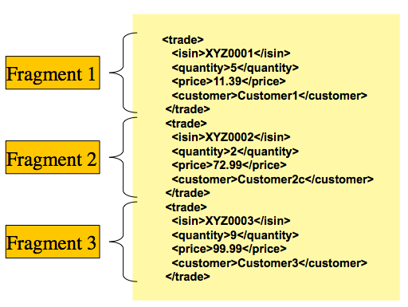
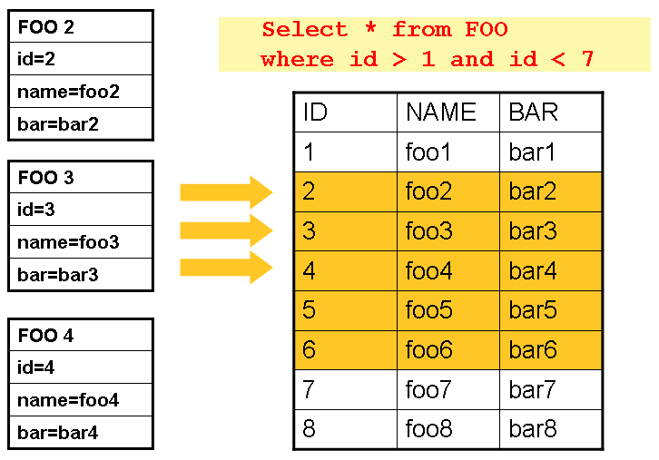
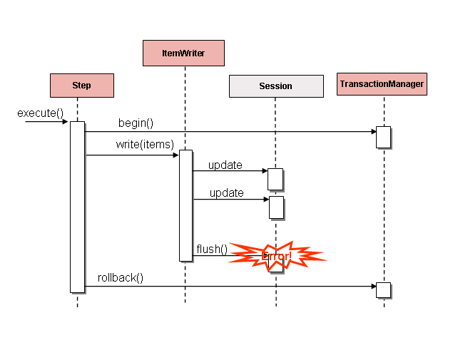
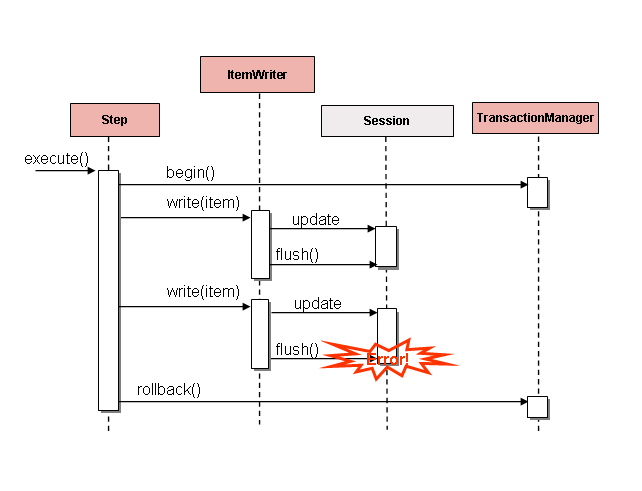

> [스프링 배치 공식 reference](https://docs.spring.io/spring-batch/docs/4.2.x/reference/html/index-single.html#readersAndWriters) 를 한글로 번역한 문서입니다.

### 목차

- [6.1. ItemReader](#61-itemreader)
- [6.2. ItemWriter](#62-itemwriter)
- [6.3. ItemProcessor](#63-itemprocessor)
  + [6.3.1. Chaining ItemProcessors](#631-chaining-itemprocessors)
  + [6.3.2. Filtering Records](#632-filtering-records)
  + [6.3.3. Fault Tolerance](#633-fault-tolerance)
- [6.4. ItemStream](#64-itemstream)
- [6.5. The Delegate Pattern and Registering with the Step](#65-the-delegate-pattern-and-registering-with-the-step)
- [6.6. Flat Files](#66-flat-files)
  + [6.6.1. The FieldSet](#661-the-fieldset)
  + [6.6.2. FlatFileItemReader](#662-flatfileitemreader)
    * [LineMapper](#linemapper)
    * [LineTokenizer](#linetokenizer)
    * [FieldSetMapper](#fieldsetmapper)
    * [DefaultLineMapper](#defaultlinemapper)
    * [Simple Delimited File Reading Example](#simple-delimited-file-reading-example)
    * [Mapping Fields by Name](#mapping-fields-by-name)
    * [Automapping FieldSets to Domain Objects](#automapping-fieldsets-to-domain-objects)
    * [Fixed Length File Formats](#fixed-length-file-formats)
    * [Multiple Record Types within a Single File](#multiple-record-types-within-a-single-file)
    * [Exception Handling in Flat Files](#exception-handling-in-flat-files)
  + [6.6.3. FlatFileItemWriter](#663-flatfileitemwriter)
    * [LineAggregator](#lineaggregator)
    * [Simplified File Writing Example](#simplified-file-writing-example)
    * [FieldExtractor](#fieldextractor)
    * [Delimited File Writing Example](#delimited-file-writing-example)
    * [Fixed Width File Writing Example](#fixed-width-file-writing-example)
    * [Handling File Creation](#handling-file-creation)
- [6.7. XML Item Readers and Writers](#67-xml-item-readers-and-writers)
  + [6.7.1. StaxEventItemReader](#671-staxeventitemreader)
  + [6.7.2. StaxEventItemWriter](#672-staxeventitemwriter)
- [6.8. JSON Item Readers And Writers](#68-json-item-readers-and-writers)
  + [6.8.1. JsonItemReader](#681-jsonitemreader)
  + [6.8.2. JsonFileItemWriter](#682-jsonfileitemwriter)
- [6.9. Multi-File Input](#69-multi-file-input)
- [6.10. Database](#610-database)
  + [6.10.1. Cursor-based ItemReader Implementations](#6101-cursor-based-itemreader-implementations)
    * [JdbcCursorItemReader](#jdbccursoritemreader)
    * [HibernateCursorItemReader](#hibernatecursoritemreader)
    * [StoredProcedureItemReader](#storedprocedureitemreader)
  + [6.10.2. Paging ItemReader Implementations](#6102-paging-itemreader-implementations)
    * [JdbcPagingItemReader](#jdbcpagingitemreader)
    * [JpaPagingItemReader](#jpapagingitemreader)
  + [6.10.3. Database ItemWriters](#6103-database-itemwriters)
- [6.11. Reusing Existing Services](#611-reusing-existing-services)
- [6.12. Validating Input](#612-validating-input)
- [6.13. Preventing State Persistence](#613-preventing-state-persistence)
- [6.14. Creating Custom ItemReaders and ItemWriters](#614-creating-custom-itemreaders-and-itemwriters)
  + [6.14.1. Custom ItemReader Example](#6141-custom-itemreader-example)
    * [Making the ItemReader Restartable](#making-the-itemreader-restartable)
  + [6.14.2. Custom ItemWriter Example](#6142-custom-itemwriter-example)
    * [Making the ItemWriter Restartable](#making-the-itemwriter-restartable)
- [6.15. Item Reader and Writer Implementations](#615-item-reader-and-writer-implementations)
  + [6.15.1. Decorators](#6151-decorators)
    * [SynchronizedItemStreamReader](#synchronizeditemstreamreader)
    * [SingleItemPeekableItemReader](#singleitempeekableitemreader)
    * [MultiResourceItemWriter](#multiresourceitemwriter)
    * [ClassifierCompositeItemWriter](#classifiercompositeitemwriter)
    * [ClassifierCompositeItemProcessor](#classifiercompositeitemprocessor)
  + [6.15.2. Messaging Readers And Writers](#6152-messaging-readers-and-writers)
    * [AmqpItemReader](#amqpitemreader)
    * [AmqpItemWriter](#amqpitemwriter)
    * [JmsItemReader](#jmsitemreader)
    * [JmsItemWriter](#jmsitemwriter)
    * [KafkaItemReader](#kafkaitemreader)
    * [KafkaItemWriter](#kafkaitemwriter)
  + [6.15.3. Database Readers](#6153-database-readers)
    * [Neo4jItemReader](#neo4jitemreader)
    * [MongoItemReader](#neo4jitemwriter)
    * [HibernateCursorItemReader](#hibernatecursoritemreader)
    * [HibernatePagingItemReader](#hibernatepagingitemreader)
    * [RepositoryItemReader](#repositoryitemreader)
  + [6.15.4. Database Writers](#6154-database-writers)
    * [Neo4jItemWriter](#neo4jitemwriter)
    * [MongoItemWriter](#mongoitemwriter)
    * [RepositoryItemWriter](#repositoryitemwriter)
    * [HibernateItemWriter](#hibernateitemwriter)
    * [JdbcBatchItemWriter](#jdbcbatchitemwriter)
    * [JpaItemWriter](#jpaitemwriter)
    * [GemfireItemWriter](#gemfireitemwriter)
  + [6.15.5. Specialized Readers](#6155-specialized-readers)
    * [LdifReader](#ldifreader)
    * [MappingLdifReader](#mappingldifreader)
    * [AvroItemReader](#avroitemreader)
  + [6.15.6. Specialized Writers](#6156-specialized-writers)
    * [SimpleMailMessageItemWriter](#simplemailmessageitemwriter)
    * [AvroItemWriter](#avroitemwriter)
  + [6.15.7. Specialized Processors](#6157-specialized-processors)
    * [ScriptItemProcessor](#scriptitemprocessor)

모든 배치 처리는 제일 간단하게 설명하면
다량의 데이터를 읽어서 어떤 계산이나 변환을 수행하고 그 결과를 쓰는 작업이다.
스프링 배치는 벌크 read와 write을 위한 세 가지 핵심 인터페이스를 제공한다:
`ItemReader`, `ItemProcessor`, `ItemWriter`.

## 6.1. `ItemReader`

`ItemReader`는 간단한 개념이긴 하지만, 매우 다양한 입력으로부터 데이터를 읽는 수단이다.
대부분의 예제는 아래 예시를 포함한다:

- 플랫(Flat) 파일: 플랫 파일 아이템 reader는
일반적으로 필드가 고정된 위치에 있거나 특정한 특수문자(쉼표같은)로 필드를 구분하는 파일을 읽는다.
- XML: XML `ItemReader`는 파싱, 매핑, 검증에 사용되는 기술과는 독립적으로 XML을 처리한다.
입력 데이터 유효성은 XSD 스키마로 검증한다.
- Database: 데이터베이스에 접근해 처리할 객체에 매핑되는 결과 셋(resultset)을 얻어온다.
디폴트 SQL `ItemReader` 구현체는 `RowMapper`를 호출해서
오브젝트를 리턴하고, 재시작을 대비해 현재 로(row)를 추적하고, 기본적인 통계를 저장하며, 
뒤에서 설명할 개선된 트랜잭션을 제공한다.

다른 예시도 많은데, 이번 챕터에서는 가장 기본적인 것들에 집중하겠다.
사용 가능한 모든 `ItemReader` 구현체는 
[Appendix A](https://docs.spring.io/spring-batch/docs/4.2.x/reference/html/index-single.html#listOfReadersAndWriters) 에 있다.

`ItemReader`는 일반적인 입력 작업을 위한 포괄적 인터페이스이다.
인터페이스 정의는 다음과 같다: 

```java
public interface ItemReader<T> {

    T read() throws Exception, UnexpectedInputException, ParseException, NonTransientResourceException;

}
```

`read` 메소드는 `ItemReader`의 가장 본질적인 역할을 정의한다.
이 메소드는 아이템 하나를 리턴하거나 더 이상 아이템이 없는 경우 `null`을 리턴한다.
아이템 하나는 파일의 한 줄을 의미하거나, 데이터베이스의 로(row) 하나가 될 수도 있고,
XML 파일에선 하나의 엘리먼트일 수도 있다.
보통 아이템은 도메인 오브젝트로 매핑되는데 (`Trade`, `Foo` 등),
꼭 그래야한다는 법은 없다.

`ItemReader`의 구현체는 앞에서 뒤로만 읽고 역행하지 말아야한다 (forward only).
그러나 별도의 트랜잭션 처리가 있는 리소스에서 데이터를 읽는다면 (JMS 큐같이)
`read` 메소드는 롤백 후 다시 호출해도 같은 아이템을 리턴해야한다.
`ItemReader`가 더 이상 처리할 아이템이 없어도 예외를 발생시키지 않는다는 점을 알아둘 필요가 있다.
예를 들어 결과가 0개인 쿼리로 설정된 데이터베이스 `ItemReader`는 
read를 처음 호출할 때부터 `null`을 반환한다.

## 6.2. `ItemWriter`

`ItemWriter`는 `ItemReader`와 비슷하지만 하는 일은 정 반대다.
리소스는 여전히 필요하고, 또 열리고 닫혀야 하지만,
`ItemWriter`는 읽는게 아니라 쓴다는 점이 다르다.
데이터베이스나 큐를 사용한다면 이 동작은 insert, update 또는 send일 것이다.
결과물의 직렬화 형식은 각 job마다 다르다.

`ItemReader`처럼 `ItemWriter`도 꽤 포괄적인 인터페이스다.
인터페이스 정의는 다음과 같다:

```java
public interface ItemWriter<T> {

    void write(List<? extends T> items) throws Exception;

}
```

`ItemReader`의 `read` 메소드처럼 `write` 메소드가 `ItemReader`의 가장 본질적인 역할을 정의한다.
리소스가 열려있다면 전달받은 아이템 리스트를 write한다.
일반적으로 아이템은 청크로 묶여서 결과물을 만들기 때문에,
이 인터페이스는 아이템 하나가 아니라 아이템 리스트를 받는다.
리스트를 전부 쓰고난 다음에 필요한 flush 처리는 write 메소드가 결과를 반환하기 전 수행한다.
예를 들어 하이버네이트 DAO로 쓴다면
각 아이템마다 각각, 여러번 write 메소드를 호출한다.
그러면 writer는 결과를 리턴하기 전 하이버네이트 세션에서 `flush`를 호출한다.

## 6.3. `ItemProcessor`

`ItemReader`와 `ItemWriter`는 각자 맡은 작업을 잘 수행하지만,
write 전에 비지니스 로직을 추가하고 싶다면 어떻게 해야 하는가?
한가지 방법은 composite 패턴을 사용하는 것이다:
다른 `ItemWriter`를 포함하고 있는 `ItemWriter`를 만들거나, 반대로
`ItemReader`가 다른 `ItemReader`를 포함하게 만들거나.
아래 코드는 이 패턴을 사용한 예제이다:

```java
public class CompositeItemWriter<T> implements ItemWriter<T> {

    ItemWriter<T> itemWriter;

    public CompositeItemWriter(ItemWriter<T> itemWriter) {
        this.itemWriter = itemWriter;
    }

    public void write(List<? extends T> items) throws Exception {
        //Add business logic here
       itemWriter.write(items);
    }

    public void setDelegate(ItemWriter<T> itemWriter){
        this.itemWriter = itemWriter;
    }
}
```

앞의 클래스는 다른 `ItemWriter` 하나를 포함하고 있는데,
비지니스 로직을 수행하고 나서 write 처리를 위임한다.
이 패턴을 `ItemReader`에도 사용할 수 있는데, 이 경우는
메인 `ItemReader`에서 읽은 데이터에 추가로 다른 참조 데이터를 읽어들일 수 있다.
`write` 메소드 호출을 직접 제어하고 싶을 때도 유용할 것이다.
그렇지만 write 시에 넘겨받은 데이터를 실제로 쓰기 전에 '변환'만 하면 된다면,
굳이 `write`를 직접 제어할 필요 없다.
item을 수정하기만 하면 된다.
이런 경우를 위해 스프링 배치는 `ItemProcessor` 인터페이스를 제공한다.
인터페이스 정의는 다음과 같다:

```java
public interface ItemProcessor<I, O> {

    O process(I item) throws Exception;
}
```

`ItemProcessor`는 간단하다. 객체 하나를 받아 다른 객체로 변환해서 반환한다.
새로 반환하는 객체는 같은 타입일 수도 있고 아닐 수도 있다.
핵심은 process 메소드 안에서 비지니스 로직을 처리할 수 있으며,
그 로직을 만드는 일은 전적으로 개발자에 달려있다는 것이다.
`ItemProcessor`는 step에 직접 연결할 수 있다. 
예를 들어 `ItemReader`는 `Foo` 클래스를 반환하는데 최종 write 전에 `Bar` 타입으로 변경해야 한다고 가정해보자.
아래 예제는 `Foo를` `Bar`로 바꾸는 `ItemProcessor`다:

```java
public class Foo {}

public class Bar {
    public Bar(Foo foo) {}
}

public class FooProcessor implements ItemProcessor<Foo,Bar>{
    public Bar process(Foo foo) throws Exception {
        //Perform simple transformation, convert a Foo to a Bar
        return new Bar(foo);
    }
}

public class BarWriter implements ItemWriter<Bar>{
    public void write(List<? extends Bar> bars) throws Exception {
        //write bars
    }
}
```

위 예제에는 `Foo` 클래스와 `Bar` 클래스, `ItemProcessor` 인터페이스를 구현한
`FooProcessor` 클래스가 있다.
여기선 변환 작업 자체가 간단하지만 다른 복잡한 변환도 가능하다.
`BarWriter`는 `Bar` 객체 리스트를 쓰며 다른 타입이 전달되면 예외를 발생시킨다. 
유사하게 `FooProcessor`도 전달받은 객체가 `Foo`가 아니면 예외를 던진다. 
아래 예제처럼 `FooProcessor`는 `Step`에 주입할 수 있다:

```java
@Bean
public Job ioSampleJob() {
	return this.jobBuilderFactory.get("ioSampleJOb")
				.start(step1())
				.end()
				.build();
}

@Bean
public Step step1() {
	return this.stepBuilderFactory.get("step1")
				.<String, String>chunk(2)
				.reader(fooReader())
				.processor(fooProcessor())
				.writer(barWriter())
				.build();
}
```

### 6.3.1. Chaining ItemProcessors

변환 하나로도 충분한 경우도 많지만
여러 `ItemProcessor` 구현체를 '연결(chian')하고 싶으면 어떻게 해야할까?
이전에 언급한 composite 패턴을 사용하면 된다.
아래 예제는 앞서 나온 예제를 수정해
`Foo`를 `Bar`로 변환하고, 다시 `Foobar` 변환해 write한다:

```java
public class Foo {}

public class Bar {
    public Bar(Foo foo) {}
}

public class Foobar {
    public Foobar(Bar bar) {}
}

public class FooProcessor implements ItemProcessor<Foo,Bar>{
    public Bar process(Foo foo) throws Exception {
        //Perform simple transformation, convert a Foo to a Bar
        return new Bar(foo);
    }
}

public class BarProcessor implements ItemProcessor<Bar,Foobar>{
    public Foobar process(Bar bar) throws Exception {
        return new Foobar(bar);
    }
}

public class FoobarWriter implements ItemWriter<Foobar>{
    public void write(List<? extends Foobar> items) throws Exception {
        //write items
    }
}
```

아래 예제에서는
함께 '연결(chained)된' `FooProcessor`와 `BarProcessor`가 
최종 결과물로 `Foobar`를 만든다: 

```java
CompositeItemProcessor<Foo,Foobar> compositeProcessor =
                                      new CompositeItemProcessor<Foo,Foobar>();
List itemProcessors = new ArrayList();
itemProcessors.add(new FooTransformer());
itemProcessors.add(new BarTransformer());
compositeProcessor.setDelegates(itemProcessors);
```

이전 예제와 같은 방법으로 `Step`에 composite processor를 설정한다:

```java
@Bean
public Job ioSampleJob() {
	return this.jobBuilderFactory.get("ioSampleJob")
				.start(step1())
				.end()
				.build();
}

@Bean
public Step step1() {
	return this.stepBuilderFactory.get("step1")
				.<String, String>chunk(2)
				.reader(fooReader())
				.processor(compositeProcessor())
				.writer(foobarWriter())
				.build();
}

@Bean
public CompositeItemProcessor compositeProcessor() {
	List<ItemProcessor> delegates = new ArrayList<>(2);
	delegates.add(new FooProcessor());
	delegates.add(new BarProcessor());

	CompositeItemProcessor processor = new CompositeItemProcessor();

	processor.setDelegates(delegates);

	return processor;
}
```

### 6.3.2. Filtering Records

item processor는 `ItemWriter`로 데이터를 넘기기 전 필터링하는 데에도 많이 사용된다.
필터링은 스킵과는 다른 액션이다.
스킵은 데이터가 유효하지 않다는 거고,
필터링은 단순히 데이터를 write하지 않겠다는 뜻이다.

예를 들어 세 가지 유형의 파일을 읽어야하는 배치 job을 떠올려 봐라:
insert할 데이터, update할 데이터, delete할 데이터.
레코드 삭제를 지원하지 않는 시스템이라면, 
`ItemWriter`에 삭제 대상 데이터를 넘기지 않으면 된다.
그렇지만 이 데이터가 잘못된 데이터는 아니므로 스킵보단 필터링이 더 적절하다.
결과적으로 `ItemWriter`에 insert 용과 update 용 데이터만 넘긴다.

아이템을 필터링하고 싶으면 `ItemProcessor`에서 `null`을 리턴하면 된다.
결과가 `null`이라면 프레임워크가 `ItemWriter`에 전달되는
아이템 리스트에서 제외시킨다.
늘 그렇듯 `ItemProcessor`에서 예외가 발생하면 스킵된다.

### 6.3.3. Fault Tolerance

청크가 롤백되면 데이터를 읽을 때 이미 캐시해둔 아이템이 다시 처리될 수도 있다.
내결함성(fault tolerance)이 있는 step이라면 (보통 skip이나 retry가 설정된)
모든 `ItemProcessor`는 멱등성(idempotence)을 보장해야한다.
보통은 `ItemProcessor`의 입력 데이터는 바꾸지 않고 결과로 사용할 인스턴스만 바꾸는 식으로 구현한다.

## 6.4. `ItemStream`

`ItemReaders`, `ItemWriters` 모두 맡은 역할은 잘 처리하지만,
양쪽 다 다른 인터페이스가 필요한 경우도 있다.
일반적으로 배치 job의 일환으로 reader와 writer는 리소스를 열고(open) 닫아야(close)하며
상태를 저장하기 위한 메커니즘이 필요하다.
아래 예제에 보이는 `ItemStream` 인터페이스는 그런 역할을 담당한다:

```java
public interface ItemStream {

    void open(ExecutionContext executionContext) throws ItemStreamException;

    void update(ExecutionContext executionContext) throws ItemStreamException;

    void close() throws ItemStreamException;
}
```

각 메소드를 설명하기 전 `ExecutionContext`를 짚고 넘어가자.
`ItemReader`로 `ItemStream`도 구현한다면
`read` 메소드 호출 전에 `open` 메소드를 호출해야 파일이나 커넥션이 필요한 리소스에 접근할 수 있다.
`ItemStream`을 구현한 `ItemWriter`도 마찬가지로 같은 규칙이 적용된다.
2장에서 설명했듯이, `ExecutionContext`에 데이터가 있다면
초기 상태가 아닌(처음 실행하는 게 아닌) `ItemReader`와 `ItemWriter`를 실행할 때 함께 사용된다.
반대로 열려 있는 모든 리소스를 안전하게 닫으려면 `close` 메소드를 호출해야 한다.
`update` 메소드는 주로 현재까지 진행된 모든 상태를 `ExecutionContext`에 저장할 때 사용한다.
커밋 전 데이터베이스에 현재 상태를 저장하려면 커밋 전에 호출해야 한다.

`ItemStream`이 `Step`인 특이한 케이스에선(스프링 배치 코어에서)
매 `StepExecution` 마다 `ExecutionContext`을 생성해 각 실행 상태를 저장하고,
같은 `JobInstance`가 실행되면 이 값을 넘겨준다.
Quartz에 비유하자면 `JobDataMap`과 유사하다.

## 6.5. The Delegate Pattern and Registering with the Step

`CompositeItemWriter`는 스프링 배치에서 흔히 쓰는 위임(delegation) 패턴 중 하나다.
위임받는 객체(delegate) 자체가 `StepListener`같은 콜백 인터페이스를 구현하는 경우도 있다.
스프링 배치 코어의 `Step`에서 위임 패턴을 사용한다면 
거의 모든 경우 수동으로 `Step`에 등록해야 한다.
`ItemStream`이나 `StepListener` 인터페이스를
`Step`과 직접 연결하는 reader, writer, processor로 구현하면 자동으로 등록된다.
그러나 `Step`은 위임 객체(delegate)는 알 수 없으므로
아래 보이는 예제처럼 listener 또는 stream으로 (필요하다면 둘 다) 직접 연결해야한다:

```java
@Bean
public Job ioSampleJob() {
	return this.jobBuilderFactory.get("ioSampleJob")
				.start(step1())
				.end()
				.build();
}

@Bean
public Step step1() {
	return this.stepBuilderFactory.get("step1")
				.<String, String>chunk(2)
				.reader(fooReader())
				.processor(fooProcessor())
				.writer(compositeItemWriter())
				.stream(barWriter())
				.build();
}

@Bean
public CustomCompositeItemWriter compositeItemWriter() {

	CustomCompositeItemWriter writer = new CustomCompositeItemWriter();

	writer.setDelegate(barWriter());

	return writer;
}

@Bean
public BarWriter barWriter() {
	return new BarWriter();
}
```

## 6.6. Flat Files

플랫(flat) 파일은 벌크 데이터를 교환할 때 가장 흔히 사용하는 방법 중 하나다.
파일 구성법을 표준(XSD)으로 정한 XML과는 달리
플랫(flat) 파일을 읽으려면 파일의 구조를 알고 있어야만 한다.
일반적으로 플랫(flat) 파일은 두 유형 중 하나에 속한다:
구분자를 사용하거나 고정 길이를 사용하거나.
구분자를 사용하는(delimited) 파일은 쉼표같은 구분자로 필드를 구분한다.
고정된 길이를 갖는 파일은 필드 길이를 미리 설정해서 필드를 구분한다.

### 6.6.1. The `FieldSet`

스프링 배치에서 플랫(flat) 파일을 다룬다면
입력 데이터든 출력 데이터든 상관 없이 `FieldSet`이 제일 중요한 클래스 중 하나다.
파일을 읽기 위한 추상 클래스를 지원하는 아키텍처나 라이브러리는 많지만
보통 `String`이나 `String` 객체의 배열을 리턴한다.
이건 반만 처리한 거나 마찬가지다.
`FieldSet`은 파일 리소스로부터 필드를 바인딩하기 위해 스프링 배치가 제공하는 인터페이스다.
덕분에 데이터베이스 입력과 매우 유사하게 파일을 처리할 수 있다. 
`FieldSet`은 개념적으로 JDBC `ResultSet`과 유사하다. 
`FieldSet`에 `String` 배열로 토큰을 넘겨주기만 하면 된다.
아래 예제에서 보이는 것처럼,
원한다면 `ResultSet`처럼 필드에 이름을 설정해서 인덱스나 이름으로 필드에 접근할 수 있다.

```java
String[] tokens = new String[]{"foo", "1", "true"};
FieldSet fs = new DefaultFieldSet(tokens);
String name = fs.readString(0);
int value = fs.readInt(1);
boolean booleanValue = fs.readBoolean(2);
```

`FieldSet`는 `Date`, long, `BigDecimal` 등 다른 값도 지원한다.
`FieldSet`의 가장 큰 장점은 일관성이다.
여러 배치 job이 각자마다의 방법으로 파싱하는게 아니라,
포맷 예외로 인한 에러를 처리할 때든, 간단한 데이터 변환을 할 때든 모두 같은 방법으로 파싱한다.

### 6.6.2. `FlatFileItemReader`

플랫(flat) 파일은 최대 2차원(표)으로 표현된 데이터라면 어떤 것이든 담을 수 있다.
스프링 배치 프레임워크에서는 기본적인 플랫(flat) 파일 읽기와 파싱을 지원하는
`FlatFileItemReader`로 플랫(flat) 파일을 읽는다.
`FlatFileItemReader`를 사용하려면 가장 중요한 `Resource`와 `LineMapper` 두 가지가 필요하다.
`LineMapper` 인터페이스는 다음 섹션에서 더 다룰 것이다.
resource 프로퍼티는 스프링 코어의 `Resource`를 나타낸다.
이 유형의 빈을 만드는 법이 궁금하다면 
[Spring Framework, Chapter 5. Resources](https://docs.spring.io/spring/docs/current/spring-framework-reference/core.html#resources) 를 보라.
따라서 이번 가이드에서는 `Resource` 객체를 만드는 방법은 아래 간단한 예제를 끝으로 더 자세히 다루지 않는다.

```java
Resource resource = new FileSystemResource("resources/trades.csv");
```

복잡한 배치 환경에서 디렉토리 구조는 종종 EAI 인프라가 관리하며,
FTP에서 배치 처리로 또는 그 반대로 파일을 이동하기 위해 외부 인터페이스 전용 드롭존(drop zone)을 설정한다.
파일 이동 유틸리티는 스프링 배치 아키텍처를 벗어나는 주제긴 하지만,
step으로 사용하는 경우도 드물지 않다.
배치 아키텍처는 처리할 파일을 어떻게 이동시킬지만 알면 된다.
스프링 배치는 시작점에서 파이프에 데이터 공급(feeding)을 시작한다.
물론 [Spring Integration](https://spring.io/projects/spring-integration)
는 더 많은 서비스 유형을 제공한다.

아래 테이블에 있는 `FlatFileItemReader`의 다른 프로퍼티로
데이터를 어떻게 해석할 지를 더 상세하게 지정할 수 있다:  

**Table 15. `FlatFileItemReader` Properties**

| Property 	| Type 	| Description |
|:-----------------:	|:-------------:	|:-------------:	|
|comments|String[]|행 전체를 주석처리하는 라인 프리픽스.|
|encoding|String|사용할 텍스트 인코딩. 디폴트는 `Charset.defaultCharset()`. |
|lineMapper|`LineMapper`|`String`을 item `Object`로 변환한다.|
|linesToSkip|int|파일 상단에 있는 무시할 라인 수.|
|recordSeparatorPolicy|RecordSeparatorPolicy|라인이 끝나는 지점과, 따옴표로 묶인 문자열 안에서 라인이 끝나면 같은 라인으로 처리할지 등을 결정할 때 사용.|
|resource|`Resource`|읽어야할 리소스.|
|skippedLinesCallback|LineCallbackHandler|건너뛸 라인의 원래 내용을 전달하는 인터페이스. `linesToSkip`이 2면 이 인터페이스를 두 번 호출한다.|	
|strict|boolean|strict 모드에선 입력 리소스가 없으면 `ExecutionContext`에서 예외를 발생시킨다. 반대 경우는 로그를 남기고 넘어간다.|

#### `LineMapper`

`ResultSet`같은 저수준의 구조를 처리해 `Object`를 반환하는 `RowMapper`처럼
플랫(flat) 파일도 `String` 한 줄을 `Object`로 변환한다.
인터페이스 정의는 다음과 같다:
```java
public interface LineMapper<T> {

    T mapLine(String line, int lineNumber) throws Exception;

}
```

기본 역할은 현재 라인과 라인 넘버를 받아 도메인 객체를 반환하는 것이다.
`ResultSet` 안에 있는 각 로(row)가 로(row) 넘버와 함께 처리되는 것처럼
각 라인을 라인 넘버와 처리한다는 점에서 `RowMapper`와 비슷하다.
따라서 동일성(identity)을 비교하거나 더 많은 정보를 로깅할 수 있다.
하지만 `RowMapper`와는 달리 `LineMapper`는 전에 말한 바와 같이
반만 처리한 것과 마찬가지인 단순 문자열을 받는다.
뒷부분에서 다룰 내용이지만,
문자열은 객체로 매핑할 수 있는 `FieldSet`으로 토큰화해야 한다.

#### LineTokenizer

플랫(flat) 파일은 파일마다 형식이 다르기 때문에
문자열을 `FieldSet`으로 변환하는 작업을 추상화시켜야 한다.
스프링 배치가 제공하는 인터페이스는 `LineTokenizer`다:

```java
public interface LineTokenizer {

    FieldSet tokenize(String line);

}
```

`LineTokenizer`는 입력받은 라인을 (이론상 문자열은 두 줄 이상을 포함할 수도 있다),
`FieldSet`으로 변환해서 리턴한다.
이 `FieldSet`은 `FieldSetMapper`로 넘겨 처리할 수 있다. 
스프링 배치는 아래 구현체를 포함한 `LineTokenizer` 구현체를 제공한다: 

- `DelimitedLineTokenizer`: 구분자로 필드를 구분하는 파일에 사용한다.
구분자로 쉼표를 가장 많이 쓰지만 파이프(|)나 세미콜론도 많이 사용한다.
- `FixedLengthTokenizer`: 각 필드를 "고정된 길이"로 정의하는 파일에 사용한다.
각 필드 길이는 각 레코드마다 정의해야 한다.
- `PatternMatchingCompositeLineTokenizer`:
패턴을 보고 각 라인에서 사용할 `LineTokenizer`를 결정한다. 

#### `FieldSetMapper`

`FieldSetMapper`는 `FieldSet` 객체를 받아 다른 객체로 매핑시키는
메소드 하나를 정의하고 있는 인터페이스다.
이 객체는 job 성격에 따라 커스텀 DTO일 수도 있고, 도메인 객체나 배열일 수도 있다.
`FieldSetMapper`를 `LineTokenizer`와 함께 사용하면
읽어온 라인을 원하는 유형의 객체로 변환할 수 있다.
인터페이스 정의는 다음과 같다:

```java
public interface FieldSetMapper<T> {

    T mapFieldSet(FieldSet fieldSet) throws BindException;

}
```

`JdbcTemplate`에서 `RowMapper`를 사용하는 것과 동일한 패턴을 사용한다.

#### `DefaultLineMapper`

플랫(flat) 파일을 읽기위한 기본적인 인터페이스를 정의했으니,
아래 세가지 기본적인 절차가 필요하다는 게 분명해졌다:

- 파일에서 라인 한 줄을 읽는다.
- `String`을 `LineTokenizer#tokenize()` 메소드로 넘겨 `FieldSet`을 받는다.
- 토크나이저로부터 받은 `FieldSet`을 `FieldSetMapper`로 넘겨
`ItemReader#read()` 메소드 결과를 받는다.

위에서 다룬 두 인터페이스는 두 가지 독립적인 처리를 한다:
문자열을 `FieldSet`으로 변환하고 `FieldSet`을 도메인 객체에 매핑한다.
`LineTokenizer`의 입력이 `LineMapper` 입력(문자열)과 일치하고
`FieldSetMapper`의 결과도 `LineMapper` 결과와 일치하므로,
`LineTokenizer`와 `FieldSetMapper` 둘 다 사용하는 디폴트 구현체를 제공한다.
아래 클래스 정의에 나오는 `DefaultLineMapper`는 사용자들이 대부분 필요로 하는 작업을 처리한다: 

```java
public class DefaultLineMapper<T> implements LineMapper<>, InitializingBean {

    private LineTokenizer tokenizer;

    private FieldSetMapper<T> fieldSetMapper;

    public T mapLine(String line, int lineNumber) throws Exception {
        return fieldSetMapper.mapFieldSet(tokenizer.tokenize(line));
    }

    public void setLineTokenizer(LineTokenizer tokenizer) {
        this.tokenizer = tokenizer;
    }

    public void setFieldSetMapper(FieldSetMapper<T> fieldSetMapper) {
        this.fieldSetMapper = fieldSetMapper;
    }
}
```

위 기능은 reader 자체에 포함하지 않고 (이전 버전의 프레임워크에서 그래왔었다)
디폴트 구현체로 제공했는데, 이를 통해 더 유연하게 파싱을 제어할 수 있다. 
특히 파일의 원본 라인에 접근해야 하는 경우 더 그렇다.

#### Simple Delimited File Reading Example

다음은 실제 환경에서 어떻게 플랫(flat) 파일로 도메인을 처리하는지 보여주는 예시이다.
이번 배치 job은 아래 파일에서 축구 선수 정보를 읽는다.

```java
ID,lastName,firstName,position,birthYear,debutYear
"AbduKa00,Abdul-Jabbar,Karim,rb,1974,1996",
"AbduRa00,Abdullah,Rabih,rb,1975,1999",
"AberWa00,Abercrombie,Walter,rb,1959,1982",
"AbraDa00,Abramowicz,Danny,wr,1945,1967",
"AdamBo00,Adams,Bob,te,1946,1969",
"AdamCh00,Adams,Charlie,wr,1979,2003"
```

파일 내용은 아래 `Player` 도메인 객체로 매핑한다:

```java
public class Player implements Serializable {

    private String ID;
    private String lastName;
    private String firstName;
    private String position;
    private int birthYear;
    private int debutYear;

    public String toString() {
        return "PLAYER:ID=" + ID + ",Last Name=" + lastName +
            ",First Name=" + firstName + ",Position=" + position +
            ",Birth Year=" + birthYear + ",DebutYear=" +
            debutYear;
    }

    // setters and getters...
}
```

`FieldSet`을 `Player` 객체에 매핑하려면 아래 보이는 것처럼
player를 리턴하는 `FieldSetMapper`를 정의해야 한다:

```java
protected static class PlayerFieldSetMapper implements FieldSetMapper<Player> {
    public Player mapFieldSet(FieldSet fieldSet) {
        Player player = new Player();

        player.setID(fieldSet.readString(0));
        player.setLastName(fieldSet.readString(1));
        player.setFirstName(fieldSet.readString(2));
        player.setPosition(fieldSet.readString(3));
        player.setBirthYear(fieldSet.readInt(4));
        player.setDebutYear(fieldSet.readInt(5));

        return player;
    }
}
```

아래처럼 `FlatFileItemReader`를 설정하고
`read` 메소드를 호출하면 파일 내용을 읽을 수 있다:

```java
FlatFileItemReader<Player> itemReader = new FlatFileItemReader<>();
itemReader.setResource(new FileSystemResource("resources/players.csv"));
//DelimitedLineTokenizer defaults to comma as its delimiter
DefaultLineMapper<Player> lineMapper = new DefaultLineMapper<>();
lineMapper.setLineTokenizer(new DelimitedLineTokenizer());
lineMapper.setFieldSetMapper(new PlayerFieldSetMapper());
itemReader.setLineMapper(lineMapper);
itemReader.open(new ExecutionContext());
Player player = itemReader.read();
```

`read`를 호출할 때 마다 파일 각 라인을 읽어 `Player` 객체를 반환한다.
파일을 다 읽으면 `null`을 리턴한다.

#### Mapping Fields by Name

`DelimitedLineTokenizer`, `FixedLengthTokenizer`는 다른 기능이
하나 더 있는데, `ResultSet`과 유사한 기능이다.
필드명을 이 두 `LineTokenizer` 구현체 중 하나에 주입해주면
좀 더 가독성있게 매핑할 수 있다.
가장 먼저, 아래 예제처럼 토크나이저에 파일 내 모든 필드의 컬럼명을 알려준다.
 
```java
tokenizer.setNames(new String[] {"ID", "lastName","firstName","position","birthYear","debutYear"});
```

그러면 아래처럼 `FieldSetMapper`에서 이 정보를 사용할 수 있다:

```java
public class PlayerMapper implements FieldSetMapper<Player> {
    public Player mapFieldSet(FieldSet fs) {

       if(fs == null){
           return null;
       }

       Player player = new Player();
       player.setID(fs.readString("ID"));
       player.setLastName(fs.readString("lastName"));
       player.setFirstName(fs.readString("firstName"));
       player.setPosition(fs.readString("position"));
       player.setDebutYear(fs.readInt("debutYear"));
       player.setBirthYear(fs.readInt("birthYear"));

       return player;
   }
}
```

#### Automapping FieldSets to Domain Objects

매번 `FieldSetMapper`에 매핑 규칙을 나열하는 건
`JdbcTemplate`의 `RowMapper`를 만드는 것 만큼이나 번거로운 작업이다.
스프링 배치에선 그럴 필요가 없는데,
`FieldSetMapper`가 자바빈 명세(JavaBean specification)를 사용해
객체의 setter와 일치하는 필드명을 자동으로 매핑해주기 때문이다.
다시 축구 예제를 가지고 `BeanWrapperFieldSetMapper`를 설정해보자:

```java
@Bean
public FieldSetMapper fieldSetMapper() {
	BeanWrapperFieldSetMapper fieldSetMapper = new BeanWrapperFieldSetMapper();

	fieldSetMapper.setPrototypeBeanName("player");

	return fieldSetMapper;
}

@Bean
@Scope("prototype")
public Player player() {
	return new Player();
}
```

스프링 컨테이너가 프로퍼티명과 일치하는 setter를 찾는 방식과 동일하게,
매퍼도 `FieldSet`의 각 엔트리마다
`Player` 오브젝트의 새 인스턴스에서 (이 때문에 프로토타입 스코프가 필요하다)
일치하는 setter를 찾는다.
`FieldSet`의 모든 필드는 자동으로 매핑되고, 그 결과로
`Player` 오브젝트가 리턴되며, 매핑 규칙을 나열하던 코드는 더 이상 필요 없다.

#### Fixed Length File Formats

지금까지는 구분자를 사용하는(delimited) 파일만 자세히 다뤘다.
하지만 구분자 파일은 파일의 절반만 대표한다.
플랫(flat) 파일을 다루는 회사라면 고정 길이 포맷도 많이 사용한다.
다음은 고정 길이 파일 예시다: 

```java
UK21341EAH4121131.11customer1
UK21341EAH4221232.11customer2
UK21341EAH4321333.11customer3
UK21341EAH4421434.11customer4
UK21341EAH4521535.11customer5
```

긴 필드 하나처럼 보이지만, 사실은 4가지 필드가 있다:

1. ISIN: 주문할 item의 유니크 식별자 - 12자.
2. Quantity: 주문 수량 - 3자.
3. Price: 아이템 가격 - 5자.
4. Customer: 주문 고객 ID - 9자.

`FixedLengthLineTokenizer`를 설정하려면
아래 예제처럼 각 길이를 범위 형식으로 알려줘야 한다:

> 범위를 위에서 사용한 문법으로 사용하려면
> `ApplicationContext` 내에 `RangeArrayPropertyEditor`를 설정해야 한다.
> 단, 배치 네임스페이스를 사용했다면 이 빈은 자동으로 `ApplicationContext` 안에 선언된다.

```java
@Bean
public FixedLengthTokenizer fixedLengthTokenizer() {
	FixedLengthTokenizer tokenizer = new FixedLengthTokenizer();

	tokenizer.setNames("ISIN", "Quantity", "Price", "Customer");
	tokenizer.setColumns(new Range(1-12),
						new Range(13-15),
						new Range(16-20),
						new Range(21-29));

	return tokenizer;
}
```

`FixedLengthLineTokenizer`는 위에서 다룬 `LineTokenizer` 인터페이스를 
그대로 사용하기 때문에 구분자(delimiter)를 사용했을 때와 같은 `FieldSet`을 반환한다.
따라서 결과값에 `BeanWrapperFieldSetMapper`를 사용하는 등의 처리를
동일하게 적용할 수 있다.

#### Multiple Record Types within a Single File

지금까지 다룬 파일 읽기 예제는 모두 단순화를 위해
파일의 모든 레코드 형식이 동일하다고 가정했었다.
하지만 현실은 항상 그렇지 않다.
파일 한개 안에서 다르게 토큰화하고 다른 객체로 매핑해야하는 경우도 흔하다.
다음은 그런 파일의 일부다:

```
USER;Smith;Peter;;T;20014539;F
LINEA;1044391041ABC037.49G201XX1383.12H
LINEB;2134776319DEF422.99M005LI
```

이 파일에는 "USER", "LINEA", "LINEB", 세 종류의 레코드가 있다.
"USER" 라인은 `User` 객체로 매핑한다.
"LINEA"가 "LINEB"보다 정보가 많긴 하지만,
"LINEA"와 "LINEB"는 모두 `Line` 객체에 매핑한다.

`ItemReader`는 각 라인을 따로 처리하지만,
`ItemWriter`가 알맞은 item을 받으려면
`LineTokenizer`와 `FieldSetMapper`를 다르게 지정해야한다.
아래 보이는 것처럼
`PatternMatchingCompositeLineMapper`을 사용하면
`LineTokenizer` 와 `FieldSetMapper` 인스턴스에 패턴을 각각 따로 지정할 수 있다: 

```java
@Bean
public PatternMatchingCompositeLineMapper orderFileLineMapper() {
	PatternMatchingCompositeLineMapper lineMapper =
		new PatternMatchingCompositeLineMapper();

	Map<String, LineTokenizer> tokenizers = new HashMap<>(3);
	tokenizers.put("USER*", userTokenizer());
	tokenizers.put("LINEA*", lineATokenizer());
	tokenizers.put("LINEB*", lineBTokenizer());

	lineMapper.setTokenizers(tokenizers);

	Map<String, FieldSetMapper> mappers = new HashMap<>(2);
	mappers.put("USER*", userFieldSetMapper());
	mappers.put("LINE*", lineFieldSetMapper());

	lineMapper.setFieldSetMappers(mappers);

	return lineMapper;
}
```

이 예제에선 "LINEA"와 "LINEB"가 각자 다른 `LineTokenizer` 인스턴스에 매핑되지만,
같은 `FieldSetMapper`를 사용한다.

`PatternMatchingCompositeLineMapper`는
각 라인별로 그에 맞는 객체에 위임(delegate)하기 위해 
`PatternMatcher#match` 메소드를 사용한다. 
`PatternMatcher`는 특별한 의미를 가진 와일드 카드 문자 두 개를 허용한다:
물음표("?")는 문자 한개를, 별("`*`")은 0개 이상의 문자를 의미한다.
앞에선 라인 프리픽스를 지정하기 위해 모든 패턴을 별로 끝냈다는 것에 주목하라.
`PatternMatcher`는 설정된 순서에 상관없이 항상 가장 구체적인 패턴부터 처리한다.
즉 패턴에 "LINE`*`"과 "LINEA`*`"가 둘 다 있다면, "LINEB"는 "LINE`*`"에 매칭된다. 
덧붙이자면, 아래 예제처럼 별 한개("`*`")만 사용하면
다른 패턴과 매칭되지 않은 모든 라인과 매칭된다.

```java
...
tokenizers.put("*", defaultLineTokenizer());
...
```

토크나이저만 설정해 쓸 수 있는 `PatternMatchingCompositeLineTokenizer`도 있다.

레코드 하나가 여러 줄에 걸쳐있는 플랫(flat) 파일도 흔하다.
이땐 좀 더 복잡한 전략이 필요하다.
이러한 주요 패턴의 데모는 `multiLineRecords` 샘플에서 확인할 수 있다.

#### Exception Handling in Flat Files

라인을 토큰화할 때 예외가 발생하는 일도 다반사다.
형식이 잘못된 레코드가 있는, 불완전한 플랫(flat) 파일도 많다.
대부분 잘못된 라인은 라인 원본과 라인 번호를 로깅하고 그냥 넘어가길 선택한다.
나중에 로그를 수동으로 확인하거나 다른 배치 job으로 점검하는 식이다.
이런 경우 파싱 예외를 처리할 수 있도록 스프링 배치는 exception 계층을 제공한다:
`FlatFileParseException`과 `FlatFileFormatException`. 
`FlatFileParseException`는 `FlatFileItemReader`가 
파일을 읽어들이는 동안 에러가 발생했을 때 던져진다.
`FlatFileFormatException`은 `LineTokenizer` 인터페이스 구현부에서
던져지는데, 토큰화 중 좀 더 구체적인 에러가 발생한 케이스다. 

`IncorrectTokenCountException`

`DelimitedLineTokenizer`, `FixedLengthLineTokenizer` 모두
`FieldSet`을 만들 때 사용할 컬럼명을 지정할 수 있다.
그러나 컬럼명 갯수가 실제 토큰화한 컬럼 수와 다르다면
`FieldSet`을 만들 수 없으므로 아래 예제처럼
실제 토큰 수와 원래 기대한 토큰 수를 포함하고 있는
`IncorrectTokenCountException`이 발생한다:

```java
tokenizer.setNames(new String[] {"A", "B", "C", "D"});

try {
    tokenizer.tokenize("a,b,c");
}
catch(IncorrectTokenCountException e){
    assertEquals(4, e.getExpectedCount());
    assertEquals(3, e.getActualCount());
}
```

토크나이저에 컬럼명을 4개로 설정했는데
파일에서 발견된 토큰이 3개 뿐이므로 `IncorrectTokenCountException`을 던진다.

`IncorrectLineLengthException`

고정 길이를 사용하는 파일은 구분자를 사용하는 파일과는 달리,
각 컬럼의 길이가 미리 정의되어있기 때문에 요구사항이 하나 더 있다.
아래처럼 라인 전체 길이가
컬럼의 가장 큰 수(컬럼 길이의 총합)와 일치하지 않으면 예외를 던진다:

```java
tokenizer.setColumns(new Range[] { new Range(1, 5),
                                   new Range(6, 10),
                                   new Range(11, 15) });
try {
    tokenizer.tokenize("12345");
    fail("Expected IncorrectLineLengthException");
}
catch (IncorrectLineLengthException ex) {
    assertEquals(15, ex.getExpectedLength());
    assertEquals(5, ex.getActualLength());
}
```

토크나이저에 설정된 범위는 1-5, 6-10, 11-15이다. 
따라서 라인의 총 길이는 15다.
하지만 앞의 예제에선 5글자짜리 라인을 넘겨받았으므로
`IncorrectLineLengthException`이 발생한다.
첫 번째 컬럼은 매핑할 수 있지만 그러지 않고 바로 예외를 던졌는데, 이렇게하면
`FieldSetMapper`에서 두 번째 컬럼을 처리하다 실패했을 때보다
더 일찍 실패하고, 더 많은 정보를 담을 수 있다.
하지만 라인 길이가 항상 같지 않은 파일도 있다.
이때는 아래 예제처럼 'strict' 프로퍼티로 라인 길이를 검증하지 않게 만들 수도 있다:

```java
tokenizer.setColumns(new Range[] { new Range(1, 5), new Range(6, 10) });
tokenizer.setStrict(false);
FieldSet tokens = tokenizer.tokenize("12345");
assertEquals("12345", tokens.readString(0));
assertEquals("", tokens.readString(1));
```

위 예제는 `tokenizer.setStrict(false)`를 호출한 부분만 빼면
이전 예제와 거의 동일하다.
이 설정은 토크나이저가 라인을 처리할 때 라인 길이를 강제하지 않게 만든다.
이제 `FieldSet`을 성공적으로 만들고 리턴할 수 있다.
그러나 나머지 값에 대해선 빈 토큰만 가지고 있다. 

### 6.6.3. FlatFileItemWriter

플랫(flat)을 write할 때는 read할 때와 같은 이슈가 있다.
step은 트랜잭션을 지원하면서 구분자(delimit) 형식이나 고정 길이 형식으로
write할 수 있어야 한다. 

#### `LineAggregator`

`LineTokenizer` 인터페이스가 필요했던 것처럼,
item을 `String`으로 바꿔 파일에 기록하려면 
여러 필드를 하나의 string으로 만들 방법이 필요하다.
스프링 배치에선 아래 정의에 있는 `LineAggregator`가 그 역할을 한다: 

```java
public interface LineAggregator<T> {

    public String aggregate(T item);

}
```

`LineAggregator`은 논리적으로 `LineTokenizer`와 정 반대다. 
`LineTokenizer`는 `String`을 받아 `FieldSet`을 리턴하는 반면, 
`LineAggregator`는 `item`을 받아 `String`을 리턴한다.

`PassThroughLineAggregator`

가장 흔히 사용하는 `LineAggregator` 인터페이스의 구현체는 
`PassThroughLineAggregator`로,
아래 코드처럼 객체가 이미 문자열이거나
객체의 문자열이 바로 쓸 수 있는 형태라는 전제가 있다:

```java
public class PassThroughLineAggregator<T> implements LineAggregator<T> {

    public String aggregate(T item) {
        return item.toString();
    }
}
```

이 구현체는 문자열을 직접 만들어야 하지만
트랜잭션이나 재시작 지원 등의 이유로 `FlatFileItemWriter`가 필요할 때 유용하다.

#### Simplified File Writing Example

`LineAggregator`의 인페이스와 가장 기본적인 구현체 `PassThroughLineAggregator`를 정의했으니
이제 write의 기본 흐름을 이해할 수 있다:

1. write할 객체를 `LineAggregator`로 넘겨 `String`을 리턴받는다.
2. `String`을 설정해둔 파일에 쓴다.

다음 코드는 `FlatFileItemWriter`에서 가져온건데,
이 흐름을 코드로 나타내고 있다:

```java
public void write(T item) throws Exception {
    write(lineAggregator.aggregate(item) + LINE_SEPARATOR);
}
```

간단하게는 아래처럼 설정할 수 있다:

```java
@Bean
public FlatFileItemWriter itemWriter() {
	return  new FlatFileItemWriterBuilder<Foo>()
           			.name("itemWriter")
           			.resource(new FileSystemResource("target/test-outputs/output.txt"))
           			.lineAggregator(new PassThroughLineAggregator<>())
           			.build();
}
```

#### `FieldExtractor`

앞에 나온 예제도 유용하지만, 
`FlatFileItemWriter`는 대부분 도메인 객체와 사용하며,
따라서 그 객체를 문자열로 바꿔야 한다.
파일을 읽을 땐 다음의 처리가 필요했다:

1. 파일에서 한 줄을 읽는다.
2. 문자열을 `LineTokenizer#tokenize() method`에 전달해서 `FieldSet`를 리턴받는다.
3. 토큰화한 `FieldSet`을 `FieldSetMapper`에 전달해 `ItemReader#read()` 메소드 결과를 받는다.

파일에 기록할 때는 유사하지만 정 반대 단계를 거친다:

1. item을 writer에 전달한다.
2. item의 필드를 배열로 변환한다.
3. 배열을 합쳐 문자열로 만든다.

프레임워크에선 객체의 어떤 필드를 write해야할 지 알 수 없으므로
`FieldExtractor`를 구현해서 item을 배열로 바꿔야 한다.
인터페이스 정의는 다음과 같다:

```java
public interface FieldExtractor<T> {

    Object[] extract(T item);

}
```

`FieldExtractor` 인터페이스 구현체는 전달받은 객체의 필드를 보고
배열을 만들고, 덕분에 구분자 사이나 혹은 고정 길이 라인 일부에 필드를 쓸 수 있다.

`PassThroughFieldExtractor`

배열이나 `Collection`, `FieldSet`같은 컬렉션을 쓰는 경우도 자주 있다.
이런 컬렉션에서 배열을 "추출"하기는 매우 쉽다.
컬렉션을 배열로 바꾸면 그만이다.
이런 경우 `PassThroughFieldExtractor`를 사용한다.
주의할 점이 있는데,
전달받은 객체가 컬렉션이 아니라면
`PassThroughFieldExtractor`는 해당 item을 하나만 담고 있는 배열을 리턴한다.

`BeanWrapperFieldExtractor`

파일 read를 설명할 때 다뤘던 `BeanWrapperFieldSetMapper`처럼
직접 도메인 객체를 변환하기 보단
도메인 객체를 객체 배열로 바꾸게끔 설정하는 게 더 좋다.
아래 있는 `BeanWrapperFieldExtractor`로 그렇게 할 수 있다:

```java
BeanWrapperFieldExtractor<Name> extractor = new BeanWrapperFieldExtractor<>();
extractor.setNames(new String[] { "first", "last", "born" });

String first = "Alan";
String last = "Turing";
int born = 1912;

Name n = new Name(first, last, born);
Object[] values = extractor.extract(n);

assertEquals(first, values[0]);
assertEquals(last, values[1]);
assertEquals(born, values[2]);
``` 

이 구현체는 한 가지 프로퍼티, 즉 매핑할 필드들의 이름만 있으면 된다.
`BeanWrapperFieldSetMapper`가 `FieldSet`의 필드를 객체의 setter와
매핑할 때 필드명이 필요한 것처럼
`BeanWrapperFieldExtractor`도 객체의 배열을 만들 때
getter와 매핑하기 위해 필드명이 필요하다.
이름 순서대로 배열 내 필드 순서가 결정된 다는 점은 알아둘 필요가 있다.

#### Delimited File Writing Example

가장 흔한 플랫(flat) 파일은 모든 필드를 구분자로 나누는 파일이다.
이때는 `DelimitedLineAggregator`를 사용한다.
다음은 고객 계좌의 잔고를 나타내는 간단한 도메인 객체를 write하는 예제다: 

```java
public class CustomerCredit {

    private int id;
    private String name;
    private BigDecimal credit;

    //getters and setters removed for clarity
}
```

도메인 객체를 사용하므로 아래 예제처럼
`FieldExtractor` 인터페이스 구현체와 구분자가 필요하다:

```java
@Bean
public FlatFileItemWriter<CustomerCredit> itemWriter(Resource outputResource) throws Exception {
	BeanWrapperFieldExtractor<CustomerCredit> fieldExtractor = new BeanWrapperFieldExtractor<>();
	fieldExtractor.setNames(new String[] {"name", "credit"});
	fieldExtractor.afterPropertiesSet();

	DelimitedLineAggregator<CustomerCredit> lineAggregator = new DelimitedLineAggregator<>();
	lineAggregator.setDelimiter(",");
	lineAggregator.setFieldExtractor(fieldExtractor);

	return new FlatFileItemWriterBuilder<CustomerCredit>()
				.name("customerCreditWriter")
				.resource(outputResource)
				.lineAggregator(lineAggregator)
				.build();
}
``` 

이 예제에선 앞에서 설명한 `BeanWrapperFieldExtractor`를 사용해
`CustomerCredit`의 name, credit 필드를 오브젝트 배열로 변환하고,
그 배열을 이용해서 각 필드를 쉼표로 구분해 파일에 쓴다.

아래 예시처럼
`FlatFileItemWriterBuilder.DelimitedBuilder`를 사용해서
`BeanWrapperFieldExtractor`와 `DelimitedLineAggregator`를
자동으로 생성할 수도 있다:

```java
@Bean
public FlatFileItemWriter<CustomerCredit> itemWriter(Resource outputResource) throws Exception {
	return new FlatFileItemWriterBuilder<CustomerCredit>()
				.name("customerCreditWriter")
				.resource(outputResource)
				.delimited()
				.delimiter("|")
				.names(new String[] {"name", "credit"})
				.build();
}
```

#### Fixed Width File Writing Example

구분자(delimited) 파일이 유일한 플랫(flat) 파일은 아니다.
각 컬럼 길이를 정해서 필드를 구분하는 걸 선호하는 사람도 많은데,
보통 이 포맷을 '고정 길이(fixed width)'라고 한다.
스프링 배치는 이를 위한 `FormatterLineAggregator`를 제공한다. 
위에서 다룬 `CustomerCredit` 도메인 객체를 사용하면
아래처럼 설정할 수 있다:

```java
@Bean
public FlatFileItemWriter<CustomerCredit> itemWriter(Resource outputResource) throws Exception {
	BeanWrapperFieldExtractor<CustomerCredit> fieldExtractor = new BeanWrapperFieldExtractor<>();
	fieldExtractor.setNames(new String[] {"name", "credit"});
	fieldExtractor.afterPropertiesSet();

	FormatterLineAggregator<CustomerCredit> lineAggregator = new FormatterLineAggregator<>();
	lineAggregator.setFormat("%-9s%-2.0f");
	lineAggregator.setFieldExtractor(fieldExtractor);

	return new FlatFileItemWriterBuilder<CustomerCredit>()
				.name("customerCreditWriter")
				.resource(outputResource)
				.lineAggregator(lineAggregator)
				.build();
}
```

위 예제는 대부분 익숙해 느껴질 것이다.
하지만 아래 보이는 format 프로퍼티는 처음 등장했다:

```java
...
FormatterLineAggregator<CustomerCredit> lineAggregator = new FormatterLineAggregator<>();
lineAggregator.setFormat("%-9s%-2.0f");
...
``` 

기본 구현은 자바 5에서 추가된 포맷터와 동일한 `Formatter`로 구현했다.
자바 `Formatter`는 C 프로그래밍 언어의 printf 기능을 기반으로 한다.
포맷터 구성 방법에 대한 자세한 내용은 대부분
[Formatter](https://docs.oracle.com/javase/8/docs/api/java/util/Formatter.html)
Javadoc에서 확인할 수 있다.

아래 예시처럼
`FlatFileItemWriterBuilder.FormattedBuilder`를 사용해서
`BeanWrapperFieldExtractor`와 `FormatterLineAggregator`를
자동으로 생성할 수도 있다:

```java
@Bean
public FlatFileItemWriter<CustomerCredit> itemWriter(Resource outputResource) throws Exception {
	return new FlatFileItemWriterBuilder<CustomerCredit>()
				.name("customerCreditWriter")
				.resource(outputResource)
				.formatted()
				.format("%-9s%-2.0f")
				.names(new String[] {"name", "credit"})
				.build();
}
```

#### Handling File Creation

`FlatFileItemReader`과 파일 리소스 관계는 매우 간단하다.
reader가 초기화되면 파일을 열고 (존재하면), 파일이 없으면 예외를 던진다.
하지만 파일을 쓰는 경우라면 그렇게 간단하지 않다.
얼핏 생각하면 `FlatFileItemWriter`도 유사하게 간단한 규칙이 있을 것 같다:
파일이 이미 있다면 예외를 던지고, 없다면 생성해서 쓰는 것.
하지만 `Job`을 재시작하면 문제가 시작된다.
일반적인 재시작 시나리오라면 반대로 행동해야한다:
파일이 있다면 마지막으로 썼던 위치에서부터 쓰고, 없다면 예외를 던진다.
하지만 job의 파일명의 항상 동일하다면 어떻게 될까?
이런 경우엔 재시작만 아니라면 이미 존재하는 파일을 지우고 싶을 것이다. 
이런 경우를 대비해 `FlatFileItemWriter`는 
`shouldDeleteIfExists`라는 프로퍼티를 가지고 있다.
이 프로퍼티를 true로 바꾸면 writer가 열릴 때 같은 이름의 파일이 존재하면 삭제한다.

## 6.7. XML Item Readers and Writers

스프링 배치는 XML을 읽어 자바 객체로 매핑하고,
자바 객체를 XML로 쓸 수 있는 트랜잭션 구조를 지원한다.

> **XML 스트리밍 제약사항**
>
> 다른 표준 XML 파싱 API는 배치 처리 요구사항을 충족하지 않으므로
> StAX API로 I/O를 처리한다 
> (DOM 방식은 전체 XML을 한 번에 메모리에 로딩하고
> SAX 방식은 콜백을 한 번밖에 사용할 수 없다).

스프링 배치에서 XML 입출력을 어떻게 처리하는지 알아둘 필요가 있다.
먼저, 파일을 읽고 쓸 때 달라지긴 하지만 스프링 배치 XML 처리에서 공통적으로
사용되는 몇 가지 개념이 있다.
XML을 처리할 땐 레코드 라인을 토큰화하는 대신 (`FieldSet` 인스턴스) 
아래 그림처럼 XML 리소스를
개별 레코드를 나타내는 '조각(fragment)'의 컬렉션으로 생각한다:



위 그림에선 'trade' 태그가 '루트 엘리먼트(root element)'로 정의돼 있다. 
'`<trade>`'와 '`</trade>`' 사이에 있는 것들은 전부 하나의 '조각(fragment)'을 구성한다.
스프링 배치는 Object/XML Mapping (OXM)을 사용해서 각 조각을 객체로 바인딩한다.
하지만 스프링 배치는 특정한 XML 바인딩 기술을 강요하지 않는다.
보통은 가장 많이 쓰이는 OXM 기술을 균일하게 추상화해 놓은 
[Spring OXM](https://docs.spring.io/spring/docs/current/spring-framework-reference/data-access.html#oxm) 에 위임한다.
스프링 OXM 의존성(dependency)은 선택이며 원하는 스프링 배치 인터페이스를 구현하면 된다.
OXM이 지원하는 기술들의 관계는 아래 그림과 같다:


OXM과 XML 조각(fragment)으로 레코드를 표현하는 법을 소개했으니
이제 reader와 writer를 자세히 살펴보겠다.

### 6.7.1. `StaxEventItemReader`

`StaxEventItemReader`는 XML 입력 스트림으로 레코드를 처리할 때 필요한 전형적인 설정을 지원한다.
먼저 `StaxEventItemReader`로 아래 XML을 처리한다고 생각해 보자:

```xml
<?xml version="1.0" encoding="UTF-8"?>
<records>
    <trade xmlns="https://springframework.org/batch/sample/io/oxm/domain">
        <isin>XYZ0001</isin>
        <quantity>5</quantity>
        <price>11.39</price>
        <customer>Customer1</customer>
    </trade>
    <trade xmlns="https://springframework.org/batch/sample/io/oxm/domain">
        <isin>XYZ0002</isin>
        <quantity>2</quantity>
        <price>72.99</price>
        <customer>Customer2c</customer>
    </trade>
    <trade xmlns="https://springframework.org/batch/sample/io/oxm/domain">
        <isin>XYZ0003</isin>
        <quantity>9</quantity>
        <price>99.99</price>
        <customer>Customer3</customer>
    </trade>
</records>
```

XML을 처리하려면 다음이 필요하다:

- Root Element Name: 객체에 매핑되는 조각(fragment)을 감싸고 있는, 루트 엘리먼트 이름.
예제에서 이 값은 trade다.
- Resource: 읽을 파일을 나타내는 스프링 Resource.
- `Unmarshaller`: 스프링 OXM이 지원하는, XML 조각(fragment)을 객체에 매핑시키는 언마샬 기능.

아래 예제는 `trade`라는 루트 엘리먼트,
`org/springframework/batch/item/xml/domain/trades.xml` 리소스, 
`tradeMarshaller`라는 언마샬러로 `StaxEventItemReader`를 구성하는 법을 보여준다.

```java
@Bean
public StaxEventItemReader itemReader() {
	return new StaxEventItemReaderBuilder<Trade>()
			.name("itemReader")
			.resource(new FileSystemResource("org/springframework/batch/item/xml/domain/trades.xml"))
			.addFragmentRootElements("trade")
			.unmarshaller(tradeMarshaller())
			.build();

}
```

이번 예제에서는 `XStreamMarshaller`를 사용하기로 했다. 
`XStreamMarshaller`은 맵으로 alias를 지정할 수 있는데, 이 맵의 첫번째 키는
첫번째 조각(fragment) 이름(즉 루트 엘리먼트), 값은 바인딩할 객체 타입이다. 
따라서 `FieldSet`과 유사하게,
객체의 필드에 매핑할 각 엘리먼트 이름을 맵의 키/값으로 표현한다.
아래처럼 스프링 설정 유틸리티로 필요한 alias를 설정할 수 있다:

```java
@Bean
public XStreamMarshaller tradeMarshaller() {
	Map<String, Class> aliases = new HashMap<>();
	aliases.put("trade", Trade.class);
	aliases.put("price", BigDecimal.class);
	aliases.put("isin", String.class);
	aliases.put("customer", String.class);
	aliases.put("quantity", Long.class);

	XStreamMarshaller marshaller = new XStreamMarshaller();

	marshaller.setAliases(aliases);

	return marshaller;
}
```

입력을 처리할 때 reader는 새 조각(fragment)를 만나기 전까지 XML 리소스를 읽는다.
기본적으로 reader는 엘리먼트 이름을 통해 새 조각(fragment)이 시작하는 지점을 알아낸다.
reader는 조각(fragment)을 독립적인 XML 문서(document)로 만들어,
XML을 자바 객체로 매핑해주는 deserializer
(보통 스프링 OXM `Unmarshaller`를 감싸는 래퍼(wrapper) )에 넘긴다.

이 단계를 요약하면 다음 자바 코드와 유사한데,
아래서는 스프링 설정이 제공하는 주입(injection)을 사용한다:

```java
StaxEventItemReader<Trade> xmlStaxEventItemReader = new StaxEventItemReader<>();
Resource resource = new ByteArrayResource(xmlResource.getBytes());

Map aliases = new HashMap();
aliases.put("trade","org.springframework.batch.sample.domain.trade.Trade");
aliases.put("price","java.math.BigDecimal");
aliases.put("customer","java.lang.String");
aliases.put("isin","java.lang.String");
aliases.put("quantity","java.lang.Long");
XStreamMarshaller unmarshaller = new XStreamMarshaller();
unmarshaller.setAliases(aliases);
xmlStaxEventItemReader.setUnmarshaller(unmarshaller);
xmlStaxEventItemReader.setResource(resource);
xmlStaxEventItemReader.setFragmentRootElementName("trade");
xmlStaxEventItemReader.open(new ExecutionContext());

boolean hasNext = true;

Trade trade = null;

while (hasNext) {
    trade = xmlStaxEventItemReader.read();
    if (trade == null) {
        hasNext = false;
    }
    else {
        System.out.println(trade);
    }
}
```

### 6.7.2. `StaxEventItemWriter`

출력 처리는 입력과는 대칭적이다.
`StaxEventItemWriter`는 `Resource`, 마샬러, `rootTagName`이 필요하다.
자바 객체는 마샬러 (일반적으로 표준 스프링 OXM Marshaller)로 전달되는데,
마샬러는 커스텀 이벤트 writer를 사용해
OXM 도구에서 각 조각(fragment)마다 발생시키는 `StartDocument`, `EndDocument` 
이벤트를 필터링해서 `Resource`에 write한다.
다음은 `StaxEventItemWriter`를 사용하는 예제다:

```java
@Bean
public StaxEventItemWriter itemWriter(Resource outputResource) {
	return new StaxEventItemWriterBuilder<Trade>()
			.name("tradesWriter")
			.marshaller(tradeMarshaller())
			.resource(outputResource)
			.rootTagName("trade")
			.overwriteOutput(true)
			.build();

}
```

위에선 세 가지 프로퍼티와,
이 챕터 앞부분에서 언급했던 이미 존재하는 파일을 덮어 쓸지를 결정하는 선택적인 속성
`overwriteOutput=true`를 설정했다.
아래 예제에서 writer가 사용하는 마샬러는 앞에서 read때 사용한 마샬러와 동일하다:

```java
@Bean
public XStreamMarshaller customerCreditMarshaller() {
	XStreamMarshaller marshaller = new XStreamMarshaller();

	Map<String, Class> aliases = new HashMap<>();
	aliases.put("trade", Trade.class);
	aliases.put("price", BigDecimal.class);
	aliases.put("isin", String.class);
	aliases.put("customer", String.class);
	aliases.put("quantity", Long.class);

	marshaller.setAliases(aliases);

	return marshaller;
}
```

아래 자바 코드는 필요한 프로퍼티를 프로그래밍 방식으로 설정하고 있는데,
앞에서 설명한 내용을 모두 함축하고 있다:

```java
FileSystemResource resource = new FileSystemResource("data/outputFile.xml")

Map aliases = new HashMap();
aliases.put("trade","org.springframework.batch.sample.domain.trade.Trade");
aliases.put("price","java.math.BigDecimal");
aliases.put("customer","java.lang.String");
aliases.put("isin","java.lang.String");
aliases.put("quantity","java.lang.Long");
Marshaller marshaller = new XStreamMarshaller();
marshaller.setAliases(aliases);

StaxEventItemWriter staxItemWriter =
	new StaxEventItemWriterBuilder<Trade>()
				.name("tradesWriter")
				.marshaller(marshaller)
				.resource(resource)
				.rootTagName("trade")
				.overwriteOutput(true)
				.build();

staxItemWriter.afterPropertiesSet();

ExecutionContext executionContext = new ExecutionContext();
staxItemWriter.open(executionContext);
Trade trade = new Trade();
trade.setPrice(11.39);
trade.setIsin("XYZ0001");
trade.setQuantity(5L);
trade.setCustomer("Customer1");
staxItemWriter.write(trade);
```

## 6.8. JSON Item Readers And Writers

스프링 배치를 사용하면 아래같은 JSON 리소스도 읽고 쓸 수 있다:

```json
[
  {
    "isin": "123",
    "quantity": 1,
    "price": 1.2,
    "customer": "foo"
  },
  {
    "isin": "456",
    "quantity": 2,
    "price": 1.4,
    "customer": "bar"
  }
]
```

JSON 리소스는 각 item을 나타내는 JSON 객체의 배열이다.
스프링 배치는 특정 JSON 라이브러리에 얽매이지 않는다. 

### 6.8.1. `JsonItemReader`

`JsonItemReader`는 JSON 파싱과 바인딩을  
`org.springframework.batch.item.json.JsonObjectReader` 인터페이스 구현체에 위임한다.
이 인터페이스는 JSON 오브젝트를 청크로 읽을 수 있는 스트리밍 API로 구현한다. 
현재는 두 가지 구현체가 제공된다:

- `org.springframework.batch.item.json.JacksonJsonObjectReader`가 사용하는
[Jackson](https://github.com/FasterXML/jackson)
- `org.springframework.batch.item.json.GsonJsonObjectReader`가 사용하는
[Gson](https://github.com/google/gson) 

JSON으로 write하려면 다음이 필요하다:

- `Resource`: write할 JSON 파일을 나타내는 스프링 Resource.
- `JsonObjectMarshaller`: 객체를 JSON 형식으로 마샬링하는 JSON object marshaller

다음은 `JsonFileItemWriter`를 정의하는 방법을 보여준다:

```java
@Bean
public JsonFileItemWriter<Trade> jsonFileItemWriter() {
   return new JsonFileItemWriterBuilder<Trade>()
                 .jsonObjectMarshaller(new JacksonJsonObjectMarshaller<>())
                 .resource(new ClassPathResource("trades.json"))
                 .name("tradeJsonFileItemWriter")
                 .build();
}
```

### 6.8.2. `JsonFileItemWriter`

`JsonFileItemWriter`는 마샬링을   
`org.springframework.batch.item.json.JsonObjectMarshaller` 인터페이스에 위임한다.
이 인터페이스 역할은 객체를 받아 JSON `String`으로 마샬링하는 것이다.
현재는 두 가지 구현체가 제공된다:

- `org.springframework.batch.item.json.JacksonJsonObjectMarshaller`가 사용하는
[Jackson](https://github.com/FasterXML/jackson)
- `org.springframework.batch.item.json.GsonJsonObjectMarshaller`가 사용하는
[Gson](https://github.com/google/gson) 

JSON을 처리하려면 다음이 필요하다:

- `Resource`: 읽을 JSON 파일을 나타내는 스프링 Resource.
- `JsonObjectReader`: JSON을 파싱하고 아이템에 바인딩시키는 JSON object reader

아래 예제는 앞에 나온 JSON 리소스 `org/springframework/batch/item/json/trades.json`와
Jackson 기반 `JsonObjectReader`를 사용하는 `JsonItemReader`를 정의한다:

```java
@Bean
public JsonFileItemWriter<Trade> jsonFileItemWriter() {
   return new JsonFileItemWriterBuilder<Trade>()
                 .jsonObjectMarshaller(new JacksonJsonObjectMarshaller<>())
                 .resource(new ClassPathResource("trades.json"))
                 .name("tradeJsonFileItemWriter")
                 .build();
}
```

## 6.9. Multi-File Input

`Step` 하나에서 여러 파일을 쓰는 경우도 흔하다.
모든 파일이 같은 포맷을 사용한다면
`MultiResourceItemReader`로 XML이나 플랫(flat) 파일을 처리할 수 있다.
한 디렉토리 안 아래 파일이 있다고 생각해보자:

```
file-1.txt  file-2.txt  ignored.txt
```

`file-1.txt`와 `file-2.txt`는 같은 형식을 사용하며
함께 처리해야 비지니스 요구사항을 만족시킬 수 있다.
아래 보이는 예제처럼 와일카드를 사용하면 `MultiResourceItemReader`로
두 파일을 함께 읽을 수 있다:

```java
@Bean
public MultiResourceItemReader multiResourceReader() {
	return new MultiResourceItemReaderBuilder<Foo>()
					.delegate(flatFileItemReader())
					.resources(resources())
					.build();
}
```

참조된 위임 객체는 간단한 `FlatFileItemReader`다.
위 설정대로면 롤백과 재시작을 고려해서 두 파일을 읽을 수 있다.
`ItemReader`로 입력을 추가한다면 (여기서는 파일)
재시작 할때 문제가 발생할 수 있다는 점을 알아둬야 한다.
배치 job은 각자의 디렉토리에만 가지고 실행하는 게 좋다.

> 입력 리소스는 `MultiResourceItemReader#setComparator(Comparator)`로 정렬돼서
> job이 재시작되도 같은 순서로 실행된다. 

## 6.10. Database

대부분의 엔터프라이즈 어플리케이션 스타일과 마찬가지로
배치에서도 데이터베이스가 중앙 스토리지를 담당한다.
하지만 배치는 시스템이 처리해야하는 데이터 셋 사이즈가 다르다는 점에서 다른 어플리케이션과 구분된다.
백만 개의 로(row)를 리턴하는 SQL을 사용하면 결과셋이 모든 로(row)를 다 읽을 때까지 메모리에 유지된다.
스프링 배치는 이를 해결할 두 가지 솔루션을 제공한다:

- [커서 기반 `ItemReader` 구현체](#6101-cursor-based-itemreader-implementations)
- [페이징 기반 `ItemReader` 구현체](#6102-paging-itemreader-implementations)

### 6.10.1. Cursor-based ItemReader Implementations

데이터베이스 커서는 관계형 데이터를 '스트리밍'해주는 데이터베이스의 솔루션이기 때문에,
배치에서도 가장 일반적으로 사용하는 접근법이다.
자바 `ResultSet` 클래스는 본질적으로 커서를 조작하기 위한 객체다. 
`ResultSet`은 커서를 현재 로(row)에 유지한다. 
`ResultSet`의 `next`를 호출하면 이 커서가 다음 로(row)를 가리킨다. 
스프링 배치의 커서 기반 `ItemReader` 구현체는 초기화할 때 커서를 열고
`read`를 호출할 때 마다 커서를 한 행씩 이동시켜서,
나중에 처리할 수 있는 매핑된 객체를 반환한다.
그 다음 모든 리소스를 반환할 수 있게 `close` 메소드를 호출한다.
스프링 코어 `JdbcTemplate`은 콜백 패턴을 사용해서 `ResultSet`의 모든 로(row)를 매핑하고
제어가 호출부로 넘어가기 전 close시킨다.
하지만 배치에서는 step이 종료될 때까지 기다려야 한다.
아래 이미지는 커서 기반 `ItemReader`의 동작 원리를 표현하는 일반적인 다이어그램이다.
예시에선 SQL을 사용하지만 (SQL이 가장 잘 알려졌으므로),
구현은 어떤 기술로 해도 상관없다.



이 예제는 기본적인 패턴을 보여준다.
`ID`, `NAME`, `BAR` 필드를 가지고 있는 'FOO' 테이블에서
ID가 1보다 크고 7보다 작은 모든 로(row)를 찾는다.
그러면 커서의 시작점(첫번째 행)은 ID 2를 가리킨다.
이 로(row)는 `Foo` 객체에 매핑된다.
`read()`를 다시 호출하면 커서는 ID가 3인 다른 로(row)로 이동한다.
`read`를 호출할 때마다 바로 결과를 쓰기때문에 가비지 컬렉터에 수집될 수 있다
(다른 인스턴스가 참조를 유지하지 않는다고 가정하면).

#### `JdbcCursorItemReader`

`JdbcCursorItemReader`는 커서 기반 테크닉을 구현한 JDBC 구현체다.
`ResultSet`과 함께 동작하며, `DataSource`에서 커넥션을 얻어와 SQL을 실행한다.
다음은 예시로 사용할 데이터베이스 스키마다: 

```sql
CREATE TABLE CUSTOMER (
   ID BIGINT IDENTITY PRIMARY KEY,
   NAME VARCHAR(45),
   CREDIT FLOAT
);
```

대부분 각 로(row)를 도메인 객체로 사용하기 때문에
아래 예제에서는 `RowMapper` 인터페이스 구현체로 `CustomerCredit` 객체에 매핑했다.

```java
public class CustomerCreditRowMapper implements RowMapper<CustomerCredit> {

    public static final String ID_COLUMN = "id";
    public static final String NAME_COLUMN = "name";
    public static final String CREDIT_COLUMN = "credit";

    public CustomerCredit mapRow(ResultSet rs, int rowNum) throws SQLException {
        CustomerCredit customerCredit = new CustomerCredit();

        customerCredit.setId(rs.getInt(ID_COLUMN));
        customerCredit.setName(rs.getString(NAME_COLUMN));
        customerCredit.setCredit(rs.getBigDecimal(CREDIT_COLUMN));

        return customerCredit;
    }
}
``` 

`JdbcCursorItemReader`는 `JdbcTemplate`과 주요 인터페이스를 공유하므로,
같은 데이터를 `JdbcTemplate`으로 읽는 예제를 `ItemReader`를 사용했을 때와 비교해보는 것도 좋다.
비교를 위해 `CUSTOMER` 데이터베이스에 1000개의 로(row)가 있다고 가정한다.
가장 먼저 `JdbcTemplate`을 사용한 예제다:

```java
//For simplicity sake, assume a dataSource has already been obtained
JdbcTemplate jdbcTemplate = new JdbcTemplate(dataSource);
List customerCredits = jdbcTemplate.query("SELECT ID, NAME, CREDIT from CUSTOMER",
                                          new CustomerCreditRowMapper());
```

위 코드를 실행하고 나면
`customerCredits`리스트에는 1000개의 `CustomerCredit` 객체가 있을 것이다.
query 메소드에서 `DataSource`로부터 커넥션을 얻어와
주어진 SQL을 실행하며, `ResultSet`안에 있는 각 로(row)마다 `mapRow` 메소드를 호출한다.
아래 코드를 보면 `JdbcCursorItemReader`가 담당하는 일을 알 수 있다:

```java
JdbcCursorItemReader itemReader = new JdbcCursorItemReader();
itemReader.setDataSource(dataSource);
itemReader.setSql("SELECT ID, NAME, CREDIT from CUSTOMER");
itemReader.setRowMapper(new CustomerCreditRowMapper());
int counter = 0;
ExecutionContext executionContext = new ExecutionContext();
itemReader.open(executionContext);
Object customerCredit = new Object();
while(customerCredit != null){
    customerCredit = itemReader.read();
    counter++;
}
itemReader.close();
```

앞의 코드를 실행하고 나면 counter 값은 1000이 된다.
만약 위 코드에서 리턴된 `customerCredit`을 리스트에 넣었다면
`JdbcTemplate` 예제 결과와 완전히 같았을 것이다.
하지만 중요한 건 `ItemReader`는 아이템을 '스트림 처리(streamed)' 해준다는 점이다.
`read` 메소드를 한 번 호출한 다음
`ItemWriter`로 아이템을 쓸 수 있고,
다음 아이템을 다시 `read`할 수 있다.
이를 통해 아이템을 주기적으로 커밋하면서 '청크'단위로 읽고 쓸 수 있으며,
이는 고성능 배치 처리의 핵심이다.
게다가 아래에서 알 수 있듯이 스프링 `Step`에 주입하기도 매우 쉽다:

```java
@Bean
public JdbcCursorItemReader<CustomerCredit> itemReader() {
	return new JdbcCursorItemReaderBuilder<CustomerCredit>()
			.dataSource(this.dataSource)
			.name("creditReader")
			.sql("select ID, NAME, CREDIT from CUSTOMER")
			.rowMapper(new CustomerCreditRowMapper())
			.build();

}
```

#### Additional Properties

자바에서 커서를 열 때는 매우 다양한 옵션이 있기 때문에
`JdbcCursorItemReader`에 설정할 수 있는 프로퍼티도 다양하다.
프로퍼티는 아래 테이블로 정리해놨다:

**Table 16. JdbcCursorItemReader Properties**

|ignoreWarnings|SQLWarnings를 로깅하고 넘어갈지 예외를 발생시킬지 결정한다. 디폴트는 `true`다 (warning을 로깅한다는 뜻).|
|fetchSize|`ItemReader`에서 사용하는 `ResultSet`객체에 더 많은 로(row)가 필요한 경우 JDBC 드라이버에 데이터베이스에서 fetch해야하는 로(row) 수에 대한 힌트를 제공한다. 디폴트는 힌트를 제공하지 않는다.|
|maxRows|한 번에 `ResultSet`으로 가져올 수 있는 로(row) 수를 제한한다.|
|queryTimeout|드라이버가 `Statement` 객체 실행을 얼마동안 기다릴지 초단위로 설정한다. 이 제한을 넘어가면 `DataAccessException`이 발생한다 (자세한 내용은 드라이버 벤더 문서를 참조하라).|
|verifyCursorPosition|`ItemReader`는 동일한 `ResultSet`을 `RowMapper`에 전달하므로, 사용자가 `ResultSet.next()`를 직접 호출하면 reader 내부 count에 이슈가 생길 수 있다. 이 값을 true로 지정하면 `RowMapper`를 호출한 후 커서 위치가 이전과 달라졌을 때 예외를 발생시킨다.| 
|saveState|`ItemStream#update(ExecutionContext)` 메소드로  `ExecutionContext`에 reader의 상태를 저장할지 결정한다. 디폴트는 `true`다.|
|driverSupportsAbsolute|JDBC 드라이버가 `ResultSet` 커서 강제 이동을 지원하는지를 나타낸다. `ResultSet.absolute()`를 지원하는 JDBC 드라이버를 사용한다면 성능을 위해 `true`로 설정하는 게 좋다. 특히 대규모 데이터셋을 다루는 step이 중간에 실패한다면 더 그렇다. 디폴트는 `false`다.|
|setUseSharedExtendedConnection|커서에 사용된 커넥션을 다른 프로세싱에서도 사용하고 트랜잭션을 공유할지를 나타낸다. 이 값이 `false`면 커서는 소유한 커넥션에서만 열리며, step 내 다른 곳에서 트랜잭션이 시작돼도 관여하지 않는다. `true`로 설정하면 커넥션이 매 커밋마다 닫혀 반환되지 않도록 반드시 데이터소스를 `ExtendedConnectionDataSourceProxy`로 감싸야 한다. `true`로 설정했을 땐 커서를 열때 사용하는 statement를 'READ_ONLY'와 'HOLD_CURSORS_OVER_COMMIT' 상태로 생성한다. 이를 통해 step에서 트랜잭션이 시작되고 커밋되는 동안 커서를 열린 채로 유지할 수 있다. 이 기능을 사용하려면 이를 지원하는 데이터베이스와 JDBC 3.0 이상을 지원하는 JDBC 드라이버가 필요하다. 디폴트는 `false`다.|

#### `HibernateCursorItemReader`

일반 스프링을 사용할 때 ORM 솔루션을 사용할 지 말지,
즉 `JdbcTemplate`, `HibernateTemplate` 중 어떤 걸 쓸지 고민하는 것처럼
스프링 배치에도 똑같은 옵션이 있다.
`HibernateCursorItemReader`는 커서 테크닉을 사용하는 하이버네이트(Hibernate) 구현체다.
하이버네이트를 스프링에서 사용하는 것은 상당히 논란거리였다.
하이버네이트는 온라인 어플리케이션을 위해 개발됐기 때문이다.
하지만 배치에서 사용할 수 없다는 뜻은 아니다.
이 문제를 해결하는 가장 쉬운 방법은 표준 세션대신 `StatelessSession`을 사용하는 것이다.
이걸 사용하면 배치에서 문제될 수 있는 하이버네이트의 캐싱과 엔터티 변경 체크(dirty checking)를 모두 제거해 준다.
상태가 없는(stateless) 세션과 일반적인 하이버네이트 세션의 차이가 궁금하다면
하이버네이트 릴리즈 문서를 참고해라.
`HibernateCursorItemReader`에 HQL 문을 선언하면 `SessionFactory`로 전달하고,
`JdbcCursorItemReader`와 같은 방식으로 read를 호출할 때마다 아이템 하나를 돌려준다.
아래 예제는 JDBC reader에서 다룬 '고객 잔고' 예제를 그대로 사용한다:

```java
HibernateCursorItemReader itemReader = new HibernateCursorItemReader();
itemReader.setQueryString("from CustomerCredit");
//For simplicity sake, assume sessionFactory already obtained.
itemReader.setSessionFactory(sessionFactory);
itemReader.setUseStatelessSession(true);
int counter = 0;
ExecutionContext executionContext = new ExecutionContext();
itemReader.open(executionContext);
Object customerCredit = new Object();
while(customerCredit != null){
    customerCredit = itemReader.read();
    counter++;
}
itemReader.close();
```

`Customer` 테이블을 위한 적절한 하이버네이트 매핑 파일이 있다면, 
여기서 설정한 `ItemReader`는 `JdbcCursorItemReader`에서 설명한 방법과 정확하게 일치하는 방법으로
`CustomerCredit`를 리턴한다.
'useStatelessSession' 프로퍼티는 디폴트값이 true지만 옵션을 끄고 킬 수 있다는 걸 보여주기 위해 추가했다.
기본 커서의 페치 사이즈는 `setFetchSize`로 설정할 수 있다는 점도 알아두자.
아래 보이는 것처럼 `JdbcCursorItemReader`만큼이나 설정하기 쉽다:

```java
@Bean
public HibernateCursorItemReader itemReader(SessionFactory sessionFactory) {
	return new HibernateCursorItemReaderBuilder<CustomerCredit>()
			.name("creditReader")
			.sessionFactory(sessionFactory)
			.queryString("from CustomerCredit")
			.build();
}
```

#### `StoredProcedureItemReader`

가끔은 저장 프로시저(stored procedure)를 실행해서 커서를 얻어와야 할 때도 있다. 
`StoredProcedureItemReader`는 커서를 얻기 위해 쿼리를 실행하는 게 아니라
커서를 리턴하는 저장 프로시저를 실행한다는 점만 빼면
`JdbcCursorItemReader`과 유사하다.
저장 프로시저는 세 가지 방식으로 커서를 리턴한다:

- `ResultSet`을 리턴 (SQL 서버, Sybase, DB2, Derby, MySQL에서 사용).
- ref-cursor를 out 파라미터로 리턴 (Oracle, PostgreSQL에서 사용).
- 저장 함수(stored funtion)의 반환값을 리턴. 

아래 예제에서도 위에서처럼 같은 '고객 잔고' 예시를 사용한다:

```java
@Bean
public StoredProcedureItemReader reader(DataSource dataSource) {
	StoredProcedureItemReader reader = new StoredProcedureItemReader();

	reader.setDataSource(dataSource);
	reader.setProcedureName("sp_customer_credit");
	reader.setRowMapper(new CustomerCreditRowMapper());

	return reader;
}
```

위 예제는 `ResultSet`을 리턴하는 (위의 옵션 1번) 저장 프로시저를 사용한다.

저장 프로시저가 `ref-cursor`를 리턴한다면 (옵션 2)
`ref-cursor`를 리턴하는 out 파라미터 위치를 알려줘야 한다.
다음은 첫 번째 파라미터를 ref-cursor로 사용하는 예제다:

```java
@Bean
public StoredProcedureItemReader reader(DataSource dataSource) {
	StoredProcedureItemReader reader = new StoredProcedureItemReader();

	reader.setDataSource(dataSource);
	reader.setProcedureName("sp_customer_credit");
	reader.setRowMapper(new CustomerCreditRowMapper());
	reader.setRefCursorPosition(1);

	return reader;
}
```

저장 함수에서 커서를 반환한다면 (옵션 3)
"function" 프로퍼티를 `true`로 바꿔야 한다.
디폴트는 `false`다.
프로퍼티 설정법은 아래 코드에 나와있다:

```java
@Bean
public StoredProcedureItemReader reader(DataSource dataSource) {
	StoredProcedureItemReader reader = new StoredProcedureItemReader();

	reader.setDataSource(dataSource);
	reader.setProcedureName("sp_customer_credit");
	reader.setRowMapper(new CustomerCreditRowMapper());
	reader.setFunction(true);

	return reader;
}
```

어떤 방식을 사용하더라도 `RowMapper`, `DataSource`와 실제 프로시저 이름을 정의해야 한다.

저장 프로시저나 펑션이 파라미터를 받는다면 역시 `parameters` 프로퍼티로 설정해줘야 한다.
오라클을 사용하는 아래 예제에서는 파라미터 세가지를 선언했다.
첫번째는 ref-cursor를 리턴하는 out 파라미터고
나머지는 INTEGER 타입을 받는 파라미터다.

```java
@Bean
public StoredProcedureItemReader reader(DataSource dataSource) {
	List<SqlParameter> parameters = new ArrayList<>();
	parameters.add(new SqlOutParameter("newId", OracleTypes.CURSOR));
	parameters.add(new SqlParameter("amount", Types.INTEGER);
	parameters.add(new SqlParameter("custId", Types.INTEGER);

	StoredProcedureItemReader reader = new StoredProcedureItemReader();

	reader.setDataSource(dataSource);
	reader.setProcedureName("spring.cursor_func");
	reader.setParameters(parameters);
	reader.setRefCursorPosition(1);
	reader.setRowMapper(rowMapper());
	reader.setPreparedStatementSetter(parameterSetter());

	return reader;
}
```

파라미터 선언 외에도 호출에 필요한 파라미터 값을 설정하는 
`PreparedStatementSetter` 구현체를 지정해야 한다.
이 reader는 위에서 설명한 `JdbcCursorItemReader`와 같은 방법으로 동작한다.
[Additional Properties](#additional-properties) 에 있는 모든 프로퍼티는
`StoredProcedureItemReader`에도 동일하게 사용할 수 있다.

### 6.10.2. Paging `ItemReader` Implementations

데이터베이스 커서를 사용하는 다른 방법은 결과의 일부만 가져오는 쿼리를
여러번 실행하는 것이다.
이 결과의 일부를 페이지(page)라고 한다.
각 쿼리는 로(row) 넘버와 페이지 안에 포함할 로(row) 갯수를 명시해야 한다.

#### `JdbcPagingItemReader`

`JdbcPagingItemReader`는 `ItemReader`의 페이징 처리 구현체다.
`JdbcPagingItemReader`는 `PagingQueryProvider`로부터
로(row)를 페이지로 구성해 돌려주는 SQL 쿼리를 제공받아야 한다.
데이터베이스마다 페이징 지원 전략이 다르기 때문에
각 데이터베이스 지원 유형마다 다른 `PagingQueryProvider`를 사용한다.
사용할 데이트베이스를 자동으로 감지하고 적절한 `PagingQueryProvider` 구현체를 
결정해주는 `SqlPagingQueryProviderFactoryBean`이라는 것도 있다.
이는 설정을 단순화해주기 때문에 가장 권장하는 방법이다. 

`SqlPagingQueryProviderFactoryBean`을 사용하려면
`select` 절과 `from` 절이 필요하다.
`where` 절도 지원하지만 필수는 아니다.
이것들과 필수 값인 `sortKey`로 SQL 구문을 만든다.

> `sortKey`에 유니크키 제약 조건(unique key constraint)이 있어야
> 실행간에 데이터를 누락시키지 않는다.

reader가 열리고 나면 `ItemReader`의 기본 방식대로
`read`를 호출할 때마다 아이템을 하나씩 돌려준다.
페이징은 추가 로(row)가 필요할 때마다 뒷단에서 처리한다.

아래는 커서기반 `ItemReader`에서 사용했던 익숙한 '고객 잔고' 예시를 사용한 설정이다:

```java
@Bean
public JdbcPagingItemReader itemReader(DataSource dataSource, PagingQueryProvider queryProvider) {
	Map<String, Object> parameterValues = new HashMap<>();
	parameterValues.put("status", "NEW");

	return new JdbcPagingItemReaderBuilder<CustomerCredit>()
           				.name("creditReader")
           				.dataSource(dataSource)
           				.queryProvider(queryProvider)
           				.parameterValues(parameterValues)
           				.rowMapper(customerCreditMapper())
           				.pageSize(1000)
           				.build();
}

@Bean
public SqlPagingQueryProviderFactoryBean queryProvider() {
	SqlPagingQueryProviderFactoryBean provider = new SqlPagingQueryProviderFactoryBean();

	provider.setSelectClause("select id, name, credit");
	provider.setFromClause("from customer");
	provider.setWhereClause("where status=:status");
	provider.setSortKey("id");

	return provider;
}
```  

위의 `ItemReader`는 `CustomerCredit` 객체를 리턴하는데 
이를 위해서는 `RowMapper`를 반드시 지정해야 한다. 
'pageSize' 프로퍼티는 쿼리를 실행할 때마다 데이터베이스에서 읽어올 엔터티 수를 의미한다. 

'parameterValues' 프로퍼티를 이용하면 쿼리에서 사용할 파라미터 값을 `Map`으로 명시할 수 있다.
`where` 절에 이름으로 접근하는 파라미터(named parameter)가 있다면
각 엔트리 키는 이 파라미터 이름과 일치해야 한다.
전통적인 '?' 플레이스홀더를 사용하면 각 엔트리 키는 1부터 시작하는 플레이스홀더 숫자여야 한다.

#### `JpaPagingItemReader`

`JpaPagingItemReader`는 페이징 처리를 지원하는 또 하나의 `ItemReader` 구현체다.
JPA에는 하이버네이트의 `StatelessSession`같은 개념이 없기 때문에 
JPA 명세에서 제공하는 다른 기능을 사용해야 한다.
JPA는 원래 페이징을 지원하기 때문에, 배치에서 JPA를 사용하할 때도 페이징이 자연스러운 선택이다.
각 페이지를 읽고나면 엔터티는 준영속 상태(detached)가 되고
영속성 컨텍스트(persistence context)는 비워지므로,
해당 페이지를 다 처리하고 나면 가비지 컬렉션이 엔터티를 수집할 수 있다.

`JpaPagingItemReader`는 JPQL 문을 사용해서 `EntityManagerFactory`에 전달한다.
`ItemReader`의 기본 방식대로 `read`를 호출할 때마다 아이템을 하나씩 돌려준다.
페이징은 추가 로(row)가 필요할 때마다 뒷단에서 처리한다.
다음은 JDBC reader에서 사용했던 '고객 잔고' 예시를 사용한 설정이다:

```java
@Bean
public JpaPagingItemReader itemReader() {
	return new JpaPagingItemReaderBuilder<CustomerCredit>()
           				.name("creditReader")
           				.entityManagerFactory(entityManagerFactory())
           				.queryString("select c from CustomerCredit c")
           				.pageSize(1000)
           				.build();
}
```

`CustomerCredit`에 적절한 JPA 애노테이션을 선언하거나 ORM 매핑 파일을 사용했다면
위 `ItemReader`는 위에서 설명한 `JdbcPagingItemReader`와 정확히 같은 방식으로
`CustomerCredit` 객체를 리턴한다. 
'pageSize' 프로퍼티는 쿼리를 실행할 때마다 데이터베이스에서 읽어올 엔터티 수를 의미한다.

### 6.10.3. Database ItemWriters

플랫(flat) 파일과 XML 파일은 별도의 `ItemWriter` 인스턴스가 필요하지만
데이터베이스 세계에선 그렇지 않다.
데이터베이스가 트랜잭션이 필요한 모든 기능을 제공하기 때문이다. 
파일에 쓸때는 트랜잭션 처리를 위해 쓴 아이템을 추적하고, 
적절하게 flush 또는 clean해줘야 하므로 별도의 `ItemWriter`구현체가 필요했다.
데이터베이스의 write는 이미 트랜잭션을 포함하고 있기 때문에 이런 기능이 필요없다.
`ItemWriter` 인터페이스를 구현하는 DAO를 만들거나
일반적인 문제를 처리하는 커스텀 `ItemWriter`를 사용하면 된다.
어느 쪽이든 처리에 문제가 없을 것이다.
하지만 데이터베이스 출력을 배치로 처리할때는 성능과 에러 핸들링 능력에 주의해야 한다.
하이버네이트를 `ItemWriter`로 사용하는 경우가 제일 많지만
JDBC 배치 모드를 사용할 때와 동일한 이슈가 있다.
데이터에 문제가 없고 데이터를 주의해서 flush한다면 
데이터베이스 출력 배치 처리에 내제된 결함은 없다.
하지만 아래 이미지에 나타낸 것처럼,
쓰는동안 발생한 에러는 충돌을 일으킬 수 있다.
즉, 아이템 하나때문에 문제가 발생했다 해도
어떤 아이템이 예외를 발생시켰는지 알 수 없다.



아이템을 쓰기 전 버퍼에 넣는다면
커밋 직전 버퍼를 flush하기 전에 발생한 에러는 예외를 발생시키지 않는다.
예를 들어 아이템 20개 단위 청크를 write하고,
15번째 아이템에서 `DataIntegrityViolationException`이 발생했다고 가정해보자.
`Step`에서는 실제로 write하기 전까진 에러가 발생한 것을 알 수 없으므로
20개 아이템 모두 성공적으로 write됐다고 생각한다. 
`Session#flush()`를 호출하면 버퍼가 비워지며 이때 exception이 발생한다. 
하지만 이때는 `Step`이 할 수 있는 게 없다.
이 트랜잭션은 반드시 롤백돼야 한다.
일반적으로 예외가 발생하면 아이템을 스킵하고 (skip/retry 정책에 따라 다름)
다시 write하지 않는다.
하지만 배치 시나리오에서는 어떤 아이템이 문제인지 알 수 없다.
exception이 발생하는 건 이미 전체 버퍼가 쓰여진 다음이다.
이 문제를 해결하러면 아래 그림처럼 아이템마다 flush하는 방법밖에 없다:



이 방법은 하이버네이트에서도 흔히 사용하는 방법이고
`write()`를 호출할 때마다 flush하는 식으로 `ItemWriter`를 구현하라고 가이드하고 있다.
이렇게하면 스프링 배치 내부에서 에러가 발생한 `ItemWriter` 호출을 개별적으로 처리하기때문에
아이템을 안정적으로 건너뛸 수 있다.

## 6.11. Reusing Existing Services

배치 시스템은 다른 어플리케이션과 함께 운영되는 경우가 많다.
온라인 시스템과의 조합이 가장 많긴 하지만,
각 어플리케이션이 사용하는 벌크 데이터를 이동시킴으로써
심지어 하드웨어와 운영체제를 갖춘 클라이언트(thick client) 어플리케이션과도 통합할 수 있다.
이런 이유로 배치 job 안에서 이미 있는 DAO나 다른 서비스를 사용하기도 한다.
이런 요구사항은 스프링 컨테이너가 필요한 클래스를 주입해주기때문에 쉽게 달성할 수 있다.
하지만 다른 스프링 배치 클래스의 의존성(dependency)때문에
혹은 사용하려는 서비스 자체가 step의 메인 `ItemReader`인 경우,
이미 있는 서비스를 `ItemReader`나 `ItemWriter`으로 사용해야 할 때도 있다.
필요한 서비스를 감싸서 아답터(adapter) 클래스를 만드는 건 사소한 일이지만
자주 사용하는 패턴이기때문에 스프링 배치는 `ItemReaderAdapter`와 `ItemWriterAdapter`
구현체를 제공한다.
두 클래스 모두 위임(delegate) 패턴으로 표준 스프링 메소드를 구현했으며
설정하기도 매우 쉽다.
`ItemReaderAdapter`를 사용하는 예시는 다음과 같다:

```java
@Bean
public ItemReaderAdapter itemReader() {
	ItemReaderAdapter reader = new ItemReaderAdapter();

	reader.setTargetObject(fooService());
	reader.setTargetMethod("generateFoo");

	return reader;
}

@Bean
public FooService fooService() {
	return new FooService();
}
```

여기서 중요한 점은 `targetMethod`의 역할이 `read` 메소드 역할과 같아야 한다는 것이다.
데이터가 더 이상 없다면 `null`을 리턴한다. 그렇지 않으면 `Object`를 리턴한다.
다른 값을 리턴하면 프레임워크가 처리가 끝나는 지점을 알 수 없어서
`ItemWriter` 구현에 따라 무한 루프에 빠지거나 의도하지 않게 실패로 끝날 수 있다.
`ItemWriterAdapter`를 사용하는 예시는 다음과 같다:

```java
@Bean
public ItemWriterAdapter itemWriter() {
	ItemWriterAdapter writer = new ItemWriterAdapter();

	writer.setTargetObject(fooService());
	writer.setTargetMethod("processFoo");

	return writer;
}

@Bean
public FooService fooService() {
	return new FooService();
}
```

## 6.12. Validating Input

이 첩터에서 입력을 파싱하기 위한 여러 가지 방법을 소개했다. 
각 주요 구현체는 입력의 형식이 잘못됐으면 예외를 던진다.
`FixedLengthTokenizer`는 데이터 범위가 누락되면 예외를 던진다.
유사하게 `RowMapper`나 `FieldSetMapper`에 존재하지 않는 인덱스에 접근하거나
형식이 다른 걸 사용하면 예외가 발생한다.
이럴 때 던져지는 모든 예외는 read 메소드가 리턴하기 전에 던진다.
하지만 리턴된 아이템이 유효한지 아닌지는 상관하지 않는다.
예를 들어 나이를 나타내는 필드가 있다면 절대 음수일 수 없다.
이 값은 존재하는 값이고 숫자이기 때문에 문제없이 파싱되며 예외를 던지지 않는다.
검증 프레임워크는 이미 넘치기때문에 스프링 배치는 또 다른 검증 프레임워크를 제공하지 않는다.
대신에 `Validator`라는 간단한 인터페이스를 제공하며
어떤 프레임워크로도 구현할 수 있다.
인터페이스 정의는 다음과 같다:

```java
public interface Validator<T> {

    void validate(T value) throws ValidationException;

}
```

`validate`의 기본 역할은 객체가 유효하지 않으면 예외를 던지고
유효하면 그대로 반환하는 것이다.
스프링 배치는 아래 빈 정의에 보이는 `ValidatingItemProcessor`를 제공한다.

```java
@Bean
public ValidatingItemProcessor itemProcessor() {
	ValidatingItemProcessor processor = new ValidatingItemProcessor();

	processor.setValidator(validator());

	return processor;
}

@Bean
public SpringValidator validator() {
	SpringValidator validator = new SpringValidator();

	validator.setValidator(new TradeValidator());

	return validator;
}
```

Bean Validation API (JSR-303)를 선언한 아이템은
`BeanValidatingItemProcessor`로 검증할 수 있다.
아래 Person 객체로 예를 들면:

```java
class Person {

    @NotEmpty
    private String name;

    public Person(String name) {
     this.name = name;
    }

    public String getName() {
     return name;
    }

    public void setName(String name) {
     this.name = name;
    }

}
```

어플리케이션 컨텍스트에 `BeanValidatingItemProcessor` 빈을 정의하고
step의 프로세서로 등록하면 된다:

```java
@Bean
public BeanValidatingItemProcessor<Person> beanValidatingItemProcessor() throws Exception {
    BeanValidatingItemProcessor<Person> beanValidatingItemProcessor = new BeanValidatingItemProcessor<>();
    beanValidatingItemProcessor.setFilter(true);

    return beanValidatingItemProcessor;
}
```

## 6.13. Preventing State Persistence

기본적으로 모든 `ItemReader`와 `ItemWriter` 구현체는
커밋 전에 현재 상태를 `ExecutionContext`에 저장한다.
하지만 이게 항상 바람직하진 아니다.
예를들어 많은 개발자가 처리 식별자를 사용해 데이터베이스 reader를 재사용할 수 있게 만든다.
이땐 입력 데이터가 처리됐는지를 식별하기 위한 별도 컬럼을 이용한다.
특정 레코드를 읽으면 (혹은 쓰면) 이 플래그를 `false`에서 `true`로 바꾼다. 
SQL 문에 `where PROCESSED_IND = false`같은 구문을 추가하면
재시작해도 이미 처리된 레코드는 조회되지 않는다.
이런 경우라면 재시작할 때 현재 로(row) 넘버같은 상태값을 사용하지 않으므로 저장할 필요가 없다.
이런 이유로 아래 보이는 것처럼, 모든 reader와 writer는 'saveState'라는 프로퍼티가 있다:

```java
@Bean
public JdbcCursorItemReader playerSummarizationSource(DataSource dataSource) {
	return new JdbcCursorItemReaderBuilder<PlayerSummary>()
				.dataSource(dataSource)
				.rowMapper(new PlayerSummaryMapper())
				.saveState(false)
				.sql("SELECT games.player_id, games.year_no, SUM(COMPLETES),"
				  + "SUM(ATTEMPTS), SUM(PASSING_YARDS), SUM(PASSING_TD),"
				  + "SUM(INTERCEPTIONS), SUM(RUSHES), SUM(RUSH_YARDS),"
				  + "SUM(RECEPTIONS), SUM(RECEPTIONS_YARDS), SUM(TOTAL_TD)"
				  + "from games, players where players.player_id ="
				  + "games.player_id group by games.player_id, games.year_no")
				.build();

}
```  

위에 있는 `ItemReader`는 몇 번을 실행해도 `ExecutionContext`에 엔트리를 저장하지 않는다.

## 6.14. Creating Custom ItemReaders and ItemWriters

지금까지 이 챕터에서 스프링 배치의 read, write의 기본 역할과 몇 가지 주요 구현체를 다뤘다.
하지만 이 구현체는 상당히 포괄적이어서 이 구현체만으로 해결하지 못하는 케이스도 많다.
이번 섹션에선 커스텀 `ItemReader`, `ItemWriter` 구현체를 만들고 올바르게 구현하는 법을
간단한 예제와 함께 설명하겠다.
reader와 writer를 재시작할 수 있게 만드는 법을 보여주기 위해
`ItemReader`는 `ItemStream`도 구현했다.

### 6.14.1. Custom `ItemReader` Example

목표한 대로 이번 예제에서는 주어진 리스트를 읽는 간단한 `ItemReader` 구현체를 만든다.
먼저 `ItemReader`의 가장 기본적인 역할을 담당하는 `read` 메소드를 구현하는 것부터 시작한다:

```java
public class CustomItemReader<T> implements ItemReader<T>{

    List<T> items;

    public CustomItemReader(List<T> items) {
        this.items = items;
    }

    public T read() throws Exception, UnexpectedInputException,
       NonTransientResourceException, ParseException {

        if (!items.isEmpty()) {
            return items.remove(0);
        }
        return null;
    }
}
```

위에 있는 클래스는 아이템 리스트를 받아 한 번에 한 개씩 아이템을 지우면서 리턴한다.
아래 코드에서도 알 수 있듯,
`ItemReader`의 가장 기본적인 요구사항대로 리스트가 비면 `null`을 리턴한다.

```java
List<String> items = new ArrayList<>();
items.add("1");
items.add("2");
items.add("3");

ItemReader itemReader = new CustomItemReader<>(items);
assertEquals("1", itemReader.read());
assertEquals("2", itemReader.read());
assertEquals("3", itemReader.read());
assertNull(itemReader.read());
```

#### Making the `ItemReader` Restartable

마지막 목표는 `ItemReader`를 재시작 가능한 구조로 만드는 것이다.
지금까지 작성한 코드로는 처리 중간에 실패해서 다시 시작한다면
`ItemReader`는 처음부터 다시 시작해야한다.
이게 유효한 경우도 많지만 어떨 땐 배치 job을 처리를 중단했던 곳에서 부터 다시 시작하고 싶을 때도 있다.
이는 reader가 상태가 있는지(stateful) 없는지(stateless)에 따라 갈린다. 
상태가 없는 reader는 재시작을 걱정할 필요 없지만,
상태가 있다면 재시작할 때 알고 있는 마지막 상태로 재구성해야한다.
이런 이유로 가능하다면 reader를 상태를 가지 않게 커스텀하길 권장한다.

그래도 상태를 저장하고 싶다면 `ItemStream` 인터페이스를 사용해야 한다:

```java
public class CustomItemReader<T> implements ItemReader<T>, ItemStream {

    List<T> items;
    int currentIndex = 0;
    private static final String CURRENT_INDEX = "current.index";

    public CustomItemReader(List<T> items) {
        this.items = items;
    }

    public T read() throws Exception, UnexpectedInputException,
        ParseException, NonTransientResourceException {

        if (currentIndex < items.size()) {
            return items.get(currentIndex++);
        }

        return null;
    }

    public void open(ExecutionContext executionContext) throws ItemStreamException {
        if(executionContext.containsKey(CURRENT_INDEX)){
            currentIndex = new Long(executionContext.getLong(CURRENT_INDEX)).intValue();
        }
        else{
            currentIndex = 0;
        }
    }

    public void update(ExecutionContext executionContext) throws ItemStreamException {
        executionContext.putLong(CURRENT_INDEX, new Long(currentIndex).longValue());
    }

    public void close() throws ItemStreamException {}
}
```

`ItemStream`의 `update` 메소드를 호출할 때마다
`ItemReader`의 현재 인덱스를 'current.index' 키와 함께 `ExecutionContext`에 저장한다.
`ItemStream`의 `open` 메소드를 호출하면 `ExecutionContext`에 이 키를 가진 엔트리가 있는지 검사한다.
이 키를 찾으면 현재 인덱스를 그 위치로 이동시킨다.
매우 간단한 예제지만 일반적인 요구사항을 충족한다:

```java
ExecutionContext executionContext = new ExecutionContext();
((ItemStream)itemReader).open(executionContext);
assertEquals("1", itemReader.read());
((ItemStream)itemReader).update(executionContext);

List<String> items = new ArrayList<>();
items.add("1");
items.add("2");
items.add("3");
itemReader = new CustomItemReader<>(items);

((ItemStream)itemReader).open(executionContext);
assertEquals("2", itemReader.read());
```

`ItemReader` 대부분은 훨씬 정교한 재시작 로직을 가지고 있다.
예를 들어 `JdbcCursorItemReader`는 커서에 마지막으로 처리된 로(row)의 ID를 저장한다.

`ExecutionContext`에 사용할 키는 흔하지 않은 이름을 써야 한다는 점을 알아둘 필요가 있다.
`Step`에 있는 모든 `ItemStream`이 같은 `ExecutionContext`을 사용하기 때문이다.
대부분 간단히 클래스명을 키로 사용하는 걸로 충분하다.
하지만 드물게 같은 step에서 같은 타입의 `ItemStream`을 두 번 사용하는 경우
(두 파일에 write한다면 가능한 일이다), 다른 유니크한 이름이 필요하다.
이런 이유로 많은 스프링 배치 `ItemReader`, `ItemWriter` 구현체가
이름을 재정의하기 위한 `setName()`를 제공한다.

### 6.14.2. Custom ItemWriter Example

커스텀 `ItemWriter` 구현체를 만드는 건 여러 가지 면에서 
위 `ItemReader`와 비슷하지만, 다른 점도 있어서 별도 예제를 넣었다. 
하지만 재시작 메커니즘은 완전히 동일하므로 이 예제에서 다시 다루지 않는다.
`ItemReader` 예제처럼 최대한 단순화하기 위해 `List`를 사용했다:

```java
public class CustomItemWriter<T> implements ItemWriter<T> {

    List<T> output = TransactionAwareProxyFactory.createTransactionalList();

    public void write(List<? extends T> items) throws Exception {
        output.addAll(items);
    }

    public List<T> getOutput() {
        return output;
    }
}
```

#### Making the `ItemWriter` Restartable

`ItemWriter`을 재시작 가능한 구조로 만들려면 
`ItemReader`처럼 `ItemStream`를 추가로 구현해서 실행 컨텍스트를 동기화시키면 된다.
예를 들어 처리된 아이템 수를 세서 꼬리말 레코드를 추가한다고 생각해 보자. 
그러려면 `ItemWriter`에서 `ItemStream`를 구현해서, 스트림이 다시 열리면
실행 컨텍스트로 카운터를 재구성하면 된다.
현실적으로 커스텀 `ItemWriter`는 재시작 가능한 다른 writer에게 위임하거나 (예를 들어 파일에 쓸 때),
트랜잭션 리소스에 write하기 때문에, 상태를 유지하거나 재시작을 고려할 필요가 없는 경우가 많다.
writer에 상태가 있다면(stateful) 반드시 `ItemStream`와 `ItemWriter`를 함께 구현해야 한다.
writer를 호출하는 쪽에서도 `ItemStream`의 존재를 알아야 하기 때문에
설정에서 stream으로 등록해줘야 한다는 것도 잊지 말자.

### 6.15. Item Reader and Writer Implementations

이번에는 이전 섹션에서 다루지 않은 reader와 writer를 다룬다.

### 6.15.1. Decorators

어떨 때는 이미 있는 `ItemReader`에 다른 기능을 추가하고 싶을 것이다.
스프링 배치는 `ItemReader`, `ItemWriter` 구현체에 다른 기능을 추가할 수 있는 데코레이터를 지원한다.

스프링 배치의 데코레이터는 아래와 같다:

- [`SynchronizedItemStreamReader`](#synchronizeditemstreamreader)
- [`SingleItemPeekableItemReader`](#singleitempeekableitemreader)
- [`MultiResourceItemWriter`](#multiresourceitemwriter)
- [`ClassifierCompositeItemWriter`](#classifiercompositeitemwriter)
- [`ClassifierCompositeItemProcessor`](#classifiercompositeitemprocessor)

#### `SynchronizedItemStreamReader`

thread safe하지 않은 `ItemReader`를 사용한다면
`SynchronizedItemStreamReader` 데코레이터를 사용해서
`ItemReader`를 thread safe하게 만들 수 있다.
스프링 배치는 `SynchronizedItemStreamReader` 인스턴스를 생성하는
`SynchronizedItemStreamReaderBuilder`를 제공한다. 

#### `SingleItemPeekableItemReader`

스프링 배치는 `ItemReader`에 peak 메소드를 추가한 데코레이터를 제공한다.
peek 메소드로 아이템 하나를 미리 볼 수 있다.
peek 메소드는 계속 호출해도 같은 아이템을 리턴하며,
이 아이템은 다음 `read` 메소드에서 반환할 아이템이다. 
스프링 배치는 `SingleItemPeekableItemReader` 인스턴스를 생성하는
`SingleItemPeekableItemReaderBuilder`를 제공한다. 

> SingleItemPeekableItemReader의 peak 메소드는 
> 여러 쓰레드에게 미리보기를 제공하지 않으므로 thread safe하지 않다.
> peek를 호출한 여러 쓰레드 중 하나만 다음 번 read에서 반환할 아이템을 받을 수 있다.

#### `MultiResourceItemWriter`

`ResourceAwareItemWriterItemStream`를 감싸고 있는 `MultiResourceItemWriter`는, 
현재 리소스에 쓰여진 아이템 수가 `itemCountLimitPerResource`를 초과하면 
새 리소스를 만들어 새 리소스에 쓴다.
스프링 배치는 `MultiResourceItemWriter` 인스턴스를 생성하는
`MultiResourceItemWriterBuilder`를 제공한다. 

#### `ClassifierCompositeItemWriter`

`ClassifierCompositeItemWriter`는 `Classifier`로
라우터(router) 패턴을 구현해서 각 아이템마다 `ItemWriter` 중 하나를 호출한다.
모든 위임 객체(delegate)가 thread safe하면 이 구현체도 thread safe하다.
스프링 배치는 `ClassifierCompositeItemWriter` 인스턴스를 생성하는
`ClassifierCompositeItemWriterBuilder`를 제공한다. 

#### `ClassifierCompositeItemProcessor`

`ClassifierCompositeItemProcessor`는
`Classifier`로 라우터 패턴을 구현해서 `ItemProcessor` 구현체 중 하나를 호출하는
`ItemProcessor`다.
스프링 배치는 `ClassifierCompositeItemProcessor` 인스턴스를 생성하는
`ClassifierCompositeItemProcessorBuilder`를 제공한다. 

### 6.15.2. Messaging Readers And Writers

스프링 배치는 자주 사용하는 메세징 시스템을 위해 아래 reader와 writer를 제공한다:

- [`AmqpItemReader`](#amqpitemreader)
- [`AmqpItemWriter`](#amqpitemwriter)
- [`JmsItemReader`](#jmsitemreader)
- [`JmsItemWriter`](#jmsitemwriter)
- [`KafkaItemReader`](#kafkaitemreader)
- [`KafkaItemWriter`](#kafkaitemwriter)

#### `AmqpItemReader`

`AmqpItemReader`는 `AmqpTemplate`으로 exchange에서 메세지를 읽거나 변환한다.
스프링 배치는 `AmqpItemReader` 인스턴스를 생성하는
`AmqpItemReaderBuilder`를 제공한다.

#### `AmqpItemWriter`

`AmqpItemWriter`는 `AmqpTemplate`으로 AMQP exchange에 메세지를 보내는 `ItemWriter`다.
`AmqpTemplate`에 이름을 명시하지 않으면 이름이 없는(nameless) exchange에 메세지를 전송한다.
스프링 배치는 `AmqpItemWriter` 인스턴스를 생성하는 `AmqpItemWriterBuilder`를 제공한다.

#### `JmsItemReader`

`JmsItemReader`는 `JmsTemplate`을 사용하는 JMS 전용 `ItemReader`다.
템플릿에 read() 메소드가 item을 읽을 때 사용할 디폴트 destination이 있어야 한다.
스프링 배치는 `JmsItemReader` 인스턴스를 생성하는
`JmsItemReaderBuilder`를 제공한다. 

#### `JmsItemWriter`

`JmsItemWriter`는 `JmsTemplate`을 사용하는 JMS 전용 `ItemWriter`다.
템플릿에 write(List) 메소드가 item을 전송 때 사용할 디폴트 destination이 있어야 한다.
스프링 배치는 `JmsItemWriter` 인스턴스를 생성하는
`JmsItemWriterBuilder`를 제공한다. 

#### `KafkaItemReader`

`KafkaItemReader`는 아파치 카프카 토픽을 읽는 `ItemReader`다.
토픽 한 개에서 여러 파티션의 메세지를 읽도록 설정할 수 있다.
재시작을 대비해 실행 컨텍스트에 메세지 오프셋을 저장한다.
스프링 배치는 `KafkaItemReader` 인스턴스를 생성하는
`KafkaItemReaderBuilder`를 제공한다.

#### `KafkaItemWriter`

`KafkaItemWriter`은 `KafkaTemplate`로 디폴트 토픽에 이벤트를 전송하는
아파치 카프카 전용 `ItemWriter`다. 
스프링 배치는 `KafkaItemWriter` 인스턴스를 생성하는
`KafkaItemWriterBuilder`를 제공한다.

### 6.15.3. Database Readers

스프링은 아래 데이터베이스 reader를 제공한다:

- [`Neo4jItemReader`](#neo4jitemreader)
- [`MongoItemReader`](#neo4jitemwriter)
- [`HibernateCursorItemReader`](#hibernatecursoritemreader)
- [`HibernatePagingItemReader`](#hibernatepagingitemreader)
- [`RepositoryItemReader`](#repositoryitemreader)

#### `Neo4jItemReader`

`Neo4jItemReader`는 페이징 기법으로 그래프 데이터베이스 Neo4j에서
객체를 읽는 `ItemReader`다. 
스프링 배치는 `Neo4jItemReader` 인스턴스를 생성하는
`Neo4jItemReaderBuilder`를 제공한다.

#### `MongoItemReader`

`MongoItemReader`는 페이징 기법으로 MongoDB에서 도큐먼트를 읽는 `ItemReader`다.
스프링 배치는 `MongoItemReader` 인스턴스를 생성하는
`MongoItemReaderBuilder`를 제공한다.

#### `HibernateCursorItemReader`

`HibernateCursorItemReader`는 하이버네이트 위에서 데이터베이스 레코드를 읽는 `ItemStreamReader`다.
HQL 쿼리를 실행하고 초기화되면,
`read()` 메소드를 호출할 때마다 결과셋을 순회해서 현재 로(row)와 일치하는 객체를 리턴한다.
스프링 배치는 `HibernateCursorItemReader` 인스턴스를 생성하는
`HibernateCursorItemReaderBuilder`를 제공한다.

#### `HibernatePagingItemReader`

`HibernatePagingItemReader`는 하이버네이트 위에서 데이터베이스 레코드를 읽지만,
한 번에 아이템을 고정된 수만큼만 읽는 `ItemReader`다.
스프링 배치는 `HibernatePagingItemReader` 인스턴스를 생성하는
`HibernatePagingItemReaderBuilder`를 제공한다.

#### `RepositoryItemReader`

`RepositoryItemReader`는 `PagingAndSortingRepository`로 레코드를 읽는 `ItemReader`다.
스프링 배치는 `RepositoryItemReader` 인스턴스를 생성하는
`RepositoryItemReaderBuilder`를 제공한다.

### 6.15.4. Database Writers

스프링은 아래 데이터베이스 writer를 제공한다:

- [`Neo4jItemWriter`](#neo4jitemwriter)
- [`MongoItemWriter`](#mongoitemwriter)
- [`RepositoryItemWriter`](#repositoryitemwriter)
- [`HibernateItemWriter`](#hibernateitemwriter)
- [`JdbcBatchItemWriter`](#jdbcbatchitemwriter)
- [`JpaItemWriter`](#jpaitemwriter)
- [`GemfireItemWriter`](#gemfireitemwriter)

#### `Neo4jItemWriter`

`Neo4jItemWriter`는 Neo4j 데이터베이스에 write하는 `ItemWriter` 구현체다. 
스프링 배치는 `Neo4jItemWriter` 인스턴스를 생성하는
`Neo4jItemWriterBuilder`를 제공한다.

#### `MongoItemWriter`

`MongoItemWriter`는 스프링 데이터의 `MongoOperations` 구현체를 사용해
MongoDB에 write하는 `ItemWriter` 구현체다.
스프링 배치는 `MongoItemWriter` 인스턴스를 생성하는
`MongoItemWriterBuilder`를 제공한다. 

#### `RepositoryItemWriter`

`RepositoryItemWriter`는 스프링 데이터의 `CrudRepository`를 감싸고 있는 `ItemWriter`다.
스프링 배치는 `RepositoryItemWriter` 인스턴스를 생성하는
`RepositoryItemWriterBuilder`를 제공한다. 

#### `HibernateItemWriter`

`HibernateItemWriter`는 하이버네이트 세션을 사용해서
현재 하이버네이트 세션에 속하지 않은 엔터티를 저장하거나 업데이트하는 `ItemWriter`다.
스프링 배치는 `HibernateItemWriter` 인스턴스를 생성하는
`HibernateItemWriterBuilder`를 제공한다. 

#### `JdbcBatchItemWriter`

`JdbcBatchItemWriter`는 `NamedParameterJdbcTemplate`의 배치 기능을 사용해
모든 아이템에 배치 명령을 실행하는 `ItemWriter`다.
스프링 배치는 `JdbcBatchItemWriter` 인스턴스를 생성하는 `JdbcBatchItemWriterBuilder`를 제공한다. 

#### `JpaItemWriter`

`JpaItemWriter`는 JPA `EntityManagerFactory`로 영속성 컨텍스트에 속하지 않은
엔터티를 병합하는 `ItemWriter`다.
스프링 배치는 `JpaItemWriter` 인스턴스를 생성하는
`JpaItemWriterBuilder`를 제공한다.

#### `GemfireItemWriter`

`GemfireItemWriter`는 `GemfireTemplate`으로 아이템을 키/값 쌍으로 GemFire에 저장하는
`ItemWriter`다.
스프링 배치는 `GemfireItemWriter` 인스턴스를 생성하는
`GemfireItemWriterBuilder`를 제공한다.

### 6.15.5. Specialized Readers

스프링 배치는 아래 특화된 reader를 제공한다:

- [`LdifReader`](#ldifreader)
- [`MappingLdifReader`](#mappingldifreader)
- [`AvroItemReader`](#avroitemreader)

#### LdifReader

`LdifReader`는 `read` 메소드를 호출할 때 마다
`Resource`에서 LDIF (LDAP Data Interchange Format) 레코드를
읽어 파싱하고 `LdapAttribute` 객체로 반환한다.
스프링 배치는 `LdifReader` 인스턴스를 생성하는
`LdifReaderBuilder`를 제공한다.

#### MappingLdifReader

`MappingLdifReader`는 `Resource`에서 LDIF (LDAP Data Interchange Format) 레코드를 읽어
각 LDIF 레코드를 파싱하고 POJO (Plain Old Java Object)로 매핑한다.
read를 호출할 때마다 POJO를 반환한다.
스프링 배치는 `MappingLdifReader` 인스턴스를 생성하는
`MappingLdifReaderBuilder`를 제공한다.

#### AvroItemReader

`AvroItemReader`는 `Resource`에서 직렬화된 Avro 데이터를 읽는다.
read 메소드를 호출할 때 마다 자바 클래스나 Avro 스키마로 명시한 타입의 인스턴스를 반환한다.
입력 데이터의 Avro 스키마를 사용하도록 설정할 수 있지만 필수는 아니다.
스프링 배치는 `AvroItemReader` 인스턴스를 생성하는 `AvroItemReaderBuilder`를 제공한다.

### 6.15.6. Specialized Writers

스프링 배치는 아래 특화된 writer를 제공한다:

- [`SimpleMailMessageItemWriter`](#simplemailmessageitemwriter)
- [`AvroItemWriter`](#avroitemwriter)

#### SimpleMailMessageItemWriter

`SimpleMailMessageItemWriter`는 메일을 보낼 수 있는 `ItemWriter`다.
실제 메세지 전송은 `MailSender`에 위임한다.
스프링 배치는 `SimpleMailMessageItemWriter` 인스턴스를 생성하는
`SimpleMailMessageItemWriterBuilder`를 제공한다.

#### AvroItemWriter

`AvroItemWrite`는 주어진 객체 타입이나 스키마를 사용해서
자바 객체를 WriteableResource로 직렬화한다.
출력 데이터에 Avro 스키마를 포함하도록 설정할 수 있지만 필수는 아니다.
스프링 배치는 `AvroItemWriter` 인스턴스를 생성하는
`AvroItemWriterBuilder`를 제공한다.

### 6.15.7. Specialized Processors

스프링 배치는 아래 특화된 processor를 제공한다:

- [`ScriptItemProcessor`](#scriptitemprocessor)

#### ScriptItemProcessor

`ScriptItemProcessor`는 현재 아이템을 스크립트로 전달해서 처리하고
스크립트의 결과를 리턴하는 `ItemProcessor`다. 
스프링 배치는 `ScriptItemProcessor` 인스턴스를 생성하는 `ScriptItemProcessorBuilder`를 제공한다.
