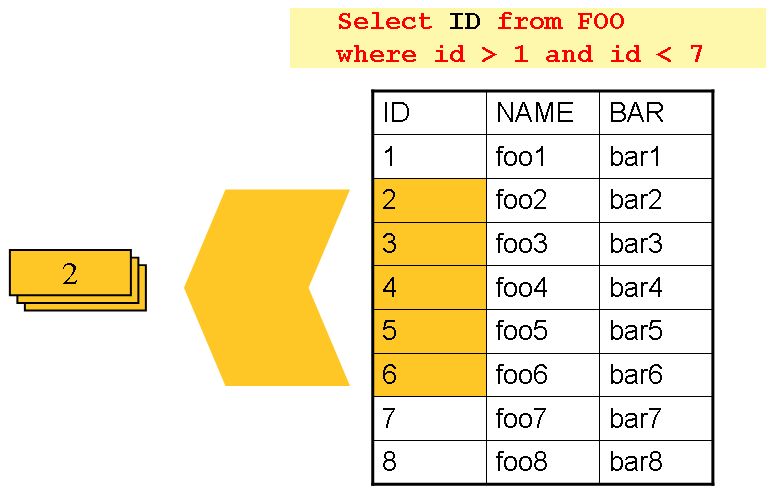
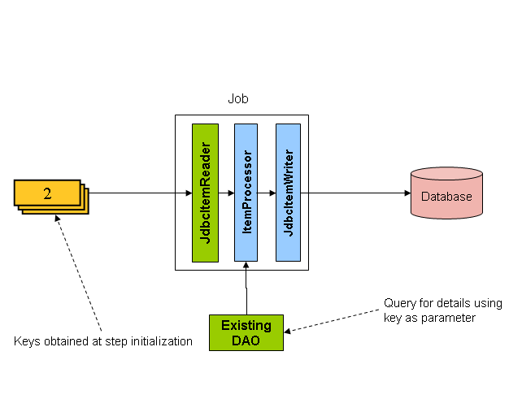

> [스프링 배치 공식 reference](https://docs.spring.io/spring-batch/docs/4.2.x/reference/html/index-single.html#commonPatterns) 를 한글로 번역한 문서입니다.

### 목차

- [11.1. Logging Item Processing and Failures](#111-logging-item-processing-and-failures)
- [11.2. Stopping a Job Manually for Business Reasons](#112-stopping-a-job-manually-for-business-reasons)
- [11.3. Adding a Footer Record](#113-adding-a-footer-record)
  + [11.3.1. Writing a Summary Footer](#1131-writing-a-summary-footer)
- [11.4. Driving Query Based ItemReaders](#114-driving-query-based-itemreaders)
- [11.5. Multi-Line Records](#115-multi-line-records)
- [11.6. Executing System Commands](#116-executing-system-commands)
- [11.7. Handling Step Completion When No Input is Found](#117-handling-step-completion-when-no-input-is-found)
- [11.8. Passing Data to Future Steps](#118-passing-data-to-future-steps)

일부 배치 job은 스프링 배치가 제공하는 컴포넌트만으로도 구성할 수 있다.
예를 들어 `ItemReader`, `ItemWriter` 구현체만으로 다양한 시나리오를 구현할 수 있다. 
하지만 커스텀 코드가 필요할 때가 훨씬 많다.
주로 `Tasklet`, `ItemReader`, `ItemWriter`와
다양한 리스너 인터페이스를 구현하는 것부터 시작한다.
제일 간단한 배치는 스프링 배치의 `ItemReader`를 사용하면 되지만
아이템을 가공하고 write할 때는 `ItemWriter`, `ItemProcessor`를
커스텀해야 할 때가 많다.

이번 장에서는 커스텀 비지니스 로직에서 흔히 쓰는 몇 가지 패턴을 다룬다.
여기서 나오는 예제는 주로 리스너 인터페이스를 사용한다.
`ItemReader`나 `ItemWriter`는 필요하다면
리스너 인터페이스도 구현할 수 있다는 점을 알아두면 좋다.

## 11.1. Logging Item Processing and Failures

step에서 에러가 발생하면 아이템 별로 특정 채널에 로그를 남기거나
데이터베이스에 레코드를 넣는 식의 특별한 처리를 많이 한다.
청크 지향 `Step`(step 팩토리 빈이 생성하는)을 사용하면
`read` 메소드에서 생긴 에러는 `ItemReadListener`로,
`write` 메소드에서 생긴 에러는 `ItemWriteListener`로 쉽게 구현할 수 있다.
아래 예제에 있는 리스너는 read와 write 실패를 모두 로깅한다:

```java
public class ItemFailureLoggerListener extends ItemListenerSupport {

    private static Log logger = LogFactory.getLog("item.error");

    public void onReadError(Exception ex) {
        logger.error("Encountered error on read", e);
    }

    public void onWriteError(Exception ex, List<? extends Object> items) {
        logger.error("Encountered error on write", ex);
    }
}
```

리스너를 구현했으면 아래 예제처럼 step에 등록해야 한다:

```java
@Bean
public Step simpleStep() {
	return this.stepBuilderFactory.get("simpleStep")
				...
				.listener(new ItemFailureLoggerListener())
				.build();
}
```

> 리스너가 `onError()` 메소드 안에서 처리하는 일은
> 트랜잭션 안에 있어야 롤백할 수 있다.
> `onError()` 안에서 데이터베이스같은 트랜잭션 리소스를 사용한다면
> 메소드에 선언적인 트랜잭션을 추가해서
> (자세한 내용은 Spring Core Reference Guide 참고)
> 전파(propagation) 속성을 `REQUIRES_NEW`로 설정해라.

## 11.2. Stopping a Job Manually for Business Reasons

스프링 배치는 `JobLauncher` 인터페이스로 `stop()` 메소드를 제공하지만
어플리케이션 개발자가 사용하는 용도는 아니다.
가끔은 비니지스 로직 안에서 job을 중단하는 게 더 편하거나 합리적이다. 

가장 간단한 방법은 `RuntimeException`을 던지는 것이다 
(무한으로 재시도하거나 스킵하지 않는 exception으로). 
예를 들어 아래 예제처럼 커스텀 exception을 사용할 수 있다:

```java
public class PoisonPillItemProcessor<T> implements ItemProcessor<T, T> {

    @Override
    public T process(T item) throws Exception {
        if (isPoisonPill(item)) {
            throw new PoisonPillException("Poison pill detected: " + item);
        }
        return item;
    }
}
```

간단하게 step을 종료하는 또 다른 방법은 아래 예제처럼
`ItemReader`에서 `null`을 리턴하는 것이다:

```java
public class EarlyCompletionItemReader implements ItemReader<T> {

    private ItemReader<T> delegate;

    public void setDelegate(ItemReader<T> delegate) { ... }

    public T read() throws Exception {
        T item = delegate.read();
        if (isEndItem(item)) {
            return null; // end the step here
        }
        return item;
    }

}
```

위 예제는 사실, 아이템이 `null`이면 배치가 완료된 것으로 판단하는
`CompletionPolicy` 디폴트 구현체가 있어야 동작한다.
더 복잡한 completion policy를 구현했다면
아래 예제처럼 `SimpleStepFactoryBean`으로 `Step`에 주입하면 된다:

```java
@Bean
public Step simpleStep() {
	return this.stepBuilderFactory.get("simpleStep")
				.<String, String>chunk(new SpecialCompletionPolicy())
				.reader(reader())
				.writer(writer())
				.build();
}
```

다른 방법은 아이템을 처리하는 동안 `Step` 구현체가 체크하는
`StepExecution` 플래그를 설정하는 것이다.
이 방법을 사용하려면 현재 `StepExecution`에 접근하는
`StepListener`를 구현하고 `Step`에 등록해야 한다. 
아래는 플래그를 설정하는 리스너 예시이다:

```java
public class CustomItemWriter extends ItemListenerSupport implements StepListener {

    private StepExecution stepExecution;

    public void beforeStep(StepExecution stepExecution) {
        this.stepExecution = stepExecution;
    }

    public void afterRead(Object item) {
        if (isPoisonPill(item)) {
            stepExecution.setTerminateOnly();
       }
    }

}
```

이 플래그를 사용하면 디폴트 설정대로 step이 `JobInterruptedException`을 던진다.
이 동작은 `StepInterruptionPolicy`가 제어한다.
하지만 exception을 던지거나 던지지 않는 동작만 가능해서
항상 비정상적으로 job을 종료한다.

## 11.3. Adding a Footer Record

플랫(flat) 파일에 write할 때는
모든 처리가 끝난 후 파일 끝에 "꼬리말(footer)" 레코드를 적는 경우가 종종 있다.
스프링 배치는 이를 위한 `FlatFileFooterCallback` 인터페이스를 지원한다.
`FlatFileFooterCallback`은(반대의 경우는 `FlatFileHeaderCallback`) 
`FlatFileItemWriter`의 선택적인 프로퍼티이며,
아래 예제처럼 item writer에 추가할 수 있다:

```java
@Bean
public FlatFileItemWriter<String> itemWriter(Resource outputResource) {
	return new FlatFileItemWriterBuilder<String>()
			.name("itemWriter")
			.resource(outputResource)
			.lineAggregator(lineAggregator())
			.headerCallback(headerCallback())
			.footerCallback(footerCallback())
			.build();
}
```

footer callback 인터페이스는 꼬리말을 적을 때 호출하는 메소드 하나만 가지고 있다.
아래는 인터페이스 정의다: 

```java
public interface FlatFileFooterCallback {

    void writeFooter(Writer writer) throws IOException;

}
```

### 11.3.1. Writing a Summary Footer

꼬리말은 흔히 데이터를 처리하는 동안 얻은 정보를 합쳐 파일 끝에 추가할 때 사용한다.
보통 꼬리말에 파일 요약 정보나 체크섬을 저장한다.

예를 들어 플랫(flat) 파일에 `Trade` 레코드를 기록하고
`Trade` 내역 총합을 꼬리말에 남기려면 아래 처럼 `ItemWriter`를 구현한다:

```java
public class TradeItemWriter implements ItemWriter<Trade>,
                                        FlatFileFooterCallback {

    private ItemWriter<Trade> delegate;

    private BigDecimal totalAmount = BigDecimal.ZERO;

    public void write(List<? extends Trade> items) throws Exception {
        BigDecimal chunkTotal = BigDecimal.ZERO;
        for (Trade trade : items) {
            chunkTotal = chunkTotal.add(trade.getAmount());
        }

        delegate.write(items);

        // After successfully writing all items
        totalAmount = totalAmount.add(chunkTotal);
    }

    public void writeFooter(Writer writer) throws IOException {
        writer.write("Total Amount Processed: " + totalAmount);
    }

    public void setDelegate(ItemWriter delegate) {...}
}
```

`TradeItemWriter`는 각 `Trade` 아이템을 처리할 때 마다
`amount` 값을 `totalAmount`에 더한다.
마지막 `Trade`를 처리하고 나면 프레임워크가 `writeFooter` 메소드를 호출해서
파일에 `totalAmount`를 기록한다.
청크 안에 있는 `Trade` 총계를 `chunkTotal`이라는 지역변수에
저장한다는 점에 주목하라.
`write` 메소드가 스킵되면 `totalAmount`에 추가하지 않기 위해서다.
exception이 발생하지 않았다고 보장할 수 있는 
`write` 메소드 마지막 라인에서 `totalAmount`를 수정한다.

`footerCallback` 메소드로
`FlatFileItemWriter`에
`TradeItemWriter`(`FlatFileFooterCallback`를 구현한)를 연결해야
`writeFooter`를 호출한다.
아래는 그 방법을 보여주는 예시다:

```java
@Bean
public TradeItemWriter tradeItemWriter() {
	TradeItemWriter itemWriter = new TradeItemWriter();

	itemWriter.setDelegate(flatFileItemWriter(null));

	return itemWriter;
}

@Bean
public FlatFileItemWriter<String> flatFileItemWriter(Resource outputResource) {
	return new FlatFileItemWriterBuilder<String>()
			.name("itemWriter")
			.resource(outputResource)
			.lineAggregator(lineAggregator())
			.footerCallback(tradeItemWriter())
			.build();
}
```

지금까지 만든 `TradeItemWriter`는 
`Step`을 재시작할 수 없는 경우에만 제대로 동작한다.
클래스에 상태가 있는데도(stateful, `totalAmount`를 저장하므로)
`totalAmount`를 데이터베이스에 저장하지 않기 때문이다.
따라서 재시작하면 이 값을 얻어올 수 없다.
이 클래스를 재시작할 수 있게 만드려면
아래 예제처럼 `ItemStream` 인터페이스의 `open`,`update` 메소드를 구현해야한다:

```java
public void open(ExecutionContext executionContext) {
    if (executionContext.containsKey("total.amount") {
        totalAmount = (BigDecimal) executionContext.get("total.amount");
    }
}

public void update(ExecutionContext executionContext) {
    executionContext.put("total.amount", totalAmount);
}
```

update 메소드는 데이터베이스에 저장하기 직전
가장 최신 상태인 `totalAmount`를 `ExecutionContext`에 저장한다.
open 메소드는 처리 시작 전 `ExecutionContext`에서 `totalAmount` 값을 읽는다.
그 덕분에 재시작했을 때 `TradeItemWriter`는
이전 `Step`이 중단됐던 곳부터 다시 처리할 수 있다.

## 11.4. Driving Query Based ItemReaders

[chapter on readers and writers](https://godekdls.github.io/Spring%20Batch/itemreadersanditemwriters/) 에서 
페이징 기법으로 데이터베이스 데이터를 읽는 법을 다뤘다.
DB2같이 극도로 비관적인(pessimistic) 잠금 기법을 사용하는 데이터베이스 벤더도 많기 때문에,  
이미 배치에서 읽고 있는 테이블을 다른 온라인 어플리케이션에서도 사용한다면 문제될 수 있다.
또, 벤더에 따라 매우 큰 데이터셋에 커서를 사용하면 문제가 생길 수도 있다.
그래서 'Driving Query' 기법으로 데이터를 조회하는 프로젝트도 많다.
이 방법은 아래 그림에 보이는 것처럼
리턴해야하는 전체 오브젝트가 아니라 키를 사용해 질의를 반복한다:



보면 알겠지만 커서 기반 예제에서 사용했던 'FOO' 테이블과 동일하다.
하지만 SQL 문에서 전체 로(row)가 아닌 ID만 검색한다.
따라서 `read` 메소드에선 `FOO` 객체 대신 `Integer`를 리턴한다.
이 숫자는 아래 그림처럼 `FOO` 객체를 조회할 때 사용한다:



`ItemProcessor`가 쿼리를 실행해서(driving query) 키를 'Foo' 객체로 바꾼다.
키로 전체 객체를 질의할 때는 DAO를 사용한다.

## 11.5. Multi-Line Records

플랫(flat) 파일은 보통 라인 한 줄이 레코드 하나를 가리키지만,
여러 포맷을 사용해 레코드를 여러 줄에 걸쳐 기록한 파일도 많다.
아래는 이런 파일 유형에서 가져온 예시다:

```
HEA;0013100345;2007-02-15
NCU;Smith;Peter;;T;20014539;F
BAD;;Oak Street 31/A;;Small Town;00235;IL;US
FOT;2;2;267.34
```

'HEA'로 시작하는 라인부터 'FOT'로 시작하는 라인까지는 전부 한 레코드로 간주한다.
이런 파일을 제대로 처리하려면 여러 가지를 고려해야 한다:

- `ItemReader`는 한 번에 레코드 하나를 읽는 대신, 
여러 줄에 걸친 레코드를 전부 그룹으로 읽어서 `ItemWriter`에 전달한다.
- 각 라인 유형별로 다르게 토큰화해야 한다.

레코드 하나가 여러 줄에 걸쳐 있고 라인이 몇개나 되는지 알 수 없기 때문에
`ItemReader`로 전체 레코드를 읽을 땐 항상 조심해야 한다.
이를 위해서는 아래 예제처럼 `FlatFileItemReader`를 감싼
커스텀 `ItemReader`를 구현해야 한다:

```java
@Bean
public MultiLineTradeItemReader itemReader() {
	MultiLineTradeItemReader itemReader = new MultiLineTradeItemReader();

	itemReader.setDelegate(flatFileItemReader());

	return itemReader;
}

@Bean
public FlatFileItemReader flatFileItemReader() {
	FlatFileItemReader<Trade> reader = new FlatFileItemReaderBuilder<>()
			.name("flatFileItemReader")
			.resource(new ClassPathResource("data/iosample/input/multiLine.txt"))
			.lineTokenizer(orderFileTokenizer())
			.fieldSetMapper(orderFieldSetMapper())
			.build();
	return reader;
}
```

위임받은 객체(delegate) `FlatFileItemReader`에서 
`PatternMatchingCompositeLineTokenizer`를 사용하면
파일을 적절하게 토큰화할 수 있는데,
이는 특히 고정 길이를 사용한다면 매우 중요하다.
자세한 내용은 [`FlatFileItemReader` in the Readers and Writers chapter](https://godekdls.github.io/Spring%20Batch/itemreadersanditemwriters/#662-flatfileitemreader) 를 참고하라.
위임받은(delegate) reader는 `PassThroughFieldSetMapper`한테
각 라인의 `FieldSet`을 받아, 감싸고 있는 `ItemReader`에게 돌려준다.
아래는 토크나이저 예시다:

```java
@Bean
public PatternMatchingCompositeLineTokenizer orderFileTokenizer() {
	PatternMatchingCompositeLineTokenizer tokenizer =
			new PatternMatchingCompositeLineTokenizer();

	Map<String, LineTokenizer> tokenizers = new HashMap<>(4);

	tokenizers.put("HEA*", headerRecordTokenizer());
	tokenizers.put("FOT*", footerRecordTokenizer());
	tokenizers.put("NCU*", customerLineTokenizer());
	tokenizers.put("BAD*", billingAddressLineTokenizer());

	tokenizer.setTokenizers(tokenizers);

	return tokenizer;
}
```

이 래퍼(wrapper) 레코드가 끝나는 지점을 알아야
레코드가 끝날 때까지 위임받은 객체(delegate)의 `read()` 메소드를 계속 호출할 수 있다.
읽은 각 라인은 래퍼가 item으로 만들어서 반환한다.
아래 예제처럼 footer까지 처리하고 나면 아이템을 리턴해서 
`ItemProcessor`, `ItemWriter`에 전달한다:

```java
private FlatFileItemReader<FieldSet> delegate;

public Trade read() throws Exception {
    Trade t = null;

    for (FieldSet line = null; (line = this.delegate.read()) != null;) {
        String prefix = line.readString(0);
        if (prefix.equals("HEA")) {
            t = new Trade(); // Record must start with header
        }
        else if (prefix.equals("NCU")) {
            Assert.notNull(t, "No header was found.");
            t.setLast(line.readString(1));
            t.setFirst(line.readString(2));
            ...
        }
        else if (prefix.equals("BAD")) {
            Assert.notNull(t, "No header was found.");
            t.setCity(line.readString(4));
            t.setState(line.readString(6));
          ...
        }
        else if (prefix.equals("FOT")) {
            return t; // Record must end with footer
        }
    }
    Assert.isNull(t, "No 'END' was found.");
    return null;
}
```

## 11.6. Executing System Commands

배치 job 내부에서 외부 명령어를 실행하는 경우도 많다.
이런 프로세스는 스케줄러로 별도로 실행할 수도 있지만,
이렇게 하면 실행에 관한 공통 메타 데이터를 사용할 수 없다.
게다가 step 여러 개로 구성한 job을 여러 job으로 분리해야 한다.

이런 경우가 꽤 많기 때문에 스프링 배치는 
시스템 명령어를 호출하는 아래 `Tasklet` 구현체를 제공한다:

```java
@Bean
public SystemCommandTasklet tasklet() {
	SystemCommandTasklet tasklet = new SystemCommandTasklet();

	tasklet.setCommand("echo hello");
	tasklet.setTimeout(5000);

	return tasklet;
}
```

## 11.7. Handling Step Completion When No Input is Found

많은 경우 데이터베이스 로(row)나 파일을 못 찾은게 문제되는 상황이 아니다.
`Step`이 단순히 처리할 작업을 못찾아서 아이템 0개를 완료했다고 생각할 수 있다.
스프링 배치가 제공하는 모든 `ItemReader` 구현체는 기본적으로 이 방식대로 접근한다.
입력이 있는데도 아무 처리도 하지 않았다면
(파일 이름이 잘못 됐다거나 하는 이슈는 종종 있다) 혼란스러울 수 있다.
이를 위해 메타 데이터로 프레임워크가 처리한 작업량을 확인해야 한다.
하지만 입력 데이터를 못 찾았을 때 예외를 발생시켜야 한다면 어떻게 해야 할까?
이럴 때는 메타 데이터를 체크해서 처리된 아이템이 없을 때
실패하도록 프로그래밍하는 게 가장 좋은 해결책이다.

이런 경우가 꽤 많기 때문에 스프링 배치는
아래 보이는 `NoWorkFoundStepExecutionListener`로 
위에서 말한 기능을 제공한다:

```java
public class NoWorkFoundStepExecutionListener extends StepExecutionListenerSupport {

    public ExitStatus afterStep(StepExecution stepExecution) {
        if (stepExecution.getReadCount() == 0) {
            return ExitStatus.FAILED;
        }
        return null;
    }

}
```

위 `StepExecutionListener`는 'afterStep' 메소드 안에서
`StepExecution`의 `readCount` 프로퍼티를 검사하기 때문에
읽은 아이템이 없다는 걸 알아챌 수 있다.
그런 경우엔 `Step`이 실패했다는 걸 의미하는 종료 코드 FAILED를 리턴한다.
그 외에는 `Step`의 상태에 영향을 주지 않는 `null`을 리턴한다.

## 11.8. Passing Data to Future Steps

현재 step에서 다음 step으로 특정 정보를 넘기는게 유용할 때가 많다.
`ExecutionContext`를 사용하면 데이터를 넘길 수 있다.
중요한 건 `ExecutionContext`이 `Step` 레벨에도 있고 `Job` 레벨에도 있다는 것이다.
`Job` `ExecutionContext`는 `Job`을 실행하는 동안 계속 유지되지만
`Step` `ExecutionContext`는 step에서만 유효하다.
다시 말해 `Job` `ExecutionContext`는 각 `Step`이 끝날 때만 업데이트되지만
`Step` `ExecutionContext`는 `Step`이 청크를 커밋할 때마다 업데이트된다.

이렇게 분리돼 있기 때문에 모든 데이터는
`Step`이 실행 중일 때 `Step` `ExecutionContext`에 저장해야 한다.
이렇게 해야 `Step`을 실행하는 동안 필요한 데이터를 저장할 수 있다.
데이터를 `Job` `ExecutionContext`에 저장하면
`Step`을 실행하는 동안은 저장되지 않아서 `Step`이 실패하면 데이터가 유실된다.

```java
public class SavingItemWriter implements ItemWriter<Object> {
    private StepExecution stepExecution;

    public void write(List<? extends Object> items) throws Exception {
        // ...

        ExecutionContext stepContext = this.stepExecution.getExecutionContext();
        stepContext.put("someKey", someObject);
    }

    @BeforeStep
    public void saveStepExecution(StepExecution stepExecution) {
        this.stepExecution = stepExecution;
    }
}
```

다음 `Step`에서 이 데이터를 사용하려면
step이 끝났을 때 `Job` `ExecutionContext`으로 "승격(promote)"시켜야 한다.
스프링 배치는 이를 위한 `ExecutionContextPromotionListener`를 제공한다.
단 `ExecutionContext`에 데이터를 넣을 때 사용한 키를 리스너에도 설정해야 한다.
원한다면 데이터를 옮길 때 패턴별로 step 종료 코드를 바꿀 수 있다
(디폴트는 `COMPLETED`다).
아래 예제에서 보이듯이 다른 리스너와 마찬가지로 `Step`에 등록해야 한다: 

```java
@Bean
public Job job1() {
	return this.jobBuilderFactory.get("job1")
				.start(step1())
				.next(step1())
				.build();
}

@Bean
public Step step1() {
	return this.stepBuilderFactory.get("step1")
				.<String, String>chunk(10)
				.reader(reader())
				.writer(savingWriter())
				.listener(promotionListener())
				.build();
}

@Bean
public ExecutionContextPromotionListener promotionListener() {
	ExecutionContextPromotionListener listener = new ExecutionContextPromotionListener();

	listener.setKeys(new String[] {"someKey" });

	return listener;
}
```

마지막으로 아래 예제처럼
`Job` `ExecutionContext`에서 저장한 값을 조회하면 된다:

```java
public class RetrievingItemWriter implements ItemWriter<Object> {
    private Object someObject;

    public void write(List<? extends Object> items) throws Exception {
        // ...
    }

    @BeforeStep
    public void retrieveInterstepData(StepExecution stepExecution) {
        JobExecution jobExecution = stepExecution.getJobExecution();
        ExecutionContext jobContext = jobExecution.getExecutionContext();
        this.someObject = jobContext.get("someKey");
    }
}
```
