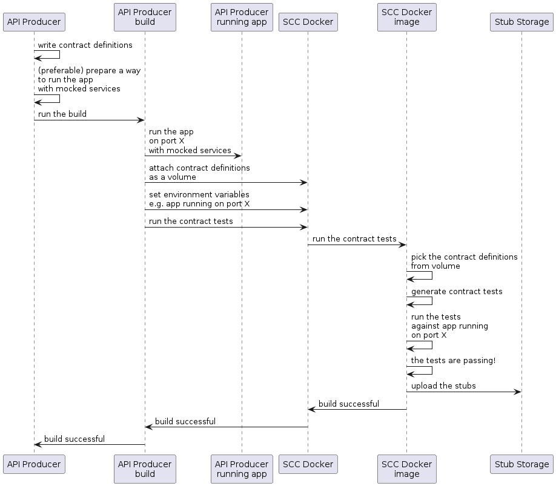
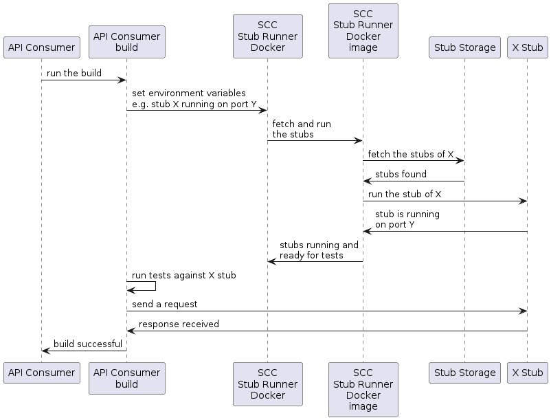

---

이번에 가정하는 것들은 다음과 같다:

- API 프로듀서producer와 API 컨슈머consumer 모두 JVM 애플리케이션이 아니다.
- 명세contract 정의는 YAML로 작성한다.
- Artifactory나 Nexus를 스텁stub 저장소로 사용한다.
- Spring Cloud Contract Docker (SCC Docker)와 Spring Cloud Contract Stub Runner Docker (SCC Stub Runner Docker) 이미지를 사용한다.

Spring Cloud Contract를 도커와 함께 사용하는 방법은 [여기](../docker-project)에서 자세히 설명한다.

[이곳](https://spring.io/blog/2018/02/13/spring-cloud-contract-in-a-polyglot-world)에서는 여러 프로그래밍 언어가 공존하는 환경에서 Spring Cloud Contract를 사용하는 방법에 관한 게시물을 읽을 수 있다.

[이곳](https://github.com/spring-cloud-samples/spring-cloud-contract-nodejs/)에서는 프로듀서producer와 컨슈머consumer 양측 모두 Spring Cloud Contract를 사용하는 NodeJS 애플리케이션 샘플을 확인할 수 있다.

### 목차

- [2.7.1. 프로듀서 플로우](#271-producer-flow)
- [2.7.2. 컨슈머 플로우](#272-consumer-flow)

### 2.7.1. Producer Flow

프로듀서producer의 흐름은 큰 틀에서 보면 다음과 같다:

1. 명세contract 정의를 작성한다 (YAML 등으로).

2. 빌드 툴을 세팅해서 다음을 진행한다:
   1. 지정한 포트에 목mock 서비스로 애플리케이션을 띄운다. 
      모킹이 불가능하다면, 인프라를 세팅하고 상태를 가지는 방식stateful으로 테스트를 정의하면 된다.

   3. Spring Cloud Contract 도커 이미지를 실행하고 환경 변수로 실행 중인 애플리케이션의 포트를 전달한다. 이때, SCC 도커 이미지는:

      - 연결된 볼륨에서 테스트를 생성한다.
      - 실행 중인 애플리케이션을 이용해 테스트를 실행한다.

테스트가 완료되고 나면, 스텁stub 저장소(e.g. Artifactory, Git)로 스텁stub이 업로드된다.

다음은 프로듀서producer의 흐름을 나타낸 UML 다이어그램이다:

{: .center-image }

### 2.7.2. Consumer Flow

컨슈머consumer의 흐름은 큰 틀에서 보면 다음과 같다:

1. 빌드 툴을 세팅해서 다음을 진행한다:

   - Spring Cloud Contract Stub Runner 도커 이미지를 통해 스텁stub을 실행한다.

     환경 변수로는 다음을 세팅해준다:

     - 가져올 스텁stub.
     - 레포지토리의 위치.

     주의할 점은:

     - 로컬 스토리지를 사용하려면 볼륨으로 마운트해야 한다.
     - 스텁stub을 실행 중인 포트를 외부에서 접근할 수 있도록 열어줘야 한다.

2. 실행 중인 스텁stub을 이용해 테스트를 실행한다.

다음은 컨슈머consumer의 흐름을 나타낸 UML 다이어그램이다:

{: .center-image }
