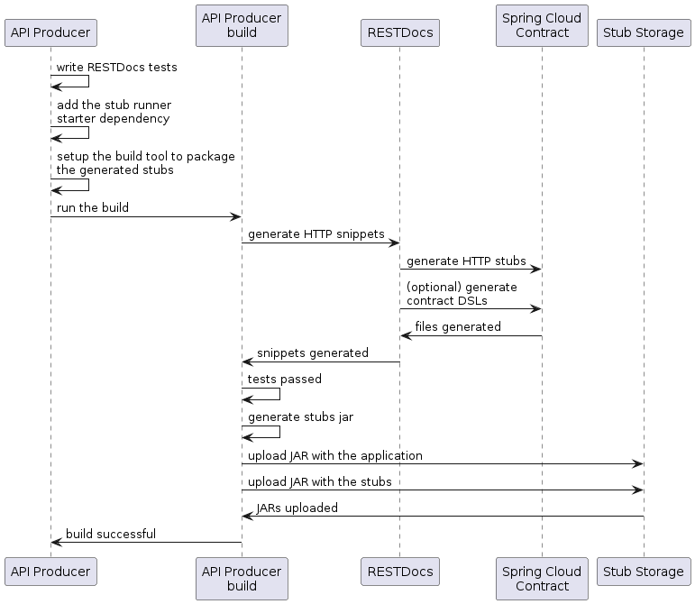

<script>defaultLanguages = ['maven']</script>

---

이번에는 Spring Cloud Contract 플러그인을 사용해서 테스트와 스텁<sup>stub</sup>을 생성하지 않는다. [Spring RESTDoc](https://spring.io/projects/spring-restdocs)을 작성하고, 이걸 이용해 자동으로 스텁<sup>stub</sup>을 생성해본다. 마지막으로, 빌드 과정에서 스텁<sup>stub</sup>을 패키징하고 스텁<sup>stub</sup> 저장소(여기서는 Nexus 혹은 Artifactory)에 업로드한다.

### 목차

- [2.8.1. 프로듀서 플로우](#281-producer-flow)
- [2.8.2. 컨슈머 플로우](#282-consumer-flow)

### 2.8.1. Producer Flow

프로듀서<sup>producer</sup>가 하는 일은 다음과 같다:

1. 컨슈머<sup>consumer</sup>에 제공할 API를 위한 RESTDocs 테스트 코드를 작성한다.

2. 빌드 설정에 다음과 같이 Spring Cloud Contract Stub Runner starter를 추가한다 (`spring-cloud-starter-contract-stub-runner`):

    <div class="switch-language-wrapper maven gradle">
    <span class="switch-language maven">Maven</span>
    <span class="switch-language gradle">Gradle</span>
    </div>
    <div class="language-only-for-maven maven gradle"></div>
    ```xml
    <dependencies>
        <dependency>
            <groupId>org.springframework.cloud</groupId>
            <artifactId>spring-cloud-starter-contract-stub-runner</artifactId>
            <scope>test</scope>
        </dependency>
    </dependencies>
    
    <dependencyManagement>
        <dependencies>
            <dependency>
                <groupId>org.springframework.cloud</groupId>
                <artifactId>spring-cloud-dependencies</artifactId>
                <version>${spring-cloud.version}</version>
                <type>pom</type>
                <scope>import</scope>
            </dependency>
        </dependencies>
    </dependencyManagement>
    ```
    <div class="language-only-for-gradle maven gradle"></div>
    ```groovy
    dependencies {
        testImplementation 'org.springframework.cloud:spring-cloud-starter-contract-stub-runner'
    }
    
    dependencyManagement {
        imports {
            mavenBom "org.springframework.cloud:spring-cloud-dependencies:${springCloudVersion}"
        }
    }
    ```

3. 빌드 툴에 다음과 같이 스텁<sup>stub</sup> 패키징 설정을 추가한다:

    <div class="switch-language-wrapper maven gradle">
    <span class="switch-language maven">Maven</span>
    <span class="switch-language gradle">Gradle</span>
    </div>
    <div class="language-only-for-maven maven gradle"></div>
    ```xml
    <!-- pom.xml -->
    <plugins>
        <plugin>
            <groupId>org.apache.maven.plugins</groupId>
            <artifactId>maven-assembly-plugin</artifactId>
            <executions>
                <execution>
                    <id>stub</id>
                    <phase>prepare-package</phase>
                    <goals>
                        <goal>single</goal>
                    </goals>
                    <inherited>false</inherited>
                    <configuration>
                        <attach>true</attach>
                        <descriptors>
                            ${basedir}/src/assembly/stub.xml
                        </descriptors>
                    </configuration>
                </execution>
            </executions>
        </plugin>
    </plugins>
    
    <!-- src/assembly/stub.xml -->
    <assembly
        xmlns="http://maven.apache.org/plugins/maven-assembly-plugin/assembly/1.1.3"
        xmlns:xsi="http://www.w3.org/2001/XMLSchema-instance"
        xsi:schemaLocation="http://maven.apache.org/plugins/maven-assembly-plugin/assembly/1.1.3 http://maven.apache.org/xsd/assembly-1.1.3.xsd">
        <id>stubs</id>
        <formats>
            <format>jar</format>
        </formats>
        <includeBaseDirectory>false</includeBaseDirectory>
        <fileSets>
            <fileSet>
                <directory>${project.build.directory}/generated-snippets/stubs</directory>
                <outputDirectory>META-INF/${project.groupId}/${project.artifactId}/${project.version}/mappings</outputDirectory>
                <includes>
                    <include>**/*</include>
                </includes>
            </fileSet>
        </fileSets>
    </assembly>
    ```
    <div class="language-only-for-gradle maven gradle"></div>
    ```groovy
    task stubsJar(type: Jar) {
        classifier = "stubs"
        into("META-INF/${project.group}/${project.name}/${project.version}/mappings") {
            include('**/*.*')
            from("${project.buildDir}/generated-snippets/stubs")
        }
    }
    // we need the tests to pass to build the stub jar
    stubsJar.dependsOn(test)
    bootJar.dependsOn(stubsJar)
    ```

이제 테스트를 실행하면 자동으로 스텁<sup>stub</sup>이 배포되고 패키징된다.

다음은 프로듀서<sup>producer</sup>의 흐름을 나타낸 UML 다이어그램이다:

{: .center-image }

### 2.8.2. Consumer Flow

컨슈머<sup>consumer</sup>가 하는 일은 스텁<sup>stub</sup>을 생성할 때 사용하는 도구가 달라져도 동일하다. [처음 만드는 Spring Cloud Contract 애플리케이션](../getting-started/#132-on-the-consumer-side) 페이지에서, Nexus/Artifactory에 있는 스텁<sup>stub</sup>을 사용해 서비스 제공자 주도로 명세를 테스트<sup>Provider Contract Testing</sup>할 때 컨슈머<sup>consumer</sup>가 할 일들을 참고하면 된다.