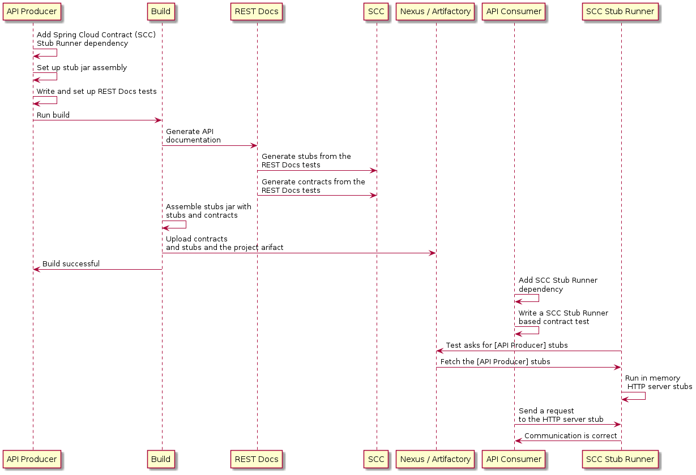

---

[Spring REST Docs](https://projects.spring.io/spring-restdocs)는 스프링 MockMvc나, WebTestClient, RestAssured로 HTTP API를 위한 문서를 생성해준다 (Asciidoc 포맷 등으로). Spring Cloud Contract WireMock을 사용하면 API 문서를 생성하는 동시에 WireMock 스텁<sup>stub</sup>도 생성할 수 있다. 평소처럼 REST Docs의 테스트 케이스를 작성한 다음, `@AutoConfigureRestDocs`를 사용해 출력 디렉토리를 지정해주면, REST Docs 출력 디렉토리에 스텁<sup>stub</sup>이 자동으로 생성된다. 아래 있는 UML 다이어그램은 REST Docs의 플로우를 나타내고 있다:

{: .center-image }

다음은 `MockMvc`를 사용하는 예시다:

```java
@RunWith(SpringRunner.class)
@SpringBootTest
@AutoConfigureRestDocs(outputDir = "target/snippets")
@AutoConfigureMockMvc
public class ApplicationTests {

	@Autowired
	private MockMvc mockMvc;

	@Test
	public void contextLoads() throws Exception {
		mockMvc.perform(get("/resource"))
				.andExpect(content().string("Hello World"))
				.andDo(document("resource"));
	}
}
```

이 코드에선 `target/snippets/stubs/resource.json`에 WireMock 스텁<sup>stub</sup>을 생성하며, `/resource` 경로로 들어오는 모든 `GET` 요청을 처리한다. 아래 있는 예제는 스프링 웹플럭스 애플리케이션 테스트에 사용하는 WebTestClient를 이용한 동일한 코드다:

```java
@RunWith(SpringRunner.class)
@SpringBootTest
@AutoConfigureRestDocs(outputDir = "target/snippets")
@AutoConfigureWebTestClient
public class ApplicationTests {

	@Autowired
	private WebTestClient client;

	@Test
	public void contextLoads() throws Exception {
		client.get().uri("/resource").exchange()
				.expectBody(String.class).isEqualTo("Hello World")
 				.consumeWith(document("resource"));
	}
}
```

테스트 코드에 별도로 설정을 추가하지 않았지만, HTTP 메소드에 대한 요청 matcher와 `host`, `content-length`를 제외한 모든 헤더가 포함된 스텁<sup>stub</sup>을 생성한다. 요청을 좀 더 구체적인 조건으로 매칭시키려면 (예를 들어 `POST`나 `PUT` 요청의 body로 매칭시키고 싶다면), 요청 matcher를 직접 명시해야 한다. 그러면 다음과 같은 두 가지 효과를 볼 수 있다:

- 명시한 스펙과 매칭되는 스텁<sup>stub</sup>만 생성한다.
- 테스트 케이스에 사용한 요청이 해당 조건에 매칭된다는 것을 검증할 수 있다.

이 기능을 사용해볼 거라면, 아래 예시처럼 `document()` 대신 `WireMockRestDocs.verify()`로 시작하면 된다:

```java
import static org.springframework.cloud.contract.wiremock.restdocs.WireMockRestDocs.verify;

@RunWith(SpringRunner.class)
@SpringBootTest
@AutoConfigureRestDocs(outputDir = "target/snippets")
@AutoConfigureMockMvc
public class ApplicationTests {

	@Autowired
	private MockMvc mockMvc;

	@Test
	public void contextLoads() throws Exception {
		mockMvc.perform(post("/resource")
                .content("{\"id\":\"123456\",\"message\":\"Hello World\"}"))
				.andExpect(status().isOk())
				.andDo(verify().jsonPath("$.id"))
				.andDo(document("resource"));
	}
}
```

위 명세<sup>contract</sup>는 `id` 필드를 가진 모든 유효한 POST 요청에, 테스트에 정의한 응답을 보내도록 명시한다. 다른 matcher를 추가하고 싶다면 `.jsonPath()`를 체이닝해서 호출하면 된다. JSON Path가 익숙하지 않다면 [JayWay 문서](https://github.com/jayway/JsonPath)를 읽어봐라. WebTestClient를 사용할 땐, 같은 위치에서 이와 유사한 스태틱 헬퍼 메소드 `verify()`를 사용하면 된다.

`jsonPath`, `contentType` 메소드도 간편하지만, 다음과 같이 WireMock API를 사용해도 자동 생성된 스텁<sup>stub</sup>과 매칭되는 요청인지를 검증할 수 있다:

```java
@Test
public void contextLoads() throws Exception {
	mockMvc.perform(post("/resource")
               .content("{\"id\":\"123456\",\"message\":\"Hello World\"}"))
			.andExpect(status().isOk())
			.andDo(verify()
					.wiremock(WireMock.post(urlPathEquals("/resource"))
					.withRequestBody(matchingJsonPath("$.id"))
					.andDo(document("post-resource"))));
}
```

WireMock API는 더 다채롭다. 헤더, 쿼리 파라미터, 요청 body를 JSON path뿐 아니라 정규식으로도 매칭시킬 수 있다. 이 기능을 활용하면 더 다양한 파라미터를 포함하는 스텁<sup>stub</sup>을 만들 수 있다. 위 예제는 다음과 유사한 스텁<sup>stub</sup>을 생성한다:

*post-resource.json*

```json
{
  "request" : {
    "url" : "/resource",
    "method" : "POST",
    "bodyPatterns" : [ {
      "matchesJsonPath" : "$.id"
    }]
  },
  "response" : {
    "status" : 200,
    "body" : "Hello World",
    "headers" : {
      "X-Application-Context" : "application:-1",
      "Content-Type" : "text/plain"
    }
  }
}
```

> 요청 matcher를 생성할 땐 `wiremock()`을 사용해도 되고, `jsonPath()`, `contentType()` 메소드 조합을 사용해도 되지만, 두 가지 방법을 동시에 사용할 수는 없다.

컨슈머<sup>consumer</sup> 측에서는 위에서 생성한 `resource.json` 파일을 클래스패스에 두고 사용할 수도 있다 (예를 들어 [스텁<sup>stub</sup>을 JAR로 배포](../stub-runner-publishing-stubs-as-jars/)하는 식으로). 그런 다음 앞에서 설명한 대로 `@AutoConfigureWireMock(stubs=“classpath:resource.json”)`을 선언하는 등, 여러 가지 방법으로 WireMock 스텁<sup>stub</sup>을 생성할 수 있다.

#### Generating Contracts with REST Docs

Spring REST Docs를 사용하면 API 문서와 Spring Cloud Contract DSL 파일을 함께 생성할 수 있다. Spring Cloud WireMock과 같이 사용하면 명세<sup>contract</sup>와 스텁<sup>stub</sup>을 모두 만들 수 있다.

이 기능은 왜 필요한 걸까? 커뮤니티에서 올라온 질문들 중, 이미 작성해둔 스프링 MVC 테스트가 많은데, DSL 기반 명세<sup>contract</sup>로 전환하고 싶다면 어떻게 해야 하는지에 관한 문의가 있었다. 이 기능을 활용하면 명세<sup>contract</sup> 파일을 자동으로 생성하고 적당히 수정해서, 플러그인이 찾을 수 있는 폴더(설정에 정의한 폴더)로 옮길 수 있다.

> 이 기능이 왜 WireMock 모듈에 있는지 궁금할 수도 있다. 명세<sup>contract</sup>와 스텁<sup>stub</sup>을 함께 생성하는 것이 좋기 때문에 WireMock 모듈에 추가했다.

아래 테스트 코드를 살펴보자:

```java
    this.mockMvc
       .perform(post("/foo").accept(MediaType.APPLICATION_PDF)
         .accept(MediaType.APPLICATION_JSON)
         .contentType(MediaType.APPLICATION_JSON)
         .content("{\"foo\": 23, \"bar\" : \"baz\" }"))
       .andExpect(status().isOk())
       .andExpect(content().string("bar"))
       // first WireMock
       .andDo(WireMockRestDocs.verify()
         .jsonPath("$[?(@.foo >= 20)]")
         .jsonPath("$[?(@.bar in ['baz','bazz','bazzz'])]")
         .contentType(MediaType.valueOf("application/json")))
       // then Contract DSL documentation
       .andDo(document("index", SpringCloudContractRestDocs.dslContract(Maps.of("priority", 1))));
```

이 테스트 코드에선 명세<sup>contract</sup>와 문서 파일을 모두 자동 생성하고, 위에서 보여준 스텁<sup>stub</sup>을 만든다.

명세<sup>contract</sup> 파일명은 `index.groovy`이며, 다음과 유사할 거다:

```groovy
import org.springframework.cloud.contract.spec.Contract

Contract.make {
    request {
        method 'POST'
        url '/foo'
        body('''
            {"foo": 23 }
        ''')
        headers {
            header('''Accept''', '''application/json''')
            header('''Content-Type''', '''application/json''')
        }
    }
    response {
        status OK()
        body('''
        bar
        ''')
        headers {
            header('''Content-Type''', '''application/json;charset=UTF-8''')
            header('''Content-Length''', '''3''')
        }
        bodyMatchers {
            jsonPath('$[?(@.foo >= 20)]', byType())
        }
    }
}
```

포맷에 맞는 명세<sup>contract</sup>가 담긴 문서가 만들어진다 (여기서는 Asciidoc 포맷). 이 파일은 `index/dsl-contract.adoc`에 위치한다.

#### Specifying the priority attribute

`SpringCloudContractRestDocs.dslContract()` 메소드는 optional 파라미터로 Map을 하나 받는데, 여기에는 템플릿에서 사용할 추가 속성을 지정할 수 있다.

예를 들면, 다음과 같이 [priority](../http/#321-http-top-level-elements) 필드를 속성에 추가할 수 있다:

```java
SpringCloudContractRestDocs.dslContract(Map.of("priority", 1))
```

#### Overriding the DSL contract template

기본적으로 `default-dsl-contract-only.snippet`이라는 파일을 기반으로 명세<sup>contract</sup>가 만들어진다.

다음과 같이 `getTemplate()` 메소드를 재정의하면 커스텀 템플릿 파일을 제공할 수도 있다:

```java
new ContractDslSnippet(){
    @Override
    protected String getTemplate() {
        return "custom-dsl-contract";
    }
}));
```

따라서, 위 예제에서 이 라인은

```java
.andDo(document("index", SpringCloudContractRestDocs.dslContract()));
```

다음과 같이 변경된다:

```java
.andDo(document("index", new ContractDslSnippet(){
                            @Override
                            protected String getTemplate() {
                                return "custom-dsl-template";
                            }
                        }));
```

템플릿들을 리졸브할 땐 클래스패스의 리소스를 스캔한다. 이땐 다음 경로를 순서대로 확인한다:

- `org/springframework/restdocs/templates/${templateFormatId}/${name}.snippet`
- `org/springframework/restdocs/templates/${name}.snippet`
- `org/springframework/restdocs/templates/${templateFormatId}/default-${name}.snippet`

따라서, 위 예제에선 `src/test/resources/org/springframework/restdocs/templates/` 경로에 `custom-dsl-template.snippet`이라는 파일을 추가해야 한다.