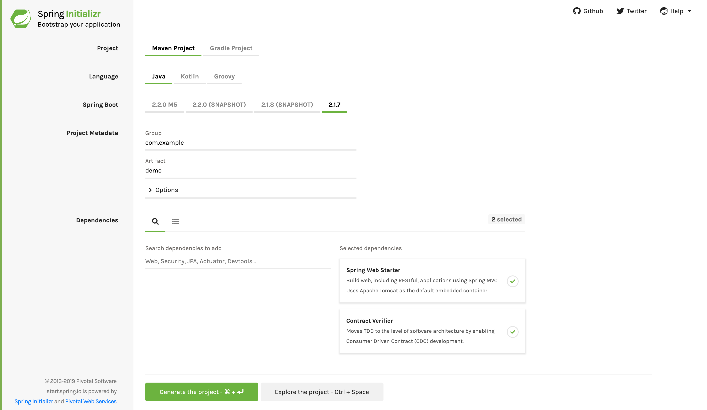

<script>defaultLanguages = ['groovy', 'mockmvc']</script>

---

Spring Cloud Contract나 스프링 자체가 처음이라면 이 섹션을 읽는 것부터 시작해라. "무엇이", "어떻게", "왜"와 관련된 기초적인 궁금증을 해결해 줄 거다. 여기서는 Spring Cloud Contract를 소개하고 설치 가이드를 함께 다룬다. 그런 다음 첫 번째 Spring Cloud Contract 애플리케이션을 빌드해보면서, 몇 가지 핵심 원칙들을 논한다.

### 목차

- [1.1. Spring Cloud Contract 소개](#11-introducing-spring-cloud-contract)
  + [1.1.1.히스토리](#111-history)
    * [왜 필요한가?](#why-do-you-need-it)
    * [테스트 딜레마](#testing-issues)
  + [1.1.2. 목표](#112-purposes)
  + [1.1.3. 컨트랙트<sup>contract</sup>란?](#113-what-is-a-contract)
- [1.2. 3초 퀵 가이드](#12-a-three-second-tour)
  + [1.2.1. 프로듀서](#121-on-the-producer-side)
  + [1.2.2. 컨슈머](#122-on-the-consumer-side)
- [1.3. 처음 만드는 Spring Cloud Contract 애플리케이션](#13-developing-your-first-spring-cloud-contract-based-application)
  + [1.3.1. 프로듀서](#131-on-the-producer-side)
  + [1.3.2. 컨슈머](#132-on-the-consumer-side)
- [1.4. 프로듀서 레포지토리의 컨트랙트<sup>contract</sup>를 이용한 CDC<sup>Consumer Driven Contracts</sup> 실행 단계별 가이드](#14-step-by-step-guide-to-consumer-driven-contracts-cdc-with-contracts-on-the-producer-side)
  + [1.4.1. 기술 노트](#141-technical-note)
  + [1.4.2. 컨슈머 (Loan Issuance)](#142-the-consumer-side-loan-issuance)
  + [1.4.3. 프로듀서 (Fraud Detection server)](#143-the-producer-side-fraud-detection-server)
  + [1.4.4. 컨슈머 (Loan Issuance), 마지막 단계](#144-consumer-side-loan-issuance-final-step)
- [1.5. 다음 단계](#15-next-steps)

---

## 1.1. Introducing Spring Cloud Contract

Spring Cloud Contract는 TDD의 개념을 소프트웨어 아키텍처 수준으로 끌고온다. Spring Cloud Contract를 이용하면 컨슈머 주도<sup>consumer-driven</sup> 및 프로듀서 주도<sup>producer-driven</sup> 명세<sup>contract</sup>를 쉽게 테스트할 수 있다.

### 1.1.1. History

Spring Cloud Contract라는 이름이 정해지기 전에는 Accurest라는 프로젝트명을 사용했었다. 이 프로젝트는 [Codearte](https://github.com/Codearte)의 [Marcin Grzejszczak](https://twitter.com/mgrzejszczak)와 [Jakub Kubrynski](https://twitter.com/jkubrynski)가 만든 프로젝트다.

2015년 1월 26일에는 `0.1.0` 버전이 릴리즈되었으며, 안정화 버전인 `1.0.0`은 2016년 2월 29일에 릴리즈됐다.

#### Why Do You Need It?

다음과 같이 여러 가지 마이크로서비스로 구성된 시스템이 있다고 가정해 보자:

{: .center-image }

#### Testing Issues

이미지 왼쪽 상단에 있는 애플리케이션이 다른 서비스와 통신할 수 있는지 테스트해보려면, 아래 두 가지 방법 중 하나를 선택할 수 있다:

- 모든 마이크로서비스를 배포하고 end-to-end 테스트를 수행한다.
- 나머지 마이크로서비스들을 모킹<sup>mocking</sup>해서 단위<sup>unit</sup> 테스트 및 통합<sup>integration</sup> 테스트를 수행한다.

두 방법 모두 좋다고 할 수 있지만, 단점 또한 많아 무시할 수 없다.

**(1) 모든 마이크로서비스를 배포하고 end-to-end 테스트를 수행한다**

장점:

- 실제 프로덕션 환경을 시뮬레이션한다.
- 여러 서비스 간의 통신을 실제로 테스트한다.

단점:

- 마이크로서비스 하나를 테스트하기 위해 6개의 마이크로서비스를 배포해야 하고 데이터베이스도 여러 개 준비해야 한다.
- 테스트 실행 환경은 단일 테스트 스위트<sup>test suite</sup> 내에서만 공유해야 한다 (그 동안 다른 사람은 테스트를 수행할 수 없다).
- 실행하는 데 시간이 오래 걸린다.
- 테스트가 다 끝나갈 때 쯤에서야 피드백이 가능하다.
- 디버깅하기 매우 어렵다.

**(2) 나머지 마이크로서비스들을 모킹<sup>mocking</sup>해서 단위<sup>unit</sup> 테스트 및 통합<sup>integration</sup> 테스트를 수행한다**

장점:

- 피드백이 매우 빠르다.
- 인프라와 관련된 요구 사항이 없다.

단점:

- 서비스마다 실제 환경과는 관계가 없는 스텁<sup>stub</sup>을 생성한다.
- 테스트는 통과했지만 실제 프로덕션으로 내보냈을 때에는 실패할 가능성도 존재한다.

앞서 언급한 문제들을 해결하기 위해 Spring Cloud Contract가 탄생했다. Spring Cloud Contract는 마이크로서비스 환경을 전부 다 세팅하지 않고도 피드백을 매우 빠르게 제공해보자는 생각에서 시작됐다. 스텁<sup>stub</sup>을 활용할 수 있다면, 테스트하고자 하는 애플리케이션이 직접 사용하는 애플리케이션만 준비하면 된다. 다음은 스텁<sup>stub</sup>과 애플리케이션의 관계를 나타낸 이미지다:

{: .center-image }

Spring Cloud Contract를 사용하면, 호출하는 서비스에서 직접 생성한 스텁<sup>stub</sup>을 사용할 수 있다. 스텁<sup>stub</sup>을 사용할 수 있다는 것 자체가 프로듀서<sup>producer</sup> 측에서 테스트를 마쳤다는 의미기도 하다. 즉, 말 그대로 스텁<sup>stub</sup>을 신뢰할 수 있다는 뜻이다.

### 1.1.2. Purposes

Spring Cloud Contract의 주요 목표는 다음과 같다:

- (클라이언트를 개발할 때 사용하는) HTTP 스텁<sup>stub</sup>이나 메시지 처리 스텁<sup>stub</sup>이, 실제 서버 측 구현체가 하는 일을 정확하게 수행함을 보장한다.
- 인수 테스트 주도 개발<sup>ATDD(acceptance test-driven development)</sup> 방법론과 마이크로서비스 아키텍처 스타일을 장려한다.
- 서버와 클라이언트 양쪽 모두 명세<sup>contract</sup>의 변경 사항을 즉시 확인할 수 있도록, 명세<sup>contract</sup>를 어딘가에 전이 의존성할 수 있는 방법을 제공한다.
- 서버 측에서 사용할 테스트용 보일러플레이트 코드를 대신 생성해준다.

기본적으로 Spring Cloud Contract는 HTTP 서버 스텁<sup>stub</sup>으로 [Wiremock](http://wiremock.org/)을 사용한다.

> Spring Cloud Contract의 용도는 명세<sup>contract</sup>에 비즈니스 로직에 필요한 기능들을 채우는 것이 **아니다**. 예를 들어, 대출 승인 여부를 결정하는 비즈니스 로직에 Spring Cloud Contract를 적용한다고 가정해보자. 사용자가 100가지 다른 이유로 대출을 거절당할 수 있더라도, 명세<sup>contract</sup>는 심사에 통과한 경우와 그렇지 않은 경우 두 가지를 만들 수 있다. 즉, 명세<sup>contract</sup> 테스트는 전반적인 동작을 모두 시뮬레이션하기 위한 것이 아니라, 여러 애플리케이션이 서로 간의 명세<sup>contract</sup>를 잘 지키는지를 테스트하는 목적이다.

### 1.1.3. What Is a Contract?

테스트에 앞서, 서비스 사용자로서 달성하고자 하는 것이 정확히 무엇인지 정의할 필요가 있다. 즉, 어떤 것을 기대하는지를 정해야 한다. 이것이 바로 명세<sup>contract</sup>를 작성하는 이유다. 다시 말해, 명세<sup>contract</sup>는 API나 메시지 통신이 어떻게 이루어져야 하는지에 대한 합의다. 다음 예시를 한 번 생각해 보자:

고객사의 ID와 대출받고자 하는 금액이 포함된 요청을 전송한다고 가정한다. `PUT` 메소드로 `/fraudcheck` URL에 요청을 전송할 거다. 아래 첨부한 Groovy와 YAML 모두 고객이 대출 심사에 승인되는지 거부되는지를 확인하기 위한 명세<sup>contract</sup>를 보여준다:

<div class="switch-language-wrapper groovy yaml">
<span class="switch-language groovy">groovy</span>
<span class="switch-language yaml">yaml</span>
</div>
<div class="language-only-for-groovy groovy yaml"></div>
```groovy
/*
 * Copyright 2013-2020 the original author or authors.
 *
 * Licensed under the Apache License, Version 2.0 (the "License");
 * you may not use this file except in compliance with the License.
 * You may obtain a copy of the License at
 *
 *      https://www.apache.org/licenses/LICENSE-2.0
 *
 * Unless required by applicable law or agreed to in writing, software
 * distributed under the License is distributed on an "AS IS" BASIS,
 * WITHOUT WARRANTIES OR CONDITIONS OF ANY KIND, either express or implied.
 * See the License for the specific language governing permissions and
 * limitations under the License.
 */

package contracts

org.springframework.cloud.contract.spec.Contract.make {
    request { // (1)
        method 'PUT' // (2)
        url '/fraudcheck' // (3)
        body([ // (4)
               "client.id": $(regex('[0-9]{10}')),
               loanAmount : 99999
        ])
        headers { // (5)
            contentType('application/json')
        }
    }
    response { // (6)
        status OK() // (7)
        body([ // (8)
               fraudCheckStatus  : "FRAUD",
               "rejection.reason": "Amount too high"
        ])
        headers { // (9)
            contentType('application/json')
        }
    }
}

/*
From the Consumer perspective, when shooting a request in the integration test:

(1) - If the consumer sends a request
(2) - With the "PUT" method
(3) - to the URL "/fraudcheck"
(4) - with the JSON body that
 * has a field `client.id` that matches a regular expression `[0-9]{10}`
 * has a field `loanAmount` that is equal to `99999`
(5) - with header `Content-Type` equal to `application/json`
(6) - then the response will be sent with
(7) - status equal `200`
(8) - and JSON body equal to
 { "fraudCheckStatus": "FRAUD", "rejectionReason": "Amount too high" }
(9) - with header `Content-Type` equal to `application/json`

From the Producer perspective, in the autogenerated producer-side test:

(1) - A request will be sent to the producer
(2) - With the "PUT" method
(3) - to the URL "/fraudcheck"
(4) - with the JSON body that
 * has a field `client.id` that will have a generated value that matches a regular expression `[0-9]{10}`
 * has a field `loanAmount` that is equal to `99999`
(5) - with header `Content-Type` equal to `application/json`
(6) - then the test will assert if the response has been sent with
(7) - status equal `200`
(8) - and JSON body equal to
 { "fraudCheckStatus": "FRAUD", "rejectionReason": "Amount too high" }
(9) - with header `Content-Type` matching `application/json.*`
 */
```
<div class="language-only-for-yaml groovy yaml"></div>
```yaml
request: # (1)
  method: PUT # (2)
  url: /yamlfraudcheck # (3)
  body: # (4)
    "client.id": 1234567890
    loanAmount: 99999
  headers: # (5)
    Content-Type: application/json
  matchers:
    body:
      - path: $.['client.id'] # (6)
        type: by_regex
        value: "[0-9]{10}"
response: # (7)
  status: 200 # (8)
  body:  # (9)
    fraudCheckStatus: "FRAUD"
    "rejection.reason": "Amount too high"
  headers: # (10)
    Content-Type: application/json


#From the Consumer perspective, when shooting a request in the integration test:
#
#(1) - If the consumer sends a request
#(2) - With the "PUT" method
#(3) - to the URL "/yamlfraudcheck"
#(4) - with the JSON body that
# * has a field `client.id`
# * has a field `loanAmount` that is equal to `99999`
#(5) - with header `Content-Type` equal to `application/json`
#(6) - and a `client.id` json entry matches the regular expression `[0-9]{10}`
#(7) - then the response will be sent with
#(8) - status equal `200`
#(9) - and JSON body equal to
# { "fraudCheckStatus": "FRAUD", "rejectionReason": "Amount too high" }
#(10) - with header `Content-Type` equal to `application/json`
#
#From the Producer perspective, in the autogenerated producer-side test:
#
#(1) - A request will be sent to the producer
#(2) - With the "PUT" method
#(3) - to the URL "/yamlfraudcheck"
#(4) - with the JSON body that
# * has a field `client.id` `1234567890`
# * has a field `loanAmount` that is equal to `99999`
#(5) - with header `Content-Type` equal to `application/json`
#(7) - then the test will assert if the response has been sent with
#(8) - status equal `200`
#(9) - and JSON body equal to
# { "fraudCheckStatus": "FRAUD", "rejectionReason": "Amount too high" }
#(10) - with header `Content-Type` equal to `application/json`
```

> 명세<sup>contract</sup>는 **신뢰할 수 있는 출처**에서 가져와야 한다. 신뢰할 수 없는 곳의 명세<sup>contract</sup>를 다운받거나 사용해서는 안 된다.

---

## 1.2. A Three-second Tour

여기서는 Spring Cloud Contract 사용법을 아래 두 가지 주제로 나누어 아주 간략하게 안내한다:

- [On the Producer Side](#121-on-the-producer-side)
- [On the Consumer Side](#122-on-the-consumer-side)

좀 더 상세한 가이드는 [여기](#13-developing-your-first-spring-cloud-contract-based-application)에서 확인할 수 있다.

다음은 Spring Cloud Contract 내 각 구성 요소들의 관계를 나타낸 UML 다이어그램이다:

{: .center-image }

### 1.2.1. On the Producer Side

Spring Cloud Contract를 시작하려면, `contractsDslDir` 프로퍼티로 설정한 명세<sup>contract</sup> 디렉토리에, REST API나 메시지 처리 명세<sup>contract</sup>를 작성한 Groovy DSL 혹은 YAML 파일을 추가하면 된다. 디폴트 디렉토리는 `$rootDir/src/test/resources/contracts`다.

그런 다음 아래 예제와 같이 빌드 파일에 Spring Cloud Contract Verifier 의존성과 플러그인을 추가하면 된다:

```xml
<dependency>
    <groupId>org.springframework.cloud</groupId>
    <artifactId>spring-cloud-starter-contract-verifier</artifactId>
    <scope>test</scope>
</dependency>
```

플러그인을 추가할 땐, 파일 내 build/plugins 부분에 다음과 같은 코드를 추가해주면 된다:

```xml
<plugin>
	<groupId>org.springframework.cloud</groupId>
	<artifactId>spring-cloud-contract-maven-plugin</artifactId>
	<version>${spring-cloud-contract.version}</version>
	<extensions>true</extensions>
</plugin>
```

`./mvnw clean install`을 실행하면 애플리케이션이 해당 명세<sup>contract</sup>를 따르고 있는지 검증하는 테스트가 자동으로 만들어진다. 이때 테스트들은 기본적으로 `org.springframework.cloud.contract.verifier.tests.` 경로 밑에 생성된다.

참고로 명세<sup>contract</sup>에 기술한 스펙은 아직 구현하지 않았기 때문에, 테스트는 실패한다.

테스트를 통과시키려면, HTTP 요청이나 메시지를 처리해줄 적당한 구현체를 추가해야 한다. 그리고 자동 생성된 테스트를 위한 베이스 테스트 클래스를 프로젝트에 추가해줘야 한다. 자동 생성된 모든 테스트들은 이 베이스 클래스를 상속하므로, 베이스 클래스는 테스트를 실행하는 데 필요한 모든 설정 정보를 가지고 있어야 한다 (예를 들어, `RestAssuredMockMvc` 컨트롤러 설정이나 메시지 처리를 위한 테스트 설정).

다음은 `pom.xml` 파일에 베이스 테스트 클래스를 지정하는 예시다:

```xml
<build>
    <plugins>
        <plugin>
            <groupId>org.springframework.cloud</groupId>
            <artifactId>spring-cloud-contract-maven-plugin</artifactId>
            <version>2.1.2.RELEASE</version>
            <extensions>true</extensions>
            <configuration>
              <baseClassForTests>com.example.contractTest.BaseTestClass</baseClassForTests> 
            </configuration>
        </plugin>
        <plugin>
            <groupId>org.springframework.boot</groupId>
            <artifactId>spring-boot-maven-plugin</artifactId>
        </plugin>
    </plugins>
</build>
```

> `baseClassForTests` 요소에는 원하는 베이스 테스트 클래스를 지정할 수 있다. `baseClassForTests`는 반드시 `spring-cloud-contract-maven-plugin` 설정 안에 있는 `configuration` 요소 밑에 있어야 한다.

실제 구현체와 베이스 테스트 클래스가 준비되면, 테스트는 통과되고, 애플리케이션과 스텁<sup>stub</sup> 아티팩트 모두 빌드되어 로컬 메이븐 레포지토리에 설치된다. 이제 변경 사항을 머지하고 애플리케이션과 스텁<sup>stub</sup> 아티팩트를 함께 온라인 레포지토리에 배포할 수 있다.

### 1.2.2. On the Consumer Side

통합 테스트를 진행할 땐, `Spring Cloud Contract Stub Runner`를 사용해 실행 중인 WireMock 인스턴스나 메시지 처리 라우트를 가져와 실제 서비스를 시뮬레이션할 수 있다.

그러려면 아래 예제와 같이 `Spring Cloud Contract Stub Runner` 의존성을 추가해줘야 한다:

```xml
<dependency>
    <groupId>org.springframework.cloud</groupId>
    <artifactId>spring-cloud-starter-contract-stub-runner</artifactId>
    <scope>test</scope>
</dependency>
```

프로듀서<sup>producer</sup>의 스텁<sup>stub</sup>은 메이븐 레포지토리에 배포되어 있으며, 아래 두 가지 방법으로 가져올 수 있다:

- 프로듀서<sup>producer</sup> 레포지토리를 체크아웃받아 명세<sup>contract</sup>를 추가하고, 아래 명령어를 실행해 스텁<sup>stub</sup>을 생성한다:

  ```bash
  $ cd local-http-server-repo
  $ ./mvnw clean install -DskipTests
  ```

  > 프로듀서<sup>producer</sup> 쪽에서 아직 명세<sup>contract</sup>를 구현하지 않았기 때문에, 자동 생성된 명세<sup>contract</sup> 테스트는 모두 실패한다. 따라서 여기서는 테스트를 건너뛴다.

- 원격 레포지토리에 미리 배포돼있는 프로듀서<sup>producer</sup> 서비스의 스텁<sup>stub</sup>을 가져온다. 이땐 아래와 같이 `Spring Cloud Contract Stub Runner` 프로퍼티에 스텁<sup>stub</sup>의 아티팩트 ID와 아티팩트 레포지토리 URL을 전달한다:

  ```yaml
  stubrunner:
    ids: 'com.example:http-server-dsl:+:stubs:8080'
    repositoryRoot: https://repo.spring.io/libs-snapshot
  ```

이제 테스트 클래스에 `@AutoConfigureStubRunner`를 선언해주면 된다. 이 어노테이션 안에다가 `Spring Cloud Contract Stub Runner`가 연동 서비스의 스텁<sup>stub</sup>을 실행하는데 필요한 `group-id`, `artifact-id`를 지정한다:

```java
@RunWith(SpringRunner.class)
@SpringBootTest(webEnvironment=WebEnvironment.NONE)
@AutoConfigureStubRunner(ids = {"com.example:http-server-dsl:+:stubs:6565"},
		stubsMode = StubRunnerProperties.StubsMode.LOCAL)
public class LoanApplicationServiceTests {
	. . .
}
```

> 온라인 레포지토리에서 스텁<sup>stub</sup>을 다운로드 받는다면 `REMOTE` `stubsMode`를, 오프라인에서 작업한다면 `LOCAL`을 사용해라.

이제 이 통합 테스트에선, 연동 서비스에서 전송해줄 것으로 예상하는 HTTP 응답 혹은 메시지의 스텁<sup>stub</sup> 값을 수신할 수 있다.

---

## 1.3. Developing Your First Spring Cloud Contract-based Application

이번에는 Spring Cloud Contract 사용법을 아래 두 가지 주제로 나누어 간략하게 안내한다:

- [On the Producer Side](#131-on-the-producer-side)
- [On the Consumer Side](#132-on-the-consumer-side)

좀 더 간단한 가이드는 [여기](#12-a-three-second-tour)에서 확인할 수 있다.

여기서 다루는 예제들은 Nexus/Artifactory를 `Stub Storage`로 사용한다.

다음은 Spring Cloud Contract 내 각 구성 요소들의 관계를 나타낸 UML 다이어그램이다:

{: .center-image }

### 1.3.1. On the Producer Side

Spring Cloud Contract를 시작하려면, 아래 예제와 같이 빌드 파일에 Spring Cloud Contract Verifier 의존성과 플러그인을 추가하면 된다:

```xml
<dependency>
    <groupId>org.springframework.cloud</groupId>
    <artifactId>spring-cloud-starter-contract-verifier</artifactId>
    <scope>test</scope>
</dependency>
```

플러그인을 추가할 땐, 파일 내 build/plugins 부분에 다음과 같은 코드를 추가해주면 된다:

```xml
<plugin>
	<groupId>org.springframework.cloud</groupId>
	<artifactId>spring-cloud-contract-maven-plugin</artifactId>
	<version>${spring-cloud-contract.version}</version>
	<extensions>true</extensions>
</plugin>
```

> Spring Cloud Contract를 시작하는 가장 쉬운 방법은 [Spring Initializr](https://start.spring.io/)에 접속해서 "Web"과 "Contract Verifier"를 의존성으로 추가하는 거다. 이렇게 하면 `pom.xml` 파일에 앞서 언급한 의존성과 (뒤에서 곧 다루는 베이스 테스트 클래스 설정을 제외한) 그 외 필요한 모든 것들이 세팅된다. 다음은 [Spring Initializr](https://start.spring.io/)로 프로젝트를 세팅하는 예시다:
>
> {: .center-image }

이제 `contractsDslDir` 프로퍼티로 설정한 명세<sup>contract</sup> 디렉토리에, REST API나 메시지 처리 명세<sup>contract</sup>를 작성한 Groovy DSL 혹은 YAML 파일을 추가하면 된다. 디폴트 디렉토리는 `$rootDir/src/test/resources/contracts`다. 참고로 파일 이름은 중요하지 않다. 이 디렉토리 내에서 원하는 네이밍 체계로 자유롭게 명세<sup>contract</sup>를 구성하면 된다.

HTTP 스텁<sup>stub</sup>의 경우, 주어진 요청에 대해 어떤 종류의 응답을 반환해야 하는지를 명세<sup>contract</sup>로 정의한다 (HTTP 메소드, URL, 헤더, 상태 코드 등을 고려해서). 다음은 Groovy와 YAML을 사용한 HTTP 스텁<sup>stub</sup> 명세<sup>contract</sup> 예시다:

<div class="switch-language-wrapper groovy yaml">
<span class="switch-language groovy">groovy</span>
<span class="switch-language yaml">yaml</span>
</div>
<div class="language-only-for-groovy groovy yaml"></div>
```groovy
package contracts

org.springframework.cloud.contract.spec.Contract.make {
    request {
        method 'PUT'
        url '/fraudcheck'
        body([
               "client.id": $(regex('[0-9]{10}')),
               loanAmount: 99999
        ])
        headers {
            contentType('application/json')
        }
    }
    response {
        status OK()
        body([
               fraudCheckStatus: "FRAUD",
               "rejection.reason": "Amount too high"
        ])
        headers {
            contentType('application/json')
        }
    }
}
```
<div class="language-only-for-yaml groovy yaml"></div>
```yaml
request:
  method: PUT
  url: /fraudcheck
  body:
    "client.id": 1234567890
    loanAmount: 99999
  headers:
    Content-Type: application/json
  matchers:
    body:
      - path: $.['client.id']
        type: by_regex
        value: "[0-9]{10}"
response:
  status: 200
  body:
    fraudCheckStatus: "FRAUD"
    "rejection.reason": "Amount too high"
  headers:
    Content-Type: application/json;charset=UTF-8
```

메시지를 처리해야 할 때는 다음과 같은 것들을 정의할 수 있다:

- 입출력 메시지 (전송된 위치와, 메시지 본문, 헤더를 고려해서)
- 메시지를 수신한 뒤 호출해야 하는 메소드
- 실행 시 메시지를 트리거해야 하는 메소드

다음은 Camel 메시지 처리 명세<sup>contract</sup> 예시다:

<div class="switch-language-wrapper groovy yaml">
<span class="switch-language groovy">groovy</span>
<span class="switch-language yaml">yaml</span>
</div>
<div class="language-only-for-groovy groovy yaml"></div>
```groovy
def contractDsl = Contract.make {
    name "foo"
    label 'some_label'
    input {
        triggeredBy('bookReturnedTriggered()')
    }
    outputMessage {
        sentTo('activemq:output')
        body('''{ "bookName" : "foo" }''')
        headers {
            header('BOOK-NAME', 'foo')
            messagingContentType(applicationJson())
        }
    }
}
```
<div class="language-only-for-yaml groovy yaml"></div>
```yaml
label: some_label
input:
  triggeredBy: bookReturnedTriggered
outputMessage:
  sentTo: activemq:output
  body:
    bookName: foo
  headers:
    BOOK-NAME: foo
    contentType: application/json
```

`./mvnw clean install`을 실행하면 애플리케이션이 해당 명세<sup>contract</sup>를 따르고 있는지 검증하는 테스트가 자동으로 만들어진다. 이때 테스트들은 기본적으로 `org.springframework.cloud.contract.verifier.tests.` 경로 밑에 생성된다.

자동 생성된 테스트는 플러그인에 설정한 프레임워크와 테스트 유형에 따라 다를 수 있다.

아래 나오는 예시에선 다음과 같은 것들을 확인할 수 있다:

- HTTP 명세<sup>contract</sup>를 위한 `MockMvc`의 디폴트 테스트 모드
- 테스트 모드를 `JAXRS`로 설정한  JAX-RS 클라이언트 기반 테스트
- 테스트 모드를 `WEBTESTCLIENT`로 설정한 `WebTestClient` 기반 테스트 (리액티브 방식의 `Web-Flux` 애플리케이션이라면 특히 더 권장)

> 이 테스트 프레임워크 중 하나만 사용하면 된다. 기본값은 MockMvc이다. 다른 프레임워크를 사용하려면, 클래스패스에 해당 라이브러리를 추가해라.

각 프레임워크 별 예제는 다음을 참고하면 된다:

<div class="switch-language-wrapper mockmvc jaxrs webtestclient">
<span class="switch-language mockmvc">mockmvc</span>
<span class="switch-language jaxrs">jaxrs</span>
<span class="switch-language webtestclient">webtestclient</span>
</div>
<div class="language-only-for-mockmvc mockmvc jaxrs webtestclient"></div>
```java
@Test
public void validate_shouldMarkClientAsFraud() throws Exception {
    // given:
        MockMvcRequestSpecification request = given()
                .header("Content-Type", "application/vnd.fraud.v1+json")
                .body("{\"client.id\":\"1234567890\",\"loanAmount\":99999}");

    // when:
        ResponseOptions response = given().spec(request)
                .put("/fraudcheck");

    // then:
        assertThat(response.statusCode()).isEqualTo(200);
        assertThat(response.header("Content-Type")).matches("application/vnd.fraud.v1.json.*");
    // and:
        DocumentContext parsedJson = JsonPath.parse(response.getBody().asString());
        assertThatJson(parsedJson).field("['fraudCheckStatus']").matches("[A-Z]{5}");
        assertThatJson(parsedJson).field("['rejection.reason']").isEqualTo("Amount too high");
}
```
<div class="language-only-for-jaxrs mockmvc jaxrs webtestclient"></div>
```java
public class FooTest {
  WebTarget webTarget;

  @Test
  public void validate_() throws Exception {

    // when:
      Response response = webTarget
              .path("/users")
              .queryParam("limit", "10")
              .queryParam("offset", "20")
              .queryParam("filter", "email")
              .queryParam("sort", "name")
              .queryParam("search", "55")
              .queryParam("age", "99")
              .queryParam("name", "Denis.Stepanov")
              .queryParam("email", "bob@email.com")
              .request()
              .build("GET")
              .invoke();
      String responseAsString = response.readEntity(String.class);

    // then:
      assertThat(response.getStatus()).isEqualTo(200);

    // and:
      DocumentContext parsedJson = JsonPath.parse(responseAsString);
      assertThatJson(parsedJson).field("['property1']").isEqualTo("a");
  }

}
```
<div class="language-only-for-webtestclient mockmvc jaxrs webtestclient"></div>
```java
@Test
public void validate_shouldRejectABeerIfTooYoung() throws Exception {
	// given:
	WebTestClientRequestSpecification request = given()
			.header("Content-Type", "application/json")
			.body("{\"age\":10}");

	// when:
	WebTestClientResponse response = given().spec(request)
			.post("/check");

	// then:
	assertThat(response.statusCode()).isEqualTo(200);
	assertThat(response.header("Content-Type")).matches("application/json.*");
	// and:
	DocumentContext parsedJson = JsonPath.parse(response.getBody().asString());
	assertThatJson(parsedJson).field("['status']").isEqualTo("NOT_OK");
}
```

참고로 명세<sup>contract</sup>에 기술한 스펙은 아직 구현하지 않았기 때문에, 테스트는 실패한다.

테스트를 통과시키려면, HTTP 요청이나 메시지를 처리해줄 적당한 구현체를 추가해야 한다. 그리고 자동 생성된 테스트를 위한 베이스 테스트 클래스를 프로젝트에 추가해줘야 한다. 자동 생성된 모든 테스트들은 이 베이스 클래스를 상속하므로, 베이스 클래스는 테스트를 실행하는 데 필요한 모든 설정 정보를 가지고 있어야 한다 (예를 들어, `RestAssuredMockMvc` 컨트롤러 설정이나 메시지 처리를 위한 테스트 설정).

다음은 `pom.xml` 파일에 베이스 테스트 클래스를 지정하는 예시다:

```xml
<build>
        <plugins>
            <plugin>
                <groupId>org.springframework.cloud</groupId>
                <artifactId>spring-cloud-contract-maven-plugin</artifactId>
                <version>2.1.2.RELEASE</version>
                <extensions>true</extensions>
                <configuration>
                    <baseClassForTests>com.example.contractTest.BaseTestClass</baseClassForTests> 
                </configuration>
            </plugin>
            <plugin>
                <groupId>org.springframework.boot</groupId>
                <artifactId>spring-boot-maven-plugin</artifactId>
            </plugin>
        </plugins>
    </build>
```

> `baseClassForTests` 요소에는 원하는 베이스 테스트 클래스를 지정할 수 있다. `baseClassForTests`는 반드시 `spring-cloud-contract-maven-plugin` 설정 안에 있는 `configuration` 요소 밑에 있어야 한다.

아래 있는 코드는 최소한으로 작성한 (그렇지만 동작은 하는) 베이스 테스트 클래스다:

```java
package com.example.contractTest;

import org.junit.Before;

import io.restassured.module.mockmvc.RestAssuredMockMvc;

public class BaseTestClass {

	@Before
	public void setup() {
		RestAssuredMockMvc.standaloneSetup(new FraudController());
	}
}
```

코드는 매우 적지만, 실제로 이 클래스만 있으면 테스트를 실행할 수 있다. 이 클래스를 기반으로 자동 생성 테스트들이 추가된다.

이제 구현 단계로 넘어가보자. 먼저 컨트롤러에서 사용할 데이터 클래스가 필요하다. 다음은 데이터 클래스 예시다:

```java
package com.example.Test;

import com.fasterxml.jackson.annotation.JsonProperty;

public class LoanRequest {

	@JsonProperty("client.id")
	private String clientId;

	private Long loanAmount;

	public String getClientId() {
		return clientId;
	}

	public void setClientId(String clientId) {
		this.clientId = clientId;
	}

	public Long getLoanAmount() {
		return loanAmount;
	}

	public void setLoanRequestAmount(Long loanAmount) {
		this.loanAmount = loanAmount;
	}
}
```

위 클래스는 파라미터를 저장할 객체 역할을 담당한다. 명세<sup>contract</sup>에서 클라이언트 ID를 `client.id`라고 표현했기 때문에, `clientId` 필드에는 `@JsonProperty(“client.id”)` 파라미터를 매핑해야 한다.

이제 아래 있는 컨트롤러로 넘어가보자:

```java
package com.example.docTest;

import org.springframework.web.bind.annotation.PutMapping;
import org.springframework.web.bind.annotation.RequestBody;
import org.springframework.web.bind.annotation.RestController;

@RestController
public class FraudController {

	@PutMapping(value = "/fraudcheck", consumes="application/json", produces="application/json")
	public String check(@RequestBody LoanRequest loanRequest) { // (1)

		if (loanRequest.getLoanAmount() > 10000) { // (2)
			return "{fraudCheckStatus: FRAUD, rejection.reason: Amount too high}"; // (3) 
		} else {
			return "{fraudCheckStatus: OK, acceptance.reason: Amount OK}"; // (4)
		}
	}
}
```

<small><span style="background-color: #a9dcfc; border-radius: 50px;">(1)</span> 들어온 파라미터를 `LoanRequest` 객체에 매핑한다.</small><br>
<small><span style="background-color: #a9dcfc; border-radius: 50px;">(2)</span> 요청한 대출금이 지나치게 많지는 않은지 검사한다.</small><br>
<small><span style="background-color: #a9dcfc; border-radius: 50px;">(3)</span> 대출금이 너무 클 때 기대하는 JSON을 반환한다 (여기서는 간단한 문자열을 만든다).</small><br>
<small><span style="background-color: #a9dcfc; border-radius: 50px;">(4)</span> 허용 가능한 금액인지를 검증하는 테스트가 있다면 이 출력값과 매칭해보면 된다.</small>

이 `FraudController`는 매우 간단하다. 원한다면 로그를 남기거나 클라이언트 ID의 유효성을 검사하는 등의 작업을 수행할 수도 있다.

실제 구현체와 베이스 테스트 클래스가 준비되면, 테스트는 통과되고, 애플리케이션과 스텁<sup>stub</sup> 아티팩트 모두 빌드되어 로컬 메이븐 레포지토리에 설치된다. 다음 예시에서 처럼, 로그를 보면 로컬 레포지토리에 스텁<sup>stub</sup> jar를 설치하는 것을 확인할 수 있다:

```java
[INFO] --- spring-cloud-contract-maven-plugin:1.0.0.BUILD-SNAPSHOT:generateStubs (default-generateStubs) @ http-server ---
[INFO] Building jar: /some/path/http-server/target/http-server-0.0.1-SNAPSHOT-stubs.jar
[INFO]
[INFO] --- maven-jar-plugin:2.6:jar (default-jar) @ http-server ---
[INFO] Building jar: /some/path/http-server/target/http-server-0.0.1-SNAPSHOT.jar
[INFO]
[INFO] --- spring-boot-maven-plugin:1.5.5.BUILD-SNAPSHOT:repackage (default) @ http-server ---
[INFO]
[INFO] --- maven-install-plugin:2.5.2:install (default-install) @ http-server ---
[INFO] Installing /some/path/http-server/target/http-server-0.0.1-SNAPSHOT.jar to /path/to/your/.m2/repository/com/example/http-server/0.0.1-SNAPSHOT/http-server-0.0.1-SNAPSHOT.jar
[INFO] Installing /some/path/http-server/pom.xml to /path/to/your/.m2/repository/com/example/http-server/0.0.1-SNAPSHOT/http-server-0.0.1-SNAPSHOT.pom
[INFO] Installing /some/path/http-server/target/http-server-0.0.1-SNAPSHOT-stubs.jar to /path/to/your/.m2/repository/com/example/http-server/0.0.1-SNAPSHOT/http-server-0.0.1-SNAPSHOT-stubs.jar
```

이제 변경 사항을 머지하고 애플리케이션과 스텁<sup>stub</sup> 아티팩트를 함께 온라인 레포지토리에 배포할 수 있다.

### 1.3.2. On the Consumer Side

통합 테스트를 진행할 땐, Spring Cloud Contract Stub Runner를 사용해 실행 중인 WireMock 인스턴스나 메시지 처리 라우트를 가져와 실제 서비스를 시뮬레이션할 수 있다.

그러려면 아래 예제와 같이 `Spring Cloud Contract Stub Runner` 의존성을 추가해줘야 한다:

```xml
<dependency>
    <groupId>org.springframework.cloud</groupId>
    <artifactId>spring-cloud-starter-contract-stub-runner</artifactId>
    <scope>test</scope>
</dependency>
```

프로듀서<sup>producer</sup>의 스텁<sup>stub</sup>은 메이븐 레포지토리에 배포되어 있으며, 아래 두 가지 방법으로 가져올 수 있다:

- 프로듀서<sup>Producer</sup> 레포지토리를 체크아웃받아 명세<sup>contract</sup>를 추가하고, 아래 명령어를 실행해 스텁<sup>stub</sup>을 생성한다:

  ```bash
  $ cd local-http-server-repo
  $ ./mvnw clean install -DskipTests
  ```
  
  > 프로듀서<sup>producer</sup> 쪽에서 아직 명세<sup>contract</sup>를 구현하지 않았기 때문에, 자동 생성된 명세<sup>contract</sup> 테스트는 모두 실패한다. 따라서 여기서는 테스트를 건너뛴다.

- 원격 레포지토리에 미리 배포돼있는 프로듀서<sup>producer</sup> 서비스의 스텁<sup>stub</sup>을 가져온다. 이땐 아래와 같이 `Spring Cloud Contract Stub Runner` 프로퍼티에 스텁<sup>stub</sup>의 아티팩트 ID와 아티팩트 레포지토리 URL을 전달한다:

  ```yaml
  stubrunner:
    ids: 'com.example:http-server-dsl:+:stubs:8080'
    repositoryRoot: https://repo.spring.io/libs-snapshot
  ```

이제 테스트 클래스에 `@AutoConfigureStubRunner`를 선언해주면 된다. 이 어노테이션 안에다가 `Spring Cloud Contract Stub Runner`가 연동 서비스의 스텁<sup>stub</sup>을 실행하는데 필요한 `group-id`, `artifact-id`를 지정한다:

```java
@RunWith(SpringRunner.class)
@SpringBootTest(webEnvironment=WebEnvironment.NONE)
@AutoConfigureStubRunner(ids = {"com.example:http-server-dsl:+:stubs:6565"},
		stubsMode = StubRunnerProperties.StubsMode.LOCAL)
public class LoanApplicationServiceTests {
	. . .
}
```

> 온라인 레포지토리에서 스텁<sup>stub</sup>을 다운로드 받는다면 `REMOTE` `stubsMode`를, 오프라인에서 작업한다면 `LOCAL`을 사용해라.

이제 이 통합 테스트에선, 연동 서비스에서 전송해줄 것으로 예상하는 HTTP 응답 혹은 메시지의 스텁<sup>stub</sup> 값을 수신할 수 있다. 빌드 로그에선 다음과 유사한 정보를 확인할 수 있다:

```java
2016-07-19 14:22:25.403  INFO 41050 --- [           main] o.s.c.c.stubrunner.AetherStubDownloader  : Desired version is + - will try to resolve the latest version
2016-07-19 14:22:25.438  INFO 41050 --- [           main] o.s.c.c.stubrunner.AetherStubDownloader  : Resolved version is 0.0.1-SNAPSHOT
2016-07-19 14:22:25.439  INFO 41050 --- [           main] o.s.c.c.stubrunner.AetherStubDownloader  : Resolving artifact com.example:http-server:jar:stubs:0.0.1-SNAPSHOT using remote repositories []
2016-07-19 14:22:25.451  INFO 41050 --- [           main] o.s.c.c.stubrunner.AetherStubDownloader  : Resolved artifact com.example:http-server:jar:stubs:0.0.1-SNAPSHOT to /path/to/your/.m2/repository/com/example/http-server/0.0.1-SNAPSHOT/http-server-0.0.1-SNAPSHOT-stubs.jar
2016-07-19 14:22:25.465  INFO 41050 --- [           main] o.s.c.c.stubrunner.AetherStubDownloader  : Unpacking stub from JAR [URI: file:/path/to/your/.m2/repository/com/example/http-server/0.0.1-SNAPSHOT/http-server-0.0.1-SNAPSHOT-stubs.jar]
2016-07-19 14:22:25.475  INFO 41050 --- [           main] o.s.c.c.stubrunner.AetherStubDownloader  : Unpacked file to [/var/folders/0p/xwq47sq106x1_g3dtv6qfm940000gq/T/contracts100276532569594265]
2016-07-19 14:22:27.737  INFO 41050 --- [           main] o.s.c.c.stubrunner.StubRunnerExecutor    : All stubs are now running RunningStubs [namesAndPorts={com.example:http-server:0.0.1-SNAPSHOT:stubs=8080}]
```

---

## 1.4. Step-by-step Guide to Consumer Driven Contracts (CDC) with Contracts on the Producer Side

이상 거래 탐지<sup>Fraud Detection</sup> 및 대출금 발급<sup>Loan Issuance</sup> 프로세스를 예로 들어 보자. 사람들에게 돈을 대출해주고 싶지만 도둑질 당하고 싶지는 않은 상황이다. 현재 구현된 시스템에서는 모든 사람에게 대출을 제공한다.

`Loan Issuance`는 `Fraud Detection` 서버의 클라이언트라고 가정한다. 이번 스프린트에서는 고객이 지나치게 많은 돈을 대출받으려고 한다면 해당 고객을 고위험군으로 마킹하는 기능을 새로 개발해야 한다.

*기술 노트*

- Fraud Detection 서버의 `artifact-id`는 `http-server`다.
- Loan Issuance의 `artifact-id`는 `http-client`다.
- 둘 모두 `group-id`는 `com.example`이다.
- 여기서 다루는 예제들은 Nexus/Artifactory를 `Stub Storage`로 사용한다.

*협업 노트*

- 클라이언트와 서버 개발 팀 모두 스프린트를 진행하는 동안 직접 커뮤니케이션하고 변경 사항을 함께 논의해야 한다.
- CDC의 핵심은 커뮤니케이션이다.

서버 측 코드는 [Spring Cloud Contract Samples](https://github.com/spring-cloud-samples/spring-cloud-contract-samples/tree/main) 레포지토리에 있는 `samples/standalone/dsl/http-server` 경로에서, 클라이언트 측 코드는 Spring Cloud Contract 레포지토리의 `samples/standalone/dsl/http-client` 경로에서 확인할 수 있다.

> 이때, 명세<sup>contract</sup>는 프로듀서<sup>producer</sup>가 소유한다. 즉, 모든 명세<sup>contract</sup>는 물리적으로 프로듀서<sup>producer</sup>의 레포지토리에 위치해있다.

### 1.4.1. Technical Note

참고로, 모든 코드는 [Spring Cloud Contract Samples 레포지토리](https://github.com/spring-cloud-samples/spring-cloud-contract-samples/tree/main)에서 확인할 수 있다.

쉽게 설명하기 위해 다음과 같은 약어를 사용한다:

- Loan Issuance (LI): HTTP client
- Fraud Detection (FD): HTTP server
- SCC: Spring Cloud Contract

### 1.4.2. The Consumer Side (Loan Issuance)

Loan Issuance 서비스(Fraud Detection 서버의 컨슈머<sup>consumer</sup>) 개발자는 다음과 같은 작업을 진행할 수 있다:

1. 담당한 기능에 대한 테스트 코드를 작성하며 TDD를 시작한다.
2. 실제 구현체를 작성한다.
3. 로컬에 Fraud Detection 서비스 레포지토리를 클론받는다.
4. 로컬에 받은 Fraud Detection 서비스 레포지토리에 명세<sup>contract</sup>를 정의한다.
6. Spring Cloud Contract (SCC) 플러그인을 추가한다.
7. 통합 테스트를 실행한다.
8. 풀 리퀘스트를 제출한다.
9. 초기 구현부를 작성한다.
10. 풀 리퀘스트를 넘겨받는다.
11. 빠진 구현부를 작성한다.
12. 애플리케이션을 배포한다.
13. 온라인 작업으로 전환한다.

아래 UML 다이어그램에 나와 있는 대출금 발급 플로우부터 시작해보자:

{: .center-image }

#### 담당한 기능에 대한 테스트 코드를 작성하며 TDD를 시작한다

다음은 대출금이 지나치게 크진 않은지 검사하는 테스트 코드다:

```java
@Test
public void shouldBeRejectedDueToAbnormalLoanAmount() {
    // given:
    LoanApplication application = new LoanApplication(new Client("1234567890"),
            99999);
    // when:
    LoanApplicationResult loanApplication = service.loanApplication(application);
    // then:
    assertThat(loanApplication.getLoanApplicationStatus())
            .isEqualTo(LoanApplicationStatus.LOAN_APPLICATION_REJECTED);
    assertThat(loanApplication.getRejectionReason()).isEqualTo("Amount too high");
}
```

새 기능에 대한 테스트 코드를 작성했다고 가정한다. 거액의 대출금 신청이 접수되면, 이 시스템은 적당한 설명과 함께 대출 신청을 거절해야 한다.

#### 실제 구현체를 작성한다

컨슈머<sup>consumer</sup>는 특정 시점에 Fraud Detection 서비스에 요청을 전송해야 한다. 고객 ID와 고객이 대출하고자 하는 금액이 포함된 요청을 보내야 한다고 가정해 보자. PUT 메소드로 `/fraudcheck` URL에 요청을 보내려면, 다음과 같은 코드를 작성할 수 있다:

```java
ResponseEntity<FraudServiceResponse> response = restTemplate.exchange(
        "http://localhost:" + port + fraudCheck(), HttpMethod.PUT,
        new HttpEntity<>(request, httpHeaders), FraudServiceResponse.class);
```

간단하게 Fraud Detection 서비스의 포트는 `8080`으로 설정했고, 컨슈머<sup>consumer</sup> 애플리케이션은 `8090`에서 실행한다.

> 지금 시점에 테스트를 실행하면 현재 `8080` 포트에서 실행 중인 서비스가 없기 때문에 바로 중단된다.

#### 로컬에 Fraud Detection 서비스 레포지토리를 클론받는다

이제 서버 측 명세<sup>contract</sup>를 직접 다뤄볼 수 있다. 그러려면 먼저 아래 명령어를 실행해 명세<sup>contract</sup>를 클론 받아야 한다:

```bash
$ git clone https://your-git-server.com/server-side.git local-http-server-repo
```

#### 로컬에 받은 Fraud Detection 서비스 레포지토리에 명세<sup>contract</sup>를 정의한다

컨슈머<sup>consumer</sup>로서 달성하고자 하는 것이 정확히 무엇인지 정의할 필요가 있다. 즉, 어떤 것을 기대하는지를 정해야 한다. 따라서, 다음과 같은 명세<sup>contract</sup>를 작성해보자:

> 작성한 명세<sup>contract</sup>는 `src/test/resources/contracts/fraud` 경로에 추가해라. 프로듀서<sup>producer</sup>의 베이스 테스트 클래스의 이름을 결정할 때 이 폴더를 참조하기 때문에 `fraud` 폴더에 추가하는 게 중요하다.

다음은 각각 Groovy와 YAML로 작성된 명세<sup>contract</sup> 예시다:

<div class="switch-language-wrapper groovy yaml">
<span class="switch-language groovy">groovy</span>
<span class="switch-language yaml">yaml</span>
</div>
<div class="language-only-for-groovy groovy yaml"></div>
```groovy
/*
 * Copyright 2013-2020 the original author or authors.
 *
 * Licensed under the Apache License, Version 2.0 (the "License");
 * you may not use this file except in compliance with the License.
 * You may obtain a copy of the License at
 *
 *      https://www.apache.org/licenses/LICENSE-2.0
 *
 * Unless required by applicable law or agreed to in writing, software
 * distributed under the License is distributed on an "AS IS" BASIS,
 * WITHOUT WARRANTIES OR CONDITIONS OF ANY KIND, either express or implied.
 * See the License for the specific language governing permissions and
 * limitations under the License.
 */

package contracts

org.springframework.cloud.contract.spec.Contract.make {
    request { // (1)
        method 'PUT' // (2)
        url '/fraudcheck' // (3)
        body([ // (4)
               "client.id": $(regex('[0-9]{10}')),
               loanAmount : 99999
        ])
        headers { // (5)
            contentType('application/json')
        }
    }
    response { // (6)
        status OK() // (7)
        body([ // (8)
               fraudCheckStatus  : "FRAUD",
               "rejection.reason": "Amount too high"
        ])
        headers { // (9)
            contentType('application/json')
        }
    }
}

/*
From the Consumer perspective, when shooting a request in the integration test:

(1) - If the consumer sends a request
(2) - With the "PUT" method
(3) - to the URL "/fraudcheck"
(4) - with the JSON body that
 * has a field `client.id` that matches a regular expression `[0-9]{10}`
 * has a field `loanAmount` that is equal to `99999`
(5) - with header `Content-Type` equal to `application/json`
(6) - then the response will be sent with
(7) - status equal `200`
(8) - and JSON body equal to
 { "fraudCheckStatus": "FRAUD", "rejectionReason": "Amount too high" }
(9) - with header `Content-Type` equal to `application/json`

From the Producer perspective, in the autogenerated producer-side test:

(1) - A request will be sent to the producer
(2) - With the "PUT" method
(3) - to the URL "/fraudcheck"
(4) - with the JSON body that
 * has a field `client.id` that will have a generated value that matches a regular expression `[0-9]{10}`
 * has a field `loanAmount` that is equal to `99999`
(5) - with header `Content-Type` equal to `application/json`
(6) - then the test will assert if the response has been sent with
(7) - status equal `200`
(8) - and JSON body equal to
 { "fraudCheckStatus": "FRAUD", "rejectionReason": "Amount too high" }
(9) - with header `Content-Type` matching `application/json.*`
 */
```
<div class="language-only-for-yaml groovy yaml"></div>
```yaml
request: # (1)
  method: PUT # (2)
  url: /yamlfraudcheck # (3)
  body: # (4)
    "client.id": 1234567890
    loanAmount: 99999
  headers: # (5)
    Content-Type: application/json
  matchers:
    body:
      - path: $.['client.id'] # (6)
        type: by_regex
        value: "[0-9]{10}"
response: # (7)
  status: 200 # (8)
  body:  # (9)
    fraudCheckStatus: "FRAUD"
    "rejection.reason": "Amount too high"
  headers: # (10)
    Content-Type: application/json


#From the Consumer perspective, when shooting a request in the integration test:
#
#(1) - If the consumer sends a request
#(2) - With the "PUT" method
#(3) - to the URL "/yamlfraudcheck"
#(4) - with the JSON body that
# * has a field `client.id`
# * has a field `loanAmount` that is equal to `99999`
#(5) - with header `Content-Type` equal to `application/json`
#(6) - and a `client.id` json entry matches the regular expression `[0-9]{10}`
#(7) - then the response will be sent with
#(8) - status equal `200`
#(9) - and JSON body equal to
# { "fraudCheckStatus": "FRAUD", "rejectionReason": "Amount too high" }
#(10) - with header `Content-Type` equal to `application/json`
#
#From the Producer perspective, in the autogenerated producer-side test:
#
#(1) - A request will be sent to the producer
#(2) - With the "PUT" method
#(3) - to the URL "/yamlfraudcheck"
#(4) - with the JSON body that
# * has a field `client.id` `1234567890`
# * has a field `loanAmount` that is equal to `99999`
#(5) - with header `Content-Type` equal to `application/json`
#(7) - then the test will assert if the response has been sent with
#(8) - status equal `200`
#(9) - and JSON body equal to
# { "fraudCheckStatus": "FRAUD", "rejectionReason": "Amount too high" }
#(10) - with header `Content-Type` equal to `application/json`
```

YML 명세<sup>contract</sup>는 매우 간단하다. 하지만 정적으로 작성된 Groovy DSL 명세<sup>contract</sup>를 살펴보면 `value(client(…), server(…))` 부분이 무엇을 의미하는지 궁금할 거다. Spring Cloud Contract에서는 이런 식의 문법을 사용해 JSON 블록이나 URL 등의 값을 동적으로 정의할 수 있다. 예를 들어, 식별자나 타임스탬프 같은 값을 하드코딩하지 않아도 된다. 또는 정해진 범위의 값들만 허용하고 싶을 수도 있다. 값을 범위로 정의하고 싶다면, 컨슈머<sup>consumer</sup> 측 값과 매칭되는 정규식을 설정하면 된다. body는 map 표기법이나 문자열 보간<sup>String Interpolation</sup>을 통해 제공할 수 있다. 참고로, map 표기법을 사용하는 것을 권장한다.

> 명세<sup>contract</sup>를 설정하려면 반드시 map 표기법을 이해하고 있어야 한다. 필요하다면 [JSON에 관한 Groovy 문서](https://groovy-lang.org/json.html)를 참고해라.

위에서 보여준 명세<sup>contract</sup>는 서버와 클라이언트 양측 간의 협의라고 할 수 있다:

- 다음 조건을 모두 만족하는 HTTP 요청이 전송된 경우:
  -  `/fraudcheck` 엔드포인트에 `PUT` 메소드로
  -  `client.id`가 정규 표현식 `[0-9]{10}`에 매칭되고 `loanAmount`가 `99999`인 JSON body
  - `Content-Type` 헤더가 `application/vnd.fraud.v1+json`
- 컨슈머<sup>consumer</sup>로 다음과 같은 응답을 전송한다
  - 상태 코드 `200`
  - `fraudCheckStatus` 필드가 `FRAUD`고 `rejectionReason` 필드가 `Amount too high`인 JSON body
  - `Content-Type` 헤더가 `application/vnd.fraud.v1+json`

실제로 통합 테스트에서 API를 검증해볼 준비가 되었다면, 로컬에 스텁<sup>stub</sup>을 설치해야 한다.

#### Spring Cloud Contract Verifier 플러그인을 추가한다

Maven이나 Gradle 플러그인을 추가하면 된다. 여기에선 Maven을 추가하는 방법을 보여준다. 먼저, 다음과 같이 `Spring Cloud Contract` BOM을 추가한다:

```xml
<dependency>
    <groupId>org.springframework.cloud</groupId>
    <artifactId>spring-cloud-contract-dependencies</artifactId>
    <version>${spring-cloud-contract.version}</version>
    <type>pom</type>
    <scope>import</scope>
</dependency>
```

다음으로, 아래와 같이 Maven 플러그인 `Spring Cloud Contract Verifier`를 추가한다:

```xml
<plugin>
    <groupId>org.springframework.cloud</groupId>
    <artifactId>spring-cloud-contract-maven-plugin</artifactId>
    <version>${spring-cloud-contract.version}</version>
    <extensions>true</extensions>
    <configuration>
        <packageWithBaseClasses>com.example.fraud</packageWithBaseClasses>
<!--        <convertToYaml>true</convertToYaml>-->
    </configuration>
</plugin>
```

이제 플러그인을 추가했으므로, 제공한 명세<sup>contract</sup>를 통해 `Spring Cloud Contract Verifier` 기능을 사용해볼 수 있다:

- 테스트 생성 및 실행
- 스텁<sup>stub</sup> 생성 및 설치

컨슈머<sup>consumer</sup>는 스텁<sup>stub</sup>만 다뤄보면 돼서, 테스트는 생성하지 않아도 된다. 테스트 생성과 실행을 건너뛰려면 다음 명령어를 실행해라:

```bash
$ cd local-http-server-repo
$ ./mvnw clean install -DskipTests
```

위 명령어를 실행하고 나면 아래와 같은 로그가 출력되는 것을 볼 수 있다:

```java
[INFO] --- spring-cloud-contract-maven-plugin:1.0.0.BUILD-SNAPSHOT:generateStubs (default-generateStubs) @ http-server ---
[INFO] Building jar: /some/path/http-server/target/http-server-0.0.1-SNAPSHOT-stubs.jar
[INFO]
[INFO] --- maven-jar-plugin:2.6:jar (default-jar) @ http-server ---
[INFO] Building jar: /some/path/http-server/target/http-server-0.0.1-SNAPSHOT.jar
[INFO]
[INFO] --- spring-boot-maven-plugin:1.5.5.BUILD-SNAPSHOT:repackage (default) @ http-server ---
[INFO]
[INFO] --- maven-install-plugin:2.5.2:install (default-install) @ http-server ---
[INFO] Installing /some/path/http-server/target/http-server-0.0.1-SNAPSHOT.jar to /path/to/your/.m2/repository/com/example/http-server/0.0.1-SNAPSHOT/http-server-0.0.1-SNAPSHOT.jar
[INFO] Installing /some/path/http-server/pom.xml to /path/to/your/.m2/repository/com/example/http-server/0.0.1-SNAPSHOT/http-server-0.0.1-SNAPSHOT.pom
[INFO] Installing /some/path/http-server/target/http-server-0.0.1-SNAPSHOT-stubs.jar to /path/to/your/.m2/repository/com/example/http-server/0.0.1-SNAPSHOT/http-server-0.0.1-SNAPSHOT-stubs.jar
```

특히 아래 로그가 매우 중요한데,

```java
[INFO] Installing /some/path/http-server/target/http-server-0.0.1-SNAPSHOT-stubs.jar to /path/to/your/.m2/repository/com/example/http-server/0.0.1-SNAPSHOT/http-server-0.0.1-SNAPSHOT-stubs.jar
```

여기서는 로컬 레포지토리에 `http-server`의 스텁<sup>stub</sup>이 설치되는 것을 확인할 수 있다.

#### 통합 테스트를 실행한다

Spring Cloud Contract Stub Runner를 이용해 스텁<sup>stub</sup>을 자동으로 다운받으려면, 컨슈머<sup>consumer</sup> 측 프로젝트(`Loan Application service`)에서 다음과 같은 작업을 수행해야 한다:

1. 다음과 같이 `Spring Cloud Contract` BOM을 추가한다:

   ```xml
   <dependencyManagement>
       <dependencies>
           <dependency>
               <groupId>org.springframework.cloud</groupId>
               <artifactId>spring-cloud-contract-dependencies</artifactId>
               <version>${spring-cloud-contract.version}</version>
               <type>pom</type>
               <scope>import</scope>
           </dependency>
           <dependency>
               <groupId>org.springframework.cloud</groupId>
               <artifactId>spring-cloud-stream-dependencies</artifactId>
               <version>${spring-cloud-stream.version}</version>
               <type>pom</type>
               <scope>import</scope>
           </dependency>
       </dependencies>
   </dependencyManagement>
   ```

2. 다음과 같이 `Spring Cloud Contract Stub Runner` 의존성을 추가한다:

   ```xml
   <dependency>
       <groupId>org.springframework.cloud</groupId>
       <artifactId>spring-cloud-starter-contract-stub-runner</artifactId>
       <scope>test</scope>
   </dependency>
   ```

3. 테스트 클래스에 `@AutoConfigureStubRunner`를 선언한다.  Stub Runner가 연동 서비스의 스텁<sup>stub</sup>을 다운받을 수 있도록 어노테이션에 `group-id`, `artifact-id` 값을 지정한다:

   ```java
   @SpringBootTest(webEnvironment = WebEnvironment.NONE)
   @AutoConfigureStubRunner(ids = {
           "com.example:http-server-dsl:0.0.1:stubs"}, stubsMode = StubRunnerProperties.StubsMode.LOCAL)
   public class LoanApplicationServiceTests {
   
   ```

4. (선택 사항) 연동 서비스 작업자와 오프라인에서 함께 개발하기 때문에, 오프라인 작업으로 전환할 수도 있다 (`StubRunnerProperties.StubsMode.LOCAL`).


이제 테스트를 실행해보면, 다음과 같은 로그가 출력되는 것을 확인할 수 있다:

```java
2016-07-19 14:22:25.403  INFO 41050 --- [           main] o.s.c.c.stubrunner.AetherStubDownloader  : Desired version is + - will try to resolve the latest version
2016-07-19 14:22:25.438  INFO 41050 --- [           main] o.s.c.c.stubrunner.AetherStubDownloader  : Resolved version is 0.0.1-SNAPSHOT
2016-07-19 14:22:25.439  INFO 41050 --- [           main] o.s.c.c.stubrunner.AetherStubDownloader  : Resolving artifact com.example:http-server:jar:stubs:0.0.1-SNAPSHOT using remote repositories []
2016-07-19 14:22:25.451  INFO 41050 --- [           main] o.s.c.c.stubrunner.AetherStubDownloader  : Resolved artifact com.example:http-server:jar:stubs:0.0.1-SNAPSHOT to /path/to/your/.m2/repository/com/example/http-server/0.0.1-SNAPSHOT/http-server-0.0.1-SNAPSHOT-stubs.jar
2016-07-19 14:22:25.465  INFO 41050 --- [           main] o.s.c.c.stubrunner.AetherStubDownloader  : Unpacking stub from JAR [URI: file:/path/to/your/.m2/repository/com/example/http-server/0.0.1-SNAPSHOT/http-server-0.0.1-SNAPSHOT-stubs.jar]
2016-07-19 14:22:25.475  INFO 41050 --- [           main] o.s.c.c.stubrunner.AetherStubDownloader  : Unpacked file to [/var/folders/0p/xwq47sq106x1_g3dtv6qfm940000gq/T/contracts100276532569594265]
2016-07-19 14:22:27.737  INFO 41050 --- [           main] o.s.c.c.stubrunner.StubRunnerExecutor    : All stubs are now running RunningStubs [namesAndPorts={com.example:http-server:0.0.1-SNAPSHOT:stubs=8080}]
```

이 로그는 Stub Runner가 스텁<sup>stub</sup>을 발견했으며, 그룹 ID `com.example`, 아티팩트 ID `http-server`인 애플리케이션 서버를 시작했다는 내용이다. 이때, 스텁<sup>stub</sup>의 버전은 `0.0.1-SNAPSHOT`, classifier는 `stubs`이며, 포트는 `8080`을 사용한다.

#### 풀 리퀘스트를 제출한다

여기까지 설명한 작업들은 필요한만큼  반복하면 된다. 명세<sup>contract</sup>를 다양하게 다뤄보면서, 로컬에 설치해보고, 명세<sup>contract</sup>가 원하는 대로 동작할 때까지 컨슈머<sup>consumer</sup> 측 작업을 반복해도 좋다.

만족스러운 결과가 나왔고 테스트도 통과한다면, 서버 쪽으로 풀 리퀘스트를 제출하면 된다. 컨슈머<sup>consumer</sup> 측 작업은 모두 완료했다.

### 1.4.3. The Producer Side (Fraud Detection server)

Fraud Detection 서버(Loan Issuance 서비스가 사용하는 서버) 개발자는 다음과 같은 작업을 진행할 수 있다:

- 풀 리퀘스트 요청을 받는다.
- 빠진 구현부를 작성한다.
- 애플리케이션을 배포한다.

다음은 fraud detection 플로우를 나타낸 UML 다이어그램이다:

{: .center-image }

#### 풀 리퀘스트를 넘겨받는다

HTTP 요청을 다시 상기시켜보면, 초기 구현부는 다음과 같다:

```java
@RequestMapping(value = "/fraudcheck", method = PUT)
public FraudCheckResult fraudCheck(@RequestBody FraudCheck fraudCheck) {
    return new FraudCheckResult(FraudCheckStatus.OK, NO_REASON);
}
```

이제 아래 명령어를 실행하면 된다:

```bash
$ git checkout -b contract-change-pr master
$ git pull https://your-git-server.com/server-side-fork.git contract-change-pr
```

테스트를 자동 생성하려면 다음과 같은 의존성을 추가해야 한다:

```xml
<dependency>
    <groupId>org.springframework.cloud</groupId>
    <artifactId>spring-cloud-starter-contract-verifier</artifactId>
    <scope>test</scope>
</dependency>
```

메이븐 플러그인을 설정할 땐, 반드시 다음과 같이 `packageWithBaseClasses` 프로퍼티를 지정해야 한다:

```xml
<plugin>
    <groupId>org.springframework.cloud</groupId>
    <artifactId>spring-cloud-contract-maven-plugin</artifactId>
    <version>${spring-cloud-contract.version}</version>
    <extensions>true</extensions>
    <configuration>
        <packageWithBaseClasses>com.example.fraud</packageWithBaseClasses>
<!--        <convertToYaml>true</convertToYaml>-->
    </configuration>
</plugin>
```

> 위 예시에서는 `packageWithBaseClasses` 프로퍼티를 설정했는데, "컨벤션 기반" 네이밍을 사용하겠다는 뜻이다. 이렇게 하면 마지막 두 패키지를 조합해서 베이스 테스트 클래스의 이름을 결정한다. 여기서는 명세<sup>contract</sup>를 `src/test/resources/contracts/fraud` 아래에 추가했었다. `contracts` 폴더에서 시작하는 패키지는 하나 뿐이므로, `fraud` 패키지 하나를 선택하게 된다. `fraud`를 대문자로 바꾸고 뒤에 `Base`를 추가하면, 테스트 클래스 이름은 `FraudBase`가 된다.

자동 생성되는 모든 테스트들은 이 클래스를 확장해서 만들어진다. 이 클래스에서 스프링 컨텍스트나 필요한 다른 것들을 설정하면 된다. 여기서는 [Rest Assured MVC](https://github.com/rest-assured/rest-assured)를 사용해서 서버 측의 `FraudDetectionController`를 시작해야 한다. `FraudBase` 클래스 코드는 아래를 참고해라:

```java
/*
 * Copyright 2013-2020 the original author or authors.
 *
 * Licensed under the Apache License, Version 2.0 (the "License");
 * you may not use this file except in compliance with the License.
 * You may obtain a copy of the License at
 *
 *      https://www.apache.org/licenses/LICENSE-2.0
 *
 * Unless required by applicable law or agreed to in writing, software
 * distributed under the License is distributed on an "AS IS" BASIS,
 * WITHOUT WARRANTIES OR CONDITIONS OF ANY KIND, either express or implied.
 * See the License for the specific language governing permissions and
 * limitations under the License.
 */

package com.example.fraud;

import io.restassured.module.mockmvc.RestAssuredMockMvc;
import org.junit.jupiter.api.BeforeEach;

public class FraudBase {

    @BeforeEach
    public void setup() {
        RestAssuredMockMvc.standaloneSetup(new FraudDetectionController(),
                new FraudStatsController(stubbedStatsProvider()));
    }

    private StatsProvider stubbedStatsProvider() {
        return fraudType -> {
            switch (fraudType) {
            case DRUNKS:
                return 100;
            case ALL:
                return 200;
            }
            return 0;
        };
    }

    public void assertThatRejectionReasonIsNull(Object rejectionReason) {
        assert rejectionReason == null;
    }

}
```

이제 `./mvnw clean install` 명령어를 실행하면 다음과 같은 결과가 출력된다:

```java
Results :

Tests in error:
  ContractVerifierTest.validate_shouldMarkClientAsFraud:32 » IllegalState Parsed...
```

이는 명세<sup>contract</sup>로부터 테스트를 생성했지만, 해당 기능을 아직 구현하지 않아 테스트가 실패했기 때문에 발생하는 오류다. 이때 자동으로 생성되는 테스트는 아래 테스트 메소드와 유사한 코드일 거다:

```java
@Test
public void validate_shouldMarkClientAsFraud() throws Exception {
    // given:
        MockMvcRequestSpecification request = given()
                .header("Content-Type", "application/vnd.fraud.v1+json")
                .body("{\"client.id\":\"1234567890\",\"loanAmount\":99999}");

    // when:
        ResponseOptions response = given().spec(request)
                .put("/fraudcheck");

    // then:
        assertThat(response.statusCode()).isEqualTo(200);
        assertThat(response.header("Content-Type")).matches("application/vnd.fraud.v1.json.*");
    // and:
        DocumentContext parsedJson = JsonPath.parse(response.getBody().asString());
        assertThatJson(parsedJson).field("['fraudCheckStatus']").matches("[A-Z]{5}");
        assertThatJson(parsedJson).field("['rejection.reason']").isEqualTo("Amount too high");
}
```

Groovy DSL을 사용했다면, 명세<sup>contract</sup>에 있는 `value(consumer(...), producer(...))` 블록의 `producer()` 부분이 모두 테스트에 주입된 것을 볼 수 있다. 마찬가지로 YAML을 사용했다면, `response`의 `matchers` 섹션에 있던 것들이 테스트에 주입된 것을 확인할 수 있다.

프로듀서<sup>producer</sup> 측에서도 TDD를 진행 중이라는 것을 잊지말자. 기대하는 동작은 테스트로 표현한다. 이 테스트에선 명세<sup>contract</sup>에 정의되어 있는 URL, 헤더, body가 포함된 요청을 자체 애플리케이션으로 전송하며, 응답에 정의한 값이 정확히 들어있기를 기대한다. 다른 말로 해보면, `red`, `green`, `refactor`에서의 `red` 단계가 준비됐다. 이제 `red`에서 `green`으로 넘어가볼 차례다.

#### 빠진 구현부를 작성한다

기대하는 입출력 값을 모두 알고 있으므로, 다음과 같이 현재 필요한 로직을 구현하면 된다:

```java
@RequestMapping(value = "/fraudcheck", method = PUT)
public FraudCheckResult fraudCheck(@RequestBody FraudCheck fraudCheck) {
    if (amountGreaterThanThreshold(fraudCheck)) {
        return new FraudCheckResult(FraudCheckStatus.FRAUD, AMOUNT_TOO_HIGH);
    }
    return new FraudCheckResult(FraudCheckStatus.OK, NO_REASON);
}
```

`./mvnw clean install`을 다시 실행해보면 테스트가 통과한다. Spring Cloud Contract Verifier 플러그인은 테스트를 `generated-test-sources`에 추가하기 때문에, 실제로 IDE에서 해당 테스트를 실행해볼 수도 있다.

#### 애플리케이션을 배포한다

작업을 완료했다면 이제 변경 사항을 배포해보자. 먼저 아래 명령어를 실행해 브랜치를 병합해야 한다:

```bash
$ git checkout master
$ git merge --no-ff contract-change-pr
$ git push origin master
```

이제 CI에서 `./mvnw clean deploy` 같은 명령어를 실행하면 애플리케이션과 스텁<sup>stub</sup> 아티팩트를 함께 배포할 수 있다.

### 1.4.4. Consumer Side (Loan Issuance), Final Step

loan issuance 서비스(Fraud Detection 서버의 컨슈머<sup>consumer</sup>) 개발자는 다음과 같은 작업을 진행해야 한다:

- 피처 브랜치를 `master`에 병합한다
- 온라인 작업 모드로 전환한다

다음은 마지막 과정을 나타낸 UML 다이어그램이다:

{: .center-image }

#### Master 브랜치에 병합하기

다음은 Git을 통해 master에 브랜치를 병합하는 명령어 중 하나다:

```bash
$ git checkout master
$ git merge --no-ff contract-change-pr
```

#### 온라인으로 작업하기

이제 Spring Cloud Contract Stub Runner의 오프라인 동작을 비활성화하고 스텁<sup>stub</sup>을 배포한 레포지토리를 지정할 차례다. 이때 서버 측의 스텁<sup>stub</sup>은 Nexus/Artifactory에서 자동으로 다운받는다. `stubsMode` 값은 `REMOTE`로 설정하면 된다. 다음은 프로퍼티 통해 변경하는 예시다:

```yaml
stubrunner:
  ids: 'com.example:http-server-dsl:+:stubs:8080'
  repositoryRoot: https://repo.spring.io/libs-snapshot
```

여기까지다. 모든 튜토리얼이 끝났다.

---

## 1.5. Next Steps

이번 섹션을 통해 Spring Cloud Contract의 기본기를 다지고 나만의 애플리케이션을 만들어보는 기회가 되었기를 바란다. 과제를 직접 해결해보는 것을 선호한다면 곧장 [spring.io](https://spring.io/)로 넘어가 [getting started](https://spring.io/guides/) 가이드를 확인해봐라. “Spring으로 어떻게 해결할 수 있나요?” 같은 류의 구체적인 문제를 해결하는데 도움이 될거다. 그 외 Spring Cloud Contract 전용 “[how-to](../howto)” 레퍼런스 문서도 제공하고 있다.

과제를 해결해보기 앞서 조금 더 깊게 알아보고 싶다면, [Spring Cloud Contract 사용 가이드](../using)를 읽어봐라. 시간이 많지 않다면 [Spring Cloud Contract가 제공하는 기능들](../features)로 넘어가도 좋다.

아니면 아래 영상들을 한 번 보는 것도 좋다:

- Olga Maciaszek-Sharma, Marcin Grzejszczak의 "컨슈머 주도 명세<sup>Consumer Driven Contracts</sup>와 마이크로서비스 아키텍처"

<iframe width="640" height="480" src="https://www.youtube.com/embed/pDkC_00hhvA?rel=0" frameborder="0" allowfullscreen="" style="box-sizing: inherit; scrollbar-color: var(--scrollbar-thumb-color) transparent; scrollbar-width: thin; max-width: 100%; vertical-align: middle;"></iframe>{: .center-image }

- Marcin Grzejszczak의 "엔터프라이즈 환경에서의 명세<sup>contract</sup> 테스트"

<iframe width="640" height="480" src="https://www.youtube.com/embed/ZyHG-VOzPZg?rel=0" frameborder="0" allowfullscreen="" style="box-sizing: inherit; scrollbar-color: var(--scrollbar-thumb-color) transparent; scrollbar-width: thin; max-width: 100%; vertical-align: middle;"></iframe>{: .center-image }

- Marcin Grzejszczak의 "명세<sup>contract</sup> 테스트가 왜 중요한가?"

<iframe width="640" height="480" src="https://www.youtube.com/embed/TvpkZu1e2Dc?rel=0&amp;start=6262" frameborder="0" allowfullscreen="" style="box-sizing: inherit; scrollbar-color: var(--scrollbar-thumb-color) transparent; scrollbar-width: thin; max-width: 100%; vertical-align: middle;"></iframe>{: .center-image }

기본 프로젝트 샘플은 [samples 레포지토리](https://github.com/spring-cloud-samples/spring-cloud-contract-samples)에서 확인할 수 있다.