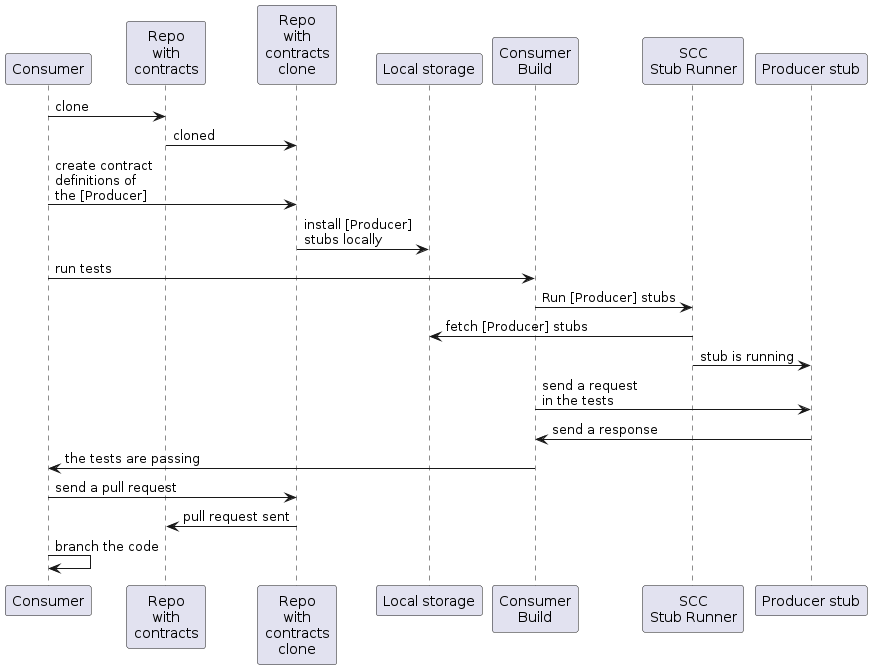
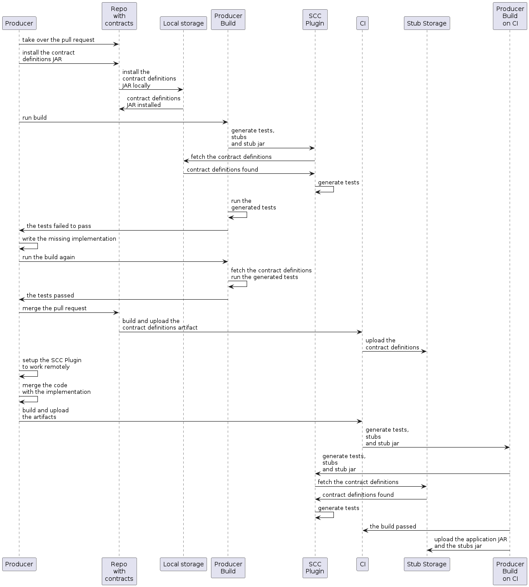

<script>defaultLanguages = ['maven']</script>

---

이번에는 컨슈머 주도로 명세<sup>Consumer Driven Contract</sup>를 테스트한다. 명세<sup>contract</sup> 정의는 별도 레포지토리에 저장한다.

### 목차

- [2.4.1. 사전 준비](#241-prerequisites)
- [2.4.2. 컨슈머 플로우](#242-consumer-flow)
- [2.4.3. 프로듀서 플로우](#243-producer-flow)

### 2.4.1 Prerequisites

외부 레포지토리에 명세<sup>contract</sup>를 보관하면서, 컨슈머 주도 명세<sup>consumer-driven contract</sup> 방식을 따르려면, 다음과 같은 git 레포지토리를 세팅해야 한다:

- 각 프로듀서<sup>producer</sup>에 대한 모든 명세<sup>contract</sup>를 정의하고 있다.
- 명세<sup>contract</sup> 정의를 JAR로 패키징할 수 있다.
- 모든 프로듀서<sup>producer</sup>에 대해, Spring Cloud Contract 플러그인(SCC 플러그인)으로 로컬에 스텁<sup>stub</sup>을 설치하는 방법을 포함하고 있다 (e.g. `pom.xml`).

이러한 레포지토리를 설정하는 방법은 [How To 섹션](../how-to-common-repo-with-contracts/)에서 자세히 다루고 있다. 관련 프로젝트 샘플은 [이곳](https://github.com/spring-cloud-samples/spring-cloud-contract-samples/tree/main/beer_contracts)을 참고해라.

그외 Spring Cloud Contract Stub Runner를 설정해둔 컨슈머<sup>consumer</sup> 코드도 필요하다. 샘플 코드는 [이곳](https://github.com/spring-cloud-samples/spring-cloud-contract-samples/tree/main/consumer)을 참고해라. 마찬가지로, Spring Cloud Contract와 플러그인을 설정한 프로듀서<sup>producer</sup> 코드도 함께 필요하다. 샘플 프로젝트는 [여기](https://github.com/spring-cloud-samples/spring-cloud-contract-samples/tree/main/producer_with_external_contracts)를 참고해라. 스텁<sup>stub</sup> 저장소로는 Nexus나 Artifactory를 활용한다.

큰 틀에서의 흐름은 다음과 같다:

1. 컨슈머<sup>consumer</sup>는 별도 레포지토리에 있는 명세<sup>contract</sup> 정의를 가지고 작업을 시작한다.
2. 컨슈머<sup>consumer</sup>의 작업이 끝나면, 컨슈머<sup>consumer</sup> 측에서 작업 코드가 포함된 브랜치를 생성하고, 명세<sup>contract</sup> 정의를 가지고 있는 별도 레포지토리에 풀 리퀘스트를 생성한다.
3. 프로듀서<sup>producer</sup>는 명세<sup>contract</sup> 정의를 가지고 있는 별도 레포지토리의 풀 리퀘스트를 넘겨받아, 모든 명세<sup>contract</sup>가 포함된 JAR를 로컬에 설치한다.
4. 프로듀서<sup>producer</sup>는 로컬에 저장된 JAR로 테스트를 자동 생성하고, 테스트를 통과시키기 위해 필요한 코드를 작성한다.
5. 프로듀서<sup>producer</sup>의 작업이 완료되면, 명세<sup>contract</sup> 정의를 가지고 있는 레포지토리의 풀 리퀘스트를 머지한다.
6. CI 도구로 명세<sup>contract</sup> 정의를 가지고 있는 레포지토리를 빌드하고, 명세<sup>contract</sup> 정의가 포함된 JAR를 Nexus나 Artifactory에 업로드하고 나면, 프로듀서<sup>producer</sup>는 해당 브랜치를 머지할 수 있다.
7. 마지막으로, 컨슈머<sup>consumer</sup>는 온라인 작업 모드로 전환해서 원격에서 프로듀서<sup>producer</sup>의 스텁<sup>stub</sup>을 가져올 수 있으며, 이 시점에 브랜치를 master에 병합한다.

### 2.4.2. Consumer Flow

컨슈머<sup>consumer</sup>는:

1. 프로듀서<sup>producer</sup>로 요청을 전송하는 테스트를 작성한다.<br>
테스트는 현재 서버가 준비되지 않아 실패한다.
   
2. 명세<sup>contract</sup> 정의를 가지고 있는 레포지토리를 클론받는다.

3. 프로듀서<sup>producer</sup>의 하위 경로에 컨슈머<sup>consumer</sup> 이름으로 폴더를 만들고, 요구 사항을 명세<sup>contract</sup>로 작성한다.<br>
예를 들어, 프로듀서<sup>producer</sup>의 이름이 `producer`, 컨슈머<sup>consumer</sup>의 이름이 `consumer`인 경우, `src/main/resources/contracts/producer/consumer/` 아래에 명세<sup>contract</sup>를 저장한다.)

4. 명세<sup>contract</sup>를 다 정의했다면, 다음과 같이 로컬 저장소에 프로듀서<sup>producer</sup> 스텁<sup>stub</sup>을 설치한다:

   ```bash
   $ cd src/main/resource/contracts/producer
   $ ./mvnw clean install
   ```

5. 다음을 위해 컨슈머<sup>consumer</sup> 테스트에 Spring Cloud Contract (SCC) Stub Runner를 세팅한다:

   - 로컬 저장소에서 프로듀서<sup>producer</sup> 스텁<sup>stub</sup>을 가져온다.
   - stubs-per-consumer 모드를 켠다 (컨슈머 주도 명세<sup>consumer-driven contract</sup> 모드가 활성화된다).<br><br>
     이때 SCC Stub Runner가 하는 일은 다음과 같다:
   - 프로듀서<sup>producer</sup> 스텁<sup>stub</sup>을 가져온다.
   - 프로듀서<sup>producer</sup> 스텁<sup>stub</sup>으로 인메모리 HTTP 서버 스텁<sup>stub</sup>을 실행한다. 이제 테스트에서는 이 HTTP 서버 스텁<sup>stub</sup>과 통신할 수 있고 테스트가 통과한다.
   - 명세<sup>contract</sup> 정의를 가지고 있는 레포지토리에, 프로듀서<sup>producer</sup>를 위해 새로 작성한 명세<sup>contract</sup>로 풀 리퀘스트를 생성한다.
   - 프로듀서<sup>producer</sup> 팀이 별도 코드를 병합할 때까지 컨슈머<sup>consumer</sup> 코드가 작성된 브랜치를 유지한다.

다음은 컨슈머<sup>consumer</sup>의 흐름을 정리한 UML 다이어그램이다:

{: .center-image }

### 2.4.3. Producer Flow

프로듀서<sup>producer</sup>는:

1. 명세<sup>contract</sup> 정의가 포함된 풀 리퀘스트를 넘겨받는다. 커맨드라인에서 아래 명령어를 입력하면 된다

   ```bash
   $ git checkout -b the_branch_with_pull_request master
   git pull https://github.com/user_id/project_name.git the_branch_with_pull_request
   ```

2. 다음과 같이 명세<sup>contract</sup> 정의를 설치한다

   ```bash
   $ ./mvnw clean install
   ```

3. 다음과 같이 플러그인을 설정해서 `src/test/resources/contracts`가 아닌 JAR에서 명세<sup>contract</sup> 정의를 가져오도록 만든다:

    <div class="switch-language-wrapper maven gradle">
    <span class="switch-language maven">Maven</span>
    <span class="switch-language gradle">Gradle</span>
    </div>
    <div class="language-only-for-maven maven gradle"></div>
    ```xml
    <plugin>
        <groupId>org.springframework.cloud</groupId>
        <artifactId>spring-cloud-contract-maven-plugin</artifactId>
        <version>${spring-cloud-contract.version}</version>
        <extensions>true</extensions>
        <configuration>
            <!-- We want to use the JAR with contracts with the following coordinates -->
            <contractDependency>
                <groupId>com.example</groupId>
                <artifactId>beer-contracts</artifactId>
            </contractDependency>
            <!-- The JAR with contracts should be taken from Maven local -->
            <contractsMode>LOCAL</contractsMode>
            <!-- ... additional configuration -->
        </configuration>
    </plugin>
    ```
    <div class="language-only-for-gradle maven gradle"></div>
    ```groovy
    contracts {
        // We want to use the JAR with contracts with the following coordinates
        // group id `com.example`, artifact id `beer-contracts`, LATEST version and NO classifier
        contractDependency {
            stringNotation = 'com.example:beer-contracts:+:'
        }
        // The JAR with contracts should be taken from Maven local
        contractsMode = "LOCAL"
        // Additional configuration
    }
    ```

4. 다음과 같이 빌드를 실행해서 테스트와 스텁<sup>stub</sup>을 생성한다:

    <div class="switch-language-wrapper maven gradle">
    <span class="switch-language maven">Maven</span>
    <span class="switch-language gradle">Gradle</span>
    </div>
    <div class="language-only-for-maven maven gradle"></div>
    ```bash
    ./mvnw clean install
    ```
    <div class="language-only-for-gradle maven gradle"></div>
    ```bash
    ./gradlew clean build
    ```

5. 테스트가 통과할 수 있도록, 필요한 로직을 구현한다.

6. 다음과 같이 명세<sup>contract</sup> 정의를 가지고 있는 레포지토리에 풀 리퀘스트를 병합한다:

   ```bash
   $ git commit -am "Finished the implementation to make the contract tests pass"
   $ git checkout master
   $ git merge --no-ff the_branch_with_pull_request
   $ git push origin master
   ```

   이 CI 시스템은 명세<sup>contract</sup> 정의를 가지고 있는 프로젝트를 빌드하고, 이 명세<sup>contract</sup> 정의가 포함된 JAR를 Nexus나 Artifactory에 업로드한다.
   
7. 리모트 모드로 전환한다.

8. 다음과 같이 플러그인을 설정해서 로컬 스토리지가 아닌 원격 저장소에서 명세<sup>contract</sup> 정의를 가져오도록 만든다:

    <div class="switch-language-wrapper maven gradle">
    <span class="switch-language maven">Maven</span>
    <span class="switch-language gradle">Gradle</span>
    </div>
    <div class="language-only-for-maven maven gradle"></div>
    ```xml
    <plugin>
        <groupId>org.springframework.cloud</groupId>
        <artifactId>spring-cloud-contract-maven-plugin</artifactId>
        <version>${spring-cloud-contract.version}</version>
        <extensions>true</extensions>
        <configuration>
            <!-- We want to use the JAR with contracts with the following coordinates -->
            <contractDependency>
                <groupId>com.example</groupId>
                <artifactId>beer-contracts</artifactId>
            </contractDependency>
            <!-- The JAR with contracts should be taken from a remote location -->
            <contractsMode>REMOTE</contractsMode>
            <!-- ... additional configuration -->
        </configuration>
    </plugin>
    ```
    <div class="language-only-for-gradle maven gradle"></div>
    ```groovy
    contracts {
        // We want to use the JAR with contracts with the following coordinates
        // group id `com.example`, artifact id `beer-contracts`, LATEST version and NO classifier
        contractDependency {
            stringNotation = 'com.example:beer-contracts:+:'
        }
        // The JAR with contracts should be taken from a remote location
        contractsMode = "REMOTE"
        // Additional configuration
    }
    ```

9. 새 로직을 추가한 프로듀서<sup>producer</sup> 코드를 병합한다.

10. 이 CI 시스템은:

    - 프로젝트를 빌드한다.
    - 테스트와 스텁<sup>stub</sup>, 스텁<sup>stub</sup> JAR를 생성한다.
    - 애플리케이션과 스텁<sup>stub</sup> 아티팩트를 Nexus나 Artifactory에 업로드한다.

다음은 프로듀서<sup>producer</sup>의 진행 과정을 정리한 UML 다이어그램이다:

{: .center-image }
