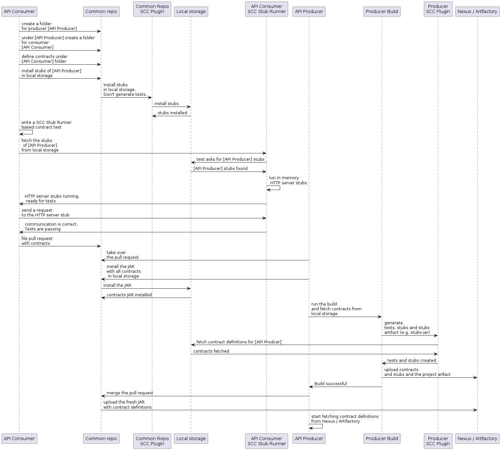

---

명세<sup>contract</sup>를 프로듀서<sup>producer</sup> 코드와 함께 보관하고 싶지 않다면, 공통 저장소에 보관하는 방법이 있다. 간혹 보안 이슈로 별도로 보관해야만 하는 상황이 있을 수도 있다 (컨슈머<sup>consumer</sup>가 프로듀서<sup>producer</sup>의 코드를 클론받을 수 없다던지). 또한 명세<sup>contract</sup>를 한 곳에 보관하면, 프로듀서<sup>producer</sup>는 컨슈머<sup>consumer</sup> 수가 얼마나 되는지, 로컬의 변경사항으로 어떤 컨슈머<sup>consumer</sup>의 빌드가 깨지게 되는지 팍악할 수 있다.

### 목차

- [7.5.1. 레포지토리 구조](#751-repo-structure)
- [7.5.2. 워크플로우](#752-workflow)
- [7.5.3. 컨슈머](#753-consumer)
- [7.5.4. 프로듀서](#754-producer)
- [7.5.5. 프로듀서 단위가 아닌 토픽 단위로 메시지 처리 컨트랙트를 정의하려면 어떻게 해야 하나요?](#755-how-can-i-define-messaging-contracts-per-topic-rather-than-per-producer)
  + [메이븐 프로젝트](#for-maven-projects)
  + [그래들 프로젝트](#for-gradle-projects)

### 7.5.1. Repo Structure

`com.example:server`를 쓰는 프로듀서<sup>producer</sup>와 `client1`, `client2`, `client3`라는 세 컨슈머<sup>consumer</sup>가 있다고 가정해보자. 그런 다음, 공통 명세<sup>contract</sup>를 보관하고 있는 레포지토리는 아래와 같은 구조로 세팅할 수 있다 ([Spring Cloud Contract의 샘플 레포지토리](https://github.com/spring-cloud-samples/spring-cloud-contract-samples)를 체크아웃받으면 하위 폴더 `standalone/contracts`에서 확인할 수 있다):

```bash
├── com
│   └── example
│       └── server
│           ├── client1
│           │   └── expectation.groovy
│           ├── client2
│           │   └── expectation.groovy
│           ├── client3
│           │   └── expectation.groovy
│           └── pom.xml
├── mvnw
├── mvnw.cmd
├── pom.xml
└── src
    └── assembly
        └── contracts.xml
```

`groupid/artifact id`를 슬래시로 구분해서 구성한 폴더 아래에는 (`com/example/server`), 세 컨슈머<sup>consumer</sup>(`client1`, `client2`, `client3`)가 기대하는 스펙이 담겨있다. 기대하는 스펙이라 함은, 이 문서에서 폭넓게 다룬 표준 Groovy DSL 명세<sup>contract</sup> 파일이다. 이 레포지토리에선 레포지토리 내 컨텐츠에 일대일로 매핑되는 JAR 파일을 생성해야 한다.

다음은 `server` 폴더 안에 있는 `pom.xml` 파일 예시다:

```xml
<?xml version="1.0" encoding="UTF-8"?>
<project xmlns:xsi="http://www.w3.org/2001/XMLSchema-instance"
         xmlns="http://maven.apache.org/POM/4.0.0"
         xsi:schemaLocation="http://maven.apache.org/POM/4.0.0 https://maven.apache.org/xsd/maven-4.0.0.xsd">
    <modelVersion>4.0.0</modelVersion>

    <groupId>com.example</groupId>
    <artifactId>server</artifactId>
    <version>0.0.1</version>

    <name>Server Stubs</name>
    <description>POM used to install locally stubs for consumer side</description>

    <parent>
        <groupId>org.springframework.boot</groupId>
        <artifactId>spring-boot-starter-parent</artifactId>
        <version>3.0.9</version>
        <relativePath/>
    </parent>

    <properties>
        <project.build.sourceEncoding>UTF-8</project.build.sourceEncoding>
        <java.version>17</java.version>
        <spring-cloud-contract.version>4.0.5-SNAPSHOT</spring-cloud-contract.version>
        <excludeBuildFolders>true</excludeBuildFolders>
    </properties>

    <build>
        <plugins>
            <plugin>
                <groupId>org.springframework.cloud</groupId>
                <artifactId>spring-cloud-contract-maven-plugin</artifactId>
                <version>${spring-cloud-contract.version}</version>
                <extensions>true</extensions>
                <configuration>
                    <!-- By default it would search under src/test/resources/ -->
                    <contractsDirectory>${project.basedir}</contractsDirectory>
                </configuration>
            </plugin>
        </plugins>
    </build>

    <repositories>
        <repository>
            <id>spring-snapshots</id>
            <name>Spring Snapshots</name>
            <url>https://repo.spring.io/snapshot</url>
            <snapshots>
                <enabled>true</enabled>
            </snapshots>
        </repository>
        <repository>
            <id>spring-milestones</id>
            <name>Spring Milestones</name>
            <url>https://repo.spring.io/milestone</url>
            <snapshots>
                <enabled>false</enabled>
            </snapshots>
        </repository>
        <repository>
            <id>spring-releases</id>
            <name>Spring Releases</name>
            <url>https://repo.spring.io/release</url>
            <snapshots>
                <enabled>false</enabled>
            </snapshots>
        </repository>
    </repositories>
    <pluginRepositories>
        <pluginRepository>
            <id>spring-snapshots</id>
            <name>Spring Snapshots</name>
            <url>https://repo.spring.io/snapshot</url>
            <snapshots>
                <enabled>true</enabled>
            </snapshots>
        </pluginRepository>
        <pluginRepository>
            <id>spring-milestones</id>
            <name>Spring Milestones</name>
            <url>https://repo.spring.io/milestone</url>
            <snapshots>
                <enabled>false</enabled>
            </snapshots>
        </pluginRepository>
        <pluginRepository>
            <id>spring-releases</id>
            <name>Spring Releases</name>
            <url>https://repo.spring.io/release</url>
            <snapshots>
                <enabled>false</enabled>
            </snapshots>
        </pluginRepository>
    </pluginRepositories>

</project>
```

잘 보면 Spring Cloud Contract Maven 플러그인 외에는 의존성이 없다. 이런 `pom.xml` 파일은, 컨슈머<sup>consumer</sup> 쪽에서 `mvn clean install -DskipTests`를 실행해 로컬에 프로듀서<sup>producer</sup> 프로젝트의 스텁<sup>stub</sup>을 설치하는 데 필요하다.

루트 폴더에 있는 `pom.xml` 파일은 다음과 같다:

```xml
<?xml version="1.0" encoding="UTF-8"?>
<project xmlns:xsi="http://www.w3.org/2001/XMLSchema-instance"
         xmlns="http://maven.apache.org/POM/4.0.0"
         xsi:schemaLocation="http://maven.apache.org/POM/4.0.0 https://maven.apache.org/xsd/maven-4.0.0.xsd">
    <modelVersion>4.0.0</modelVersion>

    <groupId>com.example.standalone</groupId>
    <artifactId>contracts</artifactId>
    <version>0.0.1</version>

    <name>Contracts</name>
    <description>Contains all the Spring Cloud Contracts, well, contracts. JAR used by the
        producers to generate tests and stubs
    </description>

    <properties>
        <project.build.sourceEncoding>UTF-8</project.build.sourceEncoding>
    </properties>

    <build>
        <plugins>
            <plugin>
                <groupId>org.apache.maven.plugins</groupId>
                <artifactId>maven-assembly-plugin</artifactId>
                <executions>
                    <execution>
                        <id>contracts</id>
                        <phase>prepare-package</phase>
                        <goals>
                            <goal>single</goal>
                        </goals>
                        <configuration>
                            <attach>true</attach>
                            <descriptor>${basedir}/src/assembly/contracts.xml</descriptor>
                            <!-- If you want an explicit classifier remove the following line -->
                            <appendAssemblyId>false</appendAssemblyId>
                        </configuration>
                    </execution>
                </executions>
            </plugin>
        </plugins>
    </build>

</project>
```

여기서는 assembly 플러그인을 사용해 모든 명세<sup>contract</sup>가 포함된 JAR를 빌드한다. 다음은 assembly 플러그인 관련 설정 예시다:

```xml
<assembly xmlns:xsi="http://www.w3.org/2001/XMLSchema-instance"
          xmlns="http://maven.apache.org/plugins/maven-assembly-plugin/assembly/1.1.3"
          xsi:schemaLocation="http://maven.apache.org/plugins/maven-assembly-plugin/assembly/1.1.3 https://maven.apache.org/xsd/assembly-1.1.3.xsd">
    <id>project</id>
    <formats>
        <format>jar</format>
    </formats>
    <includeBaseDirectory>false</includeBaseDirectory>
    <fileSets>
        <fileSet>
            <directory>${project.basedir}</directory>
            <outputDirectory>/</outputDirectory>
            <useDefaultExcludes>true</useDefaultExcludes>
            <excludes>
                <exclude>**/${project.build.directory}/**</exclude>
                <exclude>mvnw</exclude>
                <exclude>mvnw.cmd</exclude>
                <exclude>.mvn/**</exclude>
                <exclude>src/**</exclude>
            </excludes>
        </fileSet>
    </fileSets>
</assembly>
```

### 7.5.2. Workflow

이 워크플로에서는 컨슈머<sup>consumer</sup>와 프로듀서<sup>producer</sup> 모두 Spring Cloud Contract를 세팅했다고 가정한다. 또한 명세<sup>contract</sup>를 보관하고 있는 공통 레포지토리에 적절한 플러그인을 설정했다고 가정한다. 공통 레포지토리에 설정한 CI job에서는 모든 명세<sup>contract</sup> 아티팩트를 빌드하고 Nexus나 Artifactory에 업로드한다. 다음은 이 워크플로우의 UML을 나타낸 이미지다:

{: .center-image }

### 7.5.3. Consumer

컨슈머<sup>consumer</sup>의 명세<sup>contract</sup> 작업을 오프라인에서 하고 싶다면, 프로듀서<sup>producer</sup> 코드가 아닌 공통 레포지토리를 클론받고, 필요한 프로듀서 폴더로 이동해서 (e.g. `com/example/server`) `mvn clean install -DskipTests`를 실행해 로컬에 명세<sup>contract</sup>로 만든 스텁<sup>stub</sup>을 설치한다.

> [로컬에 메이븐이 설치](https://maven.apache.org/download.cgi)되어 있어야 한다.

### 7.5.4. Producer

프로듀서<sup>producer</sup>는 다음과 같이 Spring Cloud Contract Verifier 설정을 변경해서 명세<sup>contract</sup>를 보관하고 있는 URL과 명세<sup>contract</sup>가 포함된 JAR의 의존성을 제공할 수 있다:

```xml
<plugin>
	<groupId>org.springframework.cloud</groupId>
	<artifactId>spring-cloud-contract-maven-plugin</artifactId>
	<configuration>
		<contractsMode>REMOTE</contractsMode>
		<contractsRepositoryUrl>
			https://link/to/your/nexus/or/artifactory/or/sth
		</contractsRepositoryUrl>
		<contractDependency>
			<groupId>com.example.standalone</groupId>
			<artifactId>contracts</artifactId>
		</contractDependency>
	</configuration>
</plugin>
```

이렇게 설정하면 `link/to/your/nexus/or/artifactory/or/sth`에서 `groupid`는 `com.example.standalone`, `artifactid`는 `contracts`인 JAR를 다운로드한다. 그런 다음 로컬 임시 폴더에 압축을 풀고, `com/example/server`에 있는 명세<sup>contract</sup>로 테스트와 스텁<sup>stub</sup>을 생성한다. 이 컨벤션 덕분에, 프로듀서<sup>producer</sup> 팀은 호환되지 않는 변경사항이 생기면 어떤 컨슈머<sup>consumer</sup> 쪽에서 빌드가 깨지는지 미리 알 수 있다.

나머지 플로우는 동일하다.

### 7.5.5. How Can I Define Messaging Contracts per Topic Rather than per Producer?

여러 프로듀서<sup>producer</sup>가 하나의 토픽에 메시지를 발행할 시, 공통 저장소에 메시지 처리 관련 명세<sup>contract</sup>를 작성하다보면 같은 명세<sup>contract</sup>가 중복될 수 있다. 이를 방지하려면, 기존 REST 명세<sup>contract</sup>는 프로듀서<sup>producer</sup>별 폴더에 배치하고, 메시지 처리 명세<sup>contract</sup>는 토픽별 폴더에 배치하면 된다.

#### For Maven Projects

프로듀서<sup>producer</sup> 측에서 작업할 수 있도록, 관심 있는 토픽에 따라 공통 저장소 jar 파일을 필터링하기 위한 포함<sup>inclusion</sup> 패턴을 지정해야 한다. 이땐 Maven Spring Cloud Contract 플러그인의 `includedFiles` 프로퍼티를 사용하면 된다. 또한 디폴트 `contractsPath`는 공통 레포지토리의 `groupid/artifactid`이므로 변경해줘야 한다. 다음은 Spring Cloud Contract를 위한 Maven 플러그인 설정 예시다:

```xml
<plugin>
   <groupId>org.springframework.cloud</groupId>
   <artifactId>spring-cloud-contract-maven-plugin</artifactId>
   <version>${spring-cloud-contract.version}</version>
   <configuration>
      <contractsMode>REMOTE</contractsMode>
      <contractsRepositoryUrl>https://link/to/your/nexus/or/artifactory/or/sth</contractsRepositoryUrl>
      <contractDependency>
         <groupId>com.example</groupId>
         <artifactId>common-repo-with-contracts</artifactId>
         <version>+</version>
      </contractDependency>
      <contractsPath>/</contractsPath>
      <baseClassMappings>
         <baseClassMapping>
            <contractPackageRegex>.*messaging.*</contractPackageRegex>
            <baseClassFQN>com.example.services.MessagingBase</baseClassFQN>
         </baseClassMapping>
         <baseClassMapping>
            <contractPackageRegex>.*rest.*</contractPackageRegex>
            <baseClassFQN>com.example.services.TestBase</baseClassFQN>
         </baseClassMapping>
      </baseClassMappings>
      <includedFiles>
         <includedFile>**/${project.artifactId}/**</includedFile>
         <includedFile>**/${first-topic}/**</includedFile>
         <includedFile>**/${second-topic}/**</includedFile>
      </includedFiles>
   </configuration>
</plugin>
```

> 위 Maven 플러그인 설정을 꼭 그대로 쓸 필요는 없다. “일반적인” 예시라기보다는 설명을 위해 포함시킨 설정도 많다.

#### For Gradle Projects

그래들로 프로젝트를 빌드하려면:

1. 다음과 같이 공통 레포지토리 의존성을 위한 설정을 커스텀한다:

   ```groovy
   ext {
       contractsGroupId = "com.example"
       contractsArtifactId = "common-repo"
       contractsVersion = "1.2.3"
   }
   
   configurations {
       contracts {
           transitive = false
       }
   }
   ```

2. 다음과 같이 클래스패스에 공통 레포지토리 의존성을 추가한다:

   ```groovy
   dependencies {
       contracts "${contractsGroupId}:${contractsArtifactId}:${contractsVersion}"
       testCompile "${contractsGroupId}:${contractsArtifactId}:${contractsVersion}"
   }
   ```

3. 적당한 폴더에 의존성을 다운로드한다:

   ```groovy
   task getContracts(type: Copy) {
       from configurations.contracts
       into new File(project.buildDir, "downloadedContracts")
   }
   ```

4. JAR의 압축을 해제한다:

   ```groovy
   task unzipContracts(type: Copy) {
       def zipFile = new File(project.buildDir, "downloadedContracts/${contractsArtifactId}-${contractsVersion}.jar")
       def outputDir = file("${buildDir}/unpackedContracts")
   
       from zipTree(zipFile)
       into outputDir
   }
   ```

5. 사용하지 않는 명세<sup>contract</sup>를 정리한다:

   ```groovy
   task deleteUnwantedContracts(type: Delete) {
       delete fileTree(dir: "${buildDir}/unpackedContracts",
           include: "**/*",
           excludes: [
               "**/${project.name}/**"",
               "**/${first-topic}/**",
               "**/${second-topic}/**"])
   }
   ```

6. 태스크 의존성을 생성한다:

   ```groovy
   unzipContracts.dependsOn("getContracts")
   deleteUnwantedContracts.dependsOn("unzipContracts")
   build.dependsOn("deleteUnwantedContracts")
   ```

7. 플러그인 설정에 `contractsDslDir` 프로퍼티를 추가해 명세<sup>contract</sup>가 포함된 디렉토리를 지정한다:

   ```groovy
   contracts {
       contractsDslDir = new File("${buildDir}/unpackedContracts")
   }
   ```