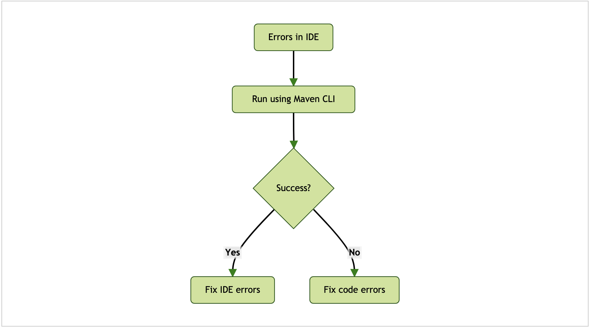
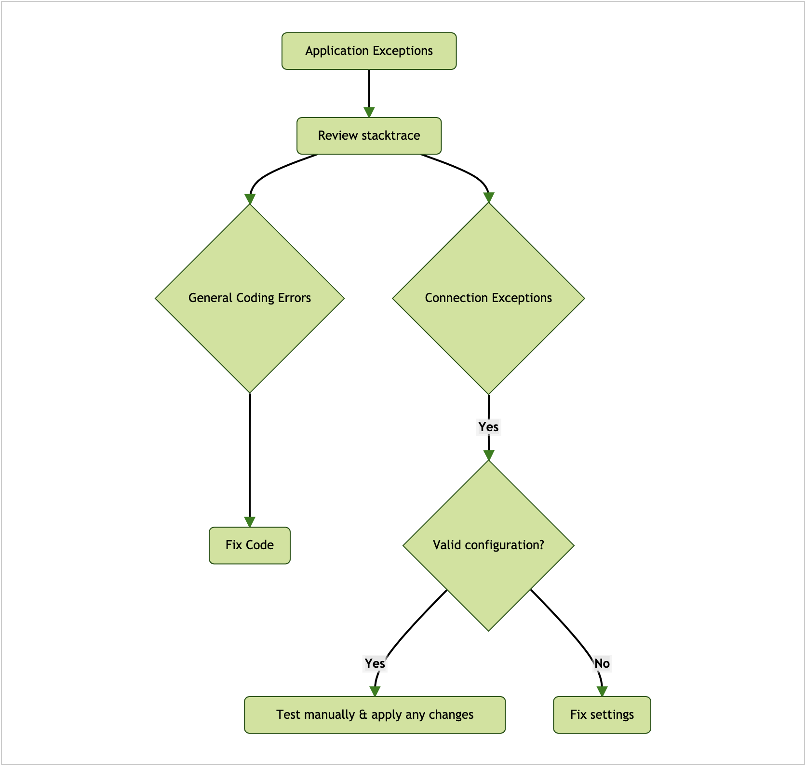
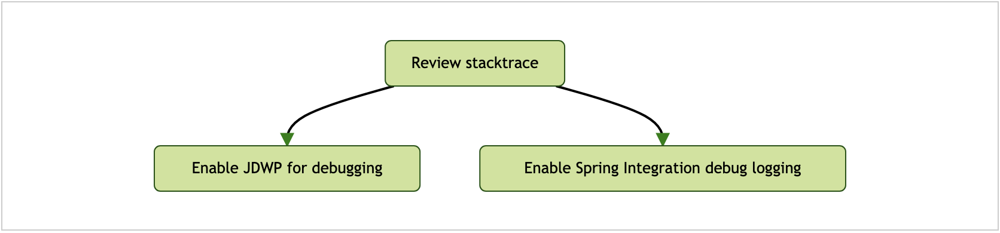
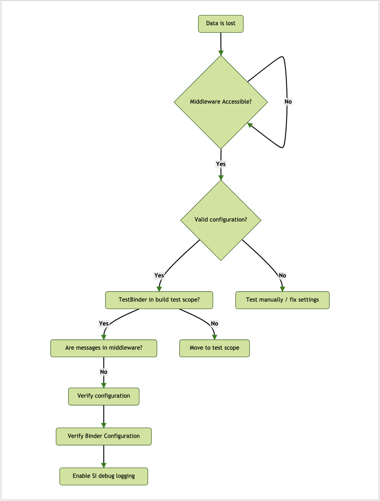
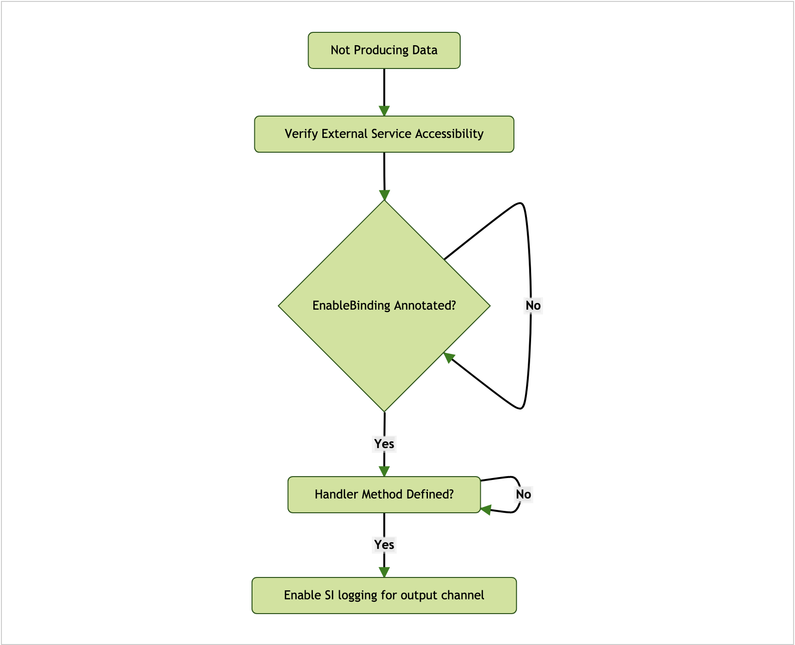
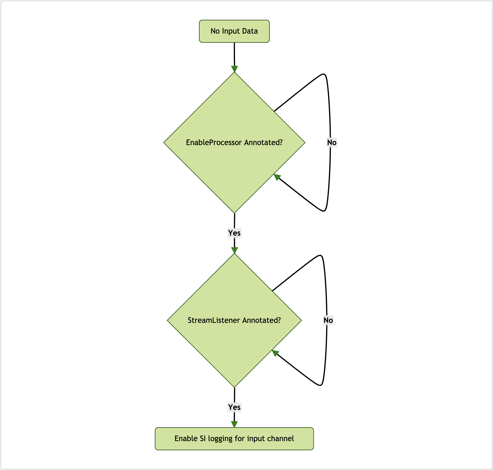
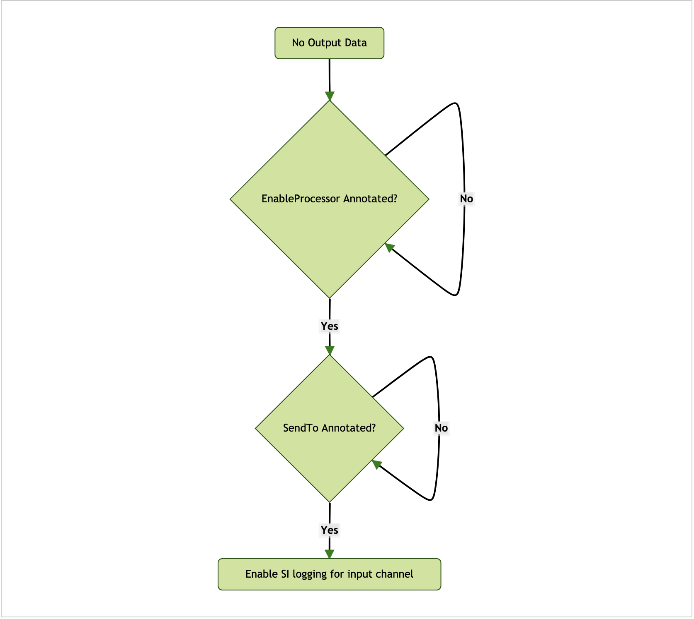
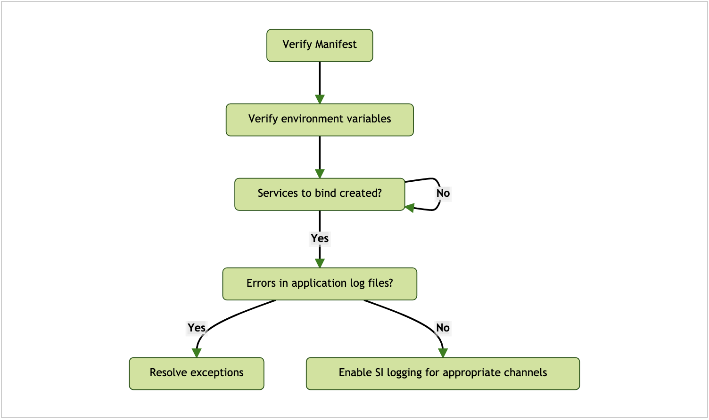
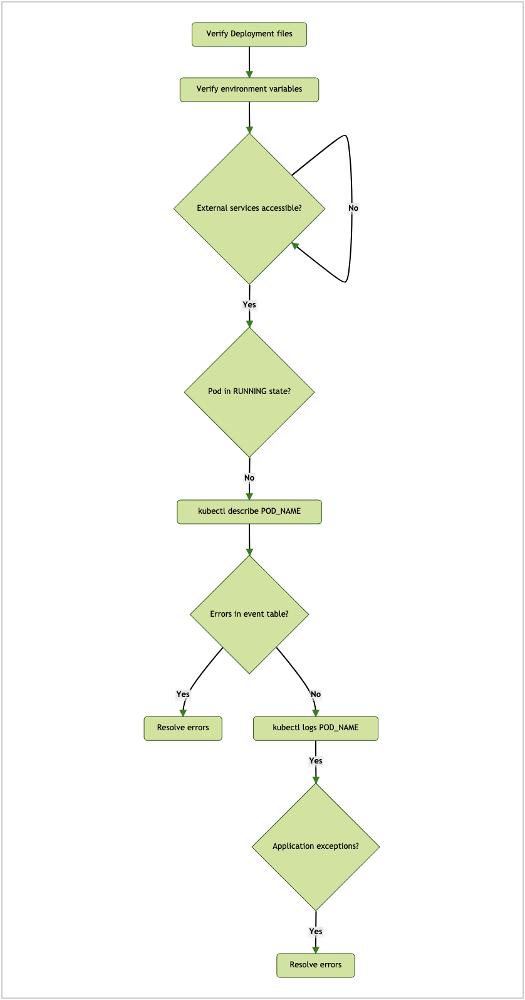
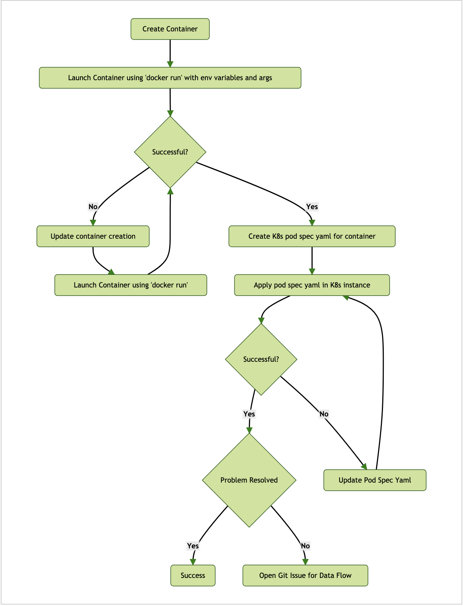

---

애플리케이션은 표준 자바 JAR로 실행할 수 있어야 하며, `java -jar`로 호출할 수 있어야 한다. 모든 의존성(데이터베이스와 메세징 미들웨어 등)을 사용할 수 있어야 하며, 커넥션 이슈는 직접 테스트해야 한다. 애플리케이션 실행과 디버깅은 SCDF를 사용해 플랫폼에 배포하고 실행하는 것과는 별개다.

### 목차

- [Project Build Errors](#project-build-errors)
- [Application Startup Exceptions](#application-startup-exceptions)
- [General Application Debugging](#general-application-debugging)
- [Data Loss](#data-loss)
- [Sources](#sources)
- [Processors - Input](#processors---input)
- [Processors - Output](#processors---output)
- [Sinks](#sinks)
- [Debugging Cloud Foundry Deployments](#debugging-cloud-foundry-deployments)
- [Debugging Kubernetes Deployments](#debugging-kubernetes-deployments)
  + [Containers](#containers)

---

## Project Build Errors

다음은 빌드 에러 시 필요한 전형적인 디버깅 프로세스를 나타낸 다이어그램이다:



IDE에서 발생한 에러를 수정하는 방법은 사용하는 IDE에 따라 다르다. IDE 밖에서 빌드에 성공하는지를 확인하면 프로젝트에서 발생하는 문제를 쳐낼 수 있다.

---

## Application Startup Exceptions

다음은 애플리케이션 기동 시 예외가 발생했을 때 필요한 전형적인 디버깅 프로세스를 나타낸 다이어그램이다:



애플리케이션을 기동할 땐 일반적인 코딩 에러나 커넥션 이슈로 예외가 발생할 수 있다. 애플리케이션 로그 파일을 검토해서 예외를 찾아 적절히 수정해라. 모든 외부 서비스에 연결할 수 있는지, 올바른 credential을 제공했는지, 기타 다른 필요한 정보 중에 문제는 없는지 확인해봐라.

---

## General Application Debugging

아래 다이어그램은 일반적인 애플리케이션 디버깅을 위한 전형적인 디버깅 프로세스다:



애플리케이션은 일반적인 자바 프로세스로 디버깅할 수 있으며, 로그 레벨을 DEBUG로 설정해 상세 로그를 출력하는 것도 가능하다.

디버거를 이용해 애플리케이션을 디버깅하려면, 애플리케이션을 기동할 때 다음과 같이 필요한 JVM 인자를 추가해라 (값은 예시로 추가해뒀다):

```sh
-agentlib:jdwp=transport=dt_socket,server=y,suspend=y,address=5005
```

이 파라미터를 추가하면 애플리케이션은 디버거가 `5005` 포트에 연결돼 디버깅을 시작할 수 있을 때까지 기다린다. 포트는 이미 사용하고 있지 않는 포트를 선택하면 된다.

DEBUG 레벨 로그를 활성화하는 것도 유용하다. 관심 패키지 중 하나는 SI<sup>Spring Integration</sup> `org.springframework.integration`이다. 이 패키지에 디버그 로그를 활성화하려면 애플리케이션을 기동할 때 아래 JVM 인자를 추가해라:

```sh
-Dlogging.level.org.springframework.integration=DEBUG
```

---

## Data Loss

다음은 데이터 유실 시 필요한 전형적인 디버깅 프로세스를 나타낸 다이어그램이다:



소스, 프로세서, 싱크는 선택한 미들웨어를 위한 `Binder` 인스턴스를 통해 통신한다. 미들웨어가 잘 떠있는지, 모든 설정이 올바른지 확인해봐라. 설정에는 credential, 큐/토픽 이름, 호스트와 기타 세부 정보들이 담겨있다. 프로젝트의 클래스패스에 바인더 의존성이 포함되어 있지 않으면 기본적으로 `TestBinder`를 사용한다.

---

## Sources

다음은 소스에서 문제가 발생했을 때 필요한 전형적인 디버깅 프로세스를 나타낸 다이어그램이다:



소스는 입력에서 데이터를 받아 다운스트림 처리를 위한 출력 채널로 전송한다. 적절한 클래스 레벨 어노테이션(`@EnableBinding(Source.class)`)을 선언했는지, 핸들러 메소드를 구현했는지 확인해봐라. 핸들러 메소드는 `Source.OUTPUT`의 출력 채널을 사용해야 한다.

---

## Processors - Input

다음은 프로세서에 입력을 전달하는 데 문제가 발생했을 시 필요한 전형적인 디버깅 프로세스를 나타낸 다이어그램이다:



프로세서는 데이터를 받아 추가 다운스트림 처리를 위해 해당 데이터를 조작해서 반환한다. 적절한 클래스 레벨 어노테이션(`@EnableBinding(Processor.class)`)을 선언했는지, 핸들러 메소드를 구현했는지 확인해봐라. 핸들러 메소드는 `Source.INPUT`의 입력 채널을 사용해야 한다.

---

## Processors - Output

다음은 프로세서의 출력에 문제가 발생했을 때 필요한 전형적인 디버깅 프로세스를 나타낸 다이어그램이다:



프로세서는 데이터를 받아 추가 다운스트림 처리를 위해 해당 데이터를 처리해서 반환한다. 적절한 클래스 레벨 어노테이션(`@EnableBinding(Processor.class)`)을 선언했는지, 핸들러 메소드를 구현했는지 확인해봐라. 핸들러 메소드는 `Source.OUTPUT`의 출력 채널을 사용해야 한다.

---

## Sinks

다음은 싱크를 위한 전형적인 디버깅 프로세스를 나타낸 다이어그램이다:


싱크는 입력 채널에서 데이터를 받아 이 데이터로 특정한 일을 수행한다 (데이터를 외부 저장소에 저장하는 등). 적절한 클래스 레벨 어노테이션(`@EnableBinding(Sink.class)`)을 선언했는지, 핸들러 메소드를 구현했는지 확인해봐라. 핸들러 메소드는 `Source.INPUT`의 출력 채널을 사용해야 한다.

---

## Debugging Cloud Foundry Deployments

다음은 클라우드 파운드리 배포 과정에서 필요한 전형적인 디버깅 프로세스를 나타낸 다이어그램이다:



애플리케이션이 로컬에선 실행되지만 클라우드 파운드리에 배포할 땐 실패한다면, 먼저 배포 매니페스트(`manifest.yml`)에 문제가 없는지 살펴봐라. 이 파일에는 반드시 설정해야 하는 환경 변수, 바인딩할 서비스, 이 서비스들의 생성 여부가 담겨 있다. 애플리케이션 기동 로그에서 해결해야 할 예외가 있는지 찾아봐라.

---

## Debugging Kubernetes Deployments

다음은 쿠버네티스 배포 과정에서 필요한 전형적인 디버깅 프로세스를 나타낸 다이어그램이다:



애플리케이션이 로컬에선 실행되지만 쿠버네티스에 배포할 땐 실패한다면, 먼저 deployment 파일에 문제가 없는지 살펴봐라. 이 파일에는 반드시 설정해야 하는 환경 변수, 서비스가 연결되는 프로퍼티, 이 서비스들의 사용 가능 여부가 담겨있다. 애플리케이션 포드의 이벤트 테이블을 통해 이미지 pull 원인, 헬스 체크 실패 등과 같은 포드 생성 이슈를 확인해봐라. 애플리케이션 기동 로그에서 해결해야 할 예외가 있는지 찾아봐라.

### Containers

다음은 컨테이너를 위한 전형적인 디버깅 프로세스를 나타낸 다이어그램이다:



앞에서 이야기한 것처럼 로컬 플랫폼에선 애플리케이션이 정상적으로 실행되더라도 Spring Cloud Data Flow로 기동할 때는 여전히 실패할 수도 있다. 이땐 컨테이너 생성 툴(DockerFile, 스프링 부트 컨테이너 플러그인, Jib 등)에서 컨테이너를 만드는 방식이 원인일 수도 있다. 위 차트는 컨테이너 관련 이슈로 앱이 실행되지 않을 때 그 이유를 찾아가는 과정을 보여주고 있다.

> Data Flow는 [공통 애플리케이션 프로퍼티](https://docs.spring.io/spring-cloud-dataflow/docs/current/reference/htmlsingle/#_common_application_properties)와 [스프링 부트 공통 태그](../../Spring%20Boot/metrics#common-tags)를 사용해 배포된 모든 `Stream` 애플리케이션에 공통 메트릭 태그를 적용한다. 이 프로퍼티들은 보통 [스프링 플레이스홀더](../../Spring%20Boot/externalized-configuration#property-placeholders)를 사용해 값을 리졸브한다. 아래 예시를 생각해보자:
>
> ```yaml
>management.metrics.tags.application: ${spring.cloud.dataflow.stream.name:unknown}-${spring.cloud.dataflow.stream.app.label:unknown}-${spring.cloud.dataflow.stream.app.type:unknown}
> ```
> 이미지 컨테이너에 따라 이 설정을 제대로 파싱하지 못할 수 있으며, 임베딩된 프로퍼티를 빈 문자열로 잘못 치환해서 스트림 앱이 실패할 수 있다. 메트릭을 사용하지 않는다면 `spring.cloud.dataflow.applicationProperties.streamResource`를 다음과 같이 존재하지 않는 파일로 설정해서 이런 필드들을 비활성화할 수 있다:
> 
> ```properties
>spring.cloud.dataflow.applicationProperties.streamResource=classpath:fake.yml
> ```