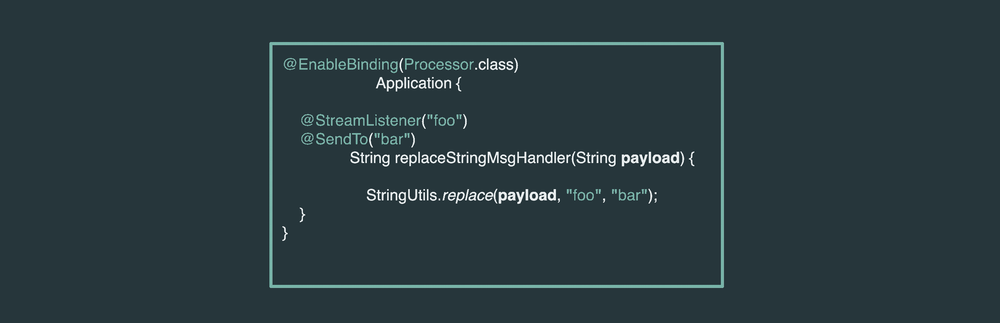

<script>defaultLanguages = ['imperative']</script>

---

Spring Cloud Stream에선 다양한 프로그래밍 모델을 이용해 스트리밍 애플리케이션을 유연하게 구축할 수 있다:

- Imperative
- Functional
- Kafka Streams

이어지는 섹션에선 한 가지 비즈니스 로직 예시를 다양한 프로그래밍 모델을 사용해 구축하는 방법을 리뷰한다.

프로그래밍 모델을 알아보기 위해, 구체적인 예로 HTTP 엔드포인트에서 데이터를 받는 시나리오를 생각해보자. 데이터를 사용할 수 있게 되면 prefix와 suffix를 추가하는 식으로 페이로드를 변환하려고 한다. 최종적으로는 변환된 데이터를 검증해볼 거다.

### 목차

- [Download Applications](#download-applications)
- [Custom Processor](#custom-processor)
- [Testing](#testing)
- [Composing Functional Beans in Processor Applications](#composing-functional-beans-in-processor-applications)


---

## Download Applications

앞에서 언급한 유스 케이스를 시연해보기 위해, 이 두 가지 애플리케이션을 바로 사용할 수 있게 다운받는 것부터 시작한다:

- [HTTP Source](https://github.com/spring-cloud-stream-app-starters/http)

```bash
wget https://repo.spring.io/release/org/springframework/cloud/stream/app/http-source-kafka/2.1.0.RELEASE/http-source-kafka-2.1.0.RELEASE.jar
```

- [Log Sink](https://github.com/spring-cloud-stream-app-starters/log)

```bash
wget https://repo.spring.io/release/org/springframework/cloud/stream/app/log-sink-kafka/2.1.1.RELEASE/log-sink-kafka-2.1.1.RELEASE.jar
```

---

## Custom Processor

소스와 싱크 간의 데이터 변환을 위한 커스텀 프로세서 애플리케이션을 기반으로 다양한 프로그래밍 모델을 시연해보겠다.

**Code:**

<div class="switch-language-wrapper imperative functional kafka-streams">
<span class="switch-language imperative">Imperative</span>
<span class="switch-language functional">Functional</span>
<span class="switch-language kafka-streams">Kafka Streams</span>
</div>
<div class="language-only-for-imperative imperative functional kafka-streams"></div>
```java
@EnableBinding(Processor.class)
public class SimpleStreamSampleProcessor {

	@StreamListener(Processor.INPUT)
	@SendTo(Processor.OUTPUT)
	public String messenger(String data) {
		return "Hello: " + data + "!";
	}
}
```
<div class="language-only-for-functional imperative functional kafka-streams"></div>
```java
public class FunctionStreamSampleProcessor {

	@Bean
	public Function<String, String> messenger() {
		return data -> "Hello: " + data + "!";
	}
}
```
<div class="language-only-for-kafka-streams imperative functional kafka-streams"></div>
```java
@EnableBinding(KafkaStreamsProcessor.class)
public class KafkaStreamsSampleProcessor {

	@StreamListener("input")
	@SendTo("output")
	public KStream<String, String> messenger(KStream<String, String> data) {
		return data.map((k, v) -> new KeyValue<>(null, "Hello: " + v + "!"));
	}
}
```

> 이 프로세서의 비즈니스 로직은 수신한 페이로드 앞 뒤에 "Hello:"와 "!"를 붙여 변환하는 일이다.
>
> 다른 프로그래밍 모델을 사용해서 동일한 "비즈니스 로직"을 구현할 수 있으며, 각각은 독립적으로 테스트하고 발전시킬 수 있는 간단한 `messenger` 함수를 구현하고 있다.
>
> **요점**: 지원하는 프로그래밍 모델 스타일 중에서 개발자가 원하는 것을 직접 고를 수 있다.

**Configuration: \*(application.properties)\***

<div class="switch-language-wrapper imperative functional kafka-streams">
<span class="switch-language imperative">Imperative</span>
<span class="switch-language functional">Functional</span>
<span class="switch-language kafka-streams">Kafka Streams</span>
</div>
<div class="language-only-for-imperative imperative functional kafka-streams"></div>
```properties
spring.cloud.stream.bindings.input.destination=incomingDataTopic
spring.cloud.stream.bindings.output.destination=outgoingDataTopic
```
<div class="language-only-for-functional imperative functional kafka-streams"></div>
```properties
spring.cloud.stream.bindings.input.destination=incomingDataTopic
spring.cloud.stream.bindings.output.destination=outgoingDataTopic
```
<div class="language-only-for-kafka-streams imperative functional kafka-streams"></div>
```properties
spring.cloud.stream.bindings.input.destination=incomingDataTopic
spring.cloud.stream.bindings.output.destination=outgoingDataTopic

spring.cloud.stream.kafka.streams.binder.applicationId=kstreams-sample
```

> 카프카 스트림즈 설정에는 `spring.cloud.stream.kafka.streams.binder.applicationId`라는 별도 프로퍼티가 추가된 걸 눈치챘을 수도 있다. 이 프로퍼티는 프레임워크에서 내부적으로 이 카프카 스트림즈 애플리케이션을 고유하게 식별하는 용도로 필요하다.



---

## Testing

1. `localhost`에서 카프카를 시작해라.
2. [여기](https://github.com/sabbyanandan/stream-programming-models)에서 프로세서 샘플을 clone받아 빌드해라.
3. 아래 애플리케이션들을 기동해라.

**Source:**

출력 목적지를 카프카의 `incomingDataTopic` 토픽에 바인딩해서 Http 소스 애플리케이션을 시작한다:

```bash
java -jar http-source-kafka-2.1.0.RELEASE.jar --spring.cloud.stream.bindings.output.destination=incomingDataTopic --server.port=9001
```

**Processor:**

빌드한 디렉토리에서 프로세서 샘플 중 하나를 시작해라:

```bash
java -jar simple/target/simple-0.0.1-SNAPSHOT.jar
```

**Sink:**

마지막으로, 입력 목적지를 카프카의 `outgoingDataTopic` 토픽에 바인딩해서 Log-sink 애플리케이션을 시작한다:

```bash
java -jar log-sink-kafka-2.1.1.RELEASE.jar --spring.cloud.stream.bindings.input.destination=outgoingDataTopic --server.port=9003
```

이제 애플리케이션을 실행시켰으므로, 몇 가지 샘플 데이터를 게시하면 결과를 확인할 수 있다.

**Data:** HTTP-source 애플리케이션이 실행 중인 포트(여기선 9001 포트)에 샘플 데이터를 게시한다:

```bash
curl localhost:9001 -H "Content-type: text/plain" -d "test data"
```

**Results:** 이제 Log-sink 애플리케이션 콘솔에 다음과 유사한 로그가 출력되는 걸 볼 수 있을 거다:

```bash
2019-04-30 15:03:27.620  INFO 38035 --- [container-0-C-1] log-sink                                 : Hello: test data!
```

이 결과를 통해 HTTP-source 애플리케이션의 데이터가 `simple-0.0.1-SNAPSHOT` 프로세서로 처리되고, 처리한 데이터는 앞 뒤에 "Hello: "와 "! "를 붙여 "Hello: test data!"로 출력되는 것을 확인할 수 있다.

---

## Composing Functional Beans in Processor Applications

기본 제공하는 Spring Cloud Stream `Processor` 애플리케이션들에선 [Functional composition](../feature-guides.stream.function-composition)을 적용할 수 **없다**. 기존 프로세서의 애플리케이션 로직 전후 중 어디에 함수를 적용해야 하는지가 모호하기 때문이다. 현재 정보만으로는 적용할 위치를 결정하기 어렵다.

하지만 다음과 같이 표준 `java.util.Function` API를 이용해 functional composition을 사용하는 자체 프로세서 애플리케이션을 만드는 건 가능하다:

```java
@Configuration
public static class FunctionProcessorConfiguration {

  @Bean
  public Function<String, String> upperAndConcat() {
     return upper().andThen(concat());
  }

  @Bean
  public Function<String, String> upper() {
     return value -> value.toUpperCase();
  }

  @Bean
  public Function<String, String> concat() {
     return value -> "Hello "+ value;
  }
}
```

커스텀 `processor` 애플리케이션으로 스트림을 배포하려면, `processor` 애플리케이션은 functional 빈들을 구성할 수 있도록 `spring.cloud.stream.function.definition` 프로퍼티를 정의해서 배포해야 한다.

이 예제에선 다음과 같이 설정하면 된다:

```properties
spring.cloud.stream.function.definition=upper|concat
```