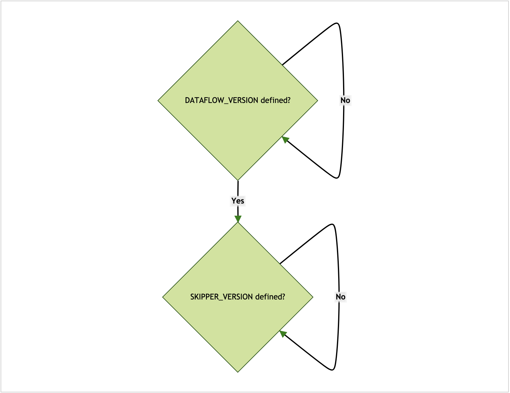
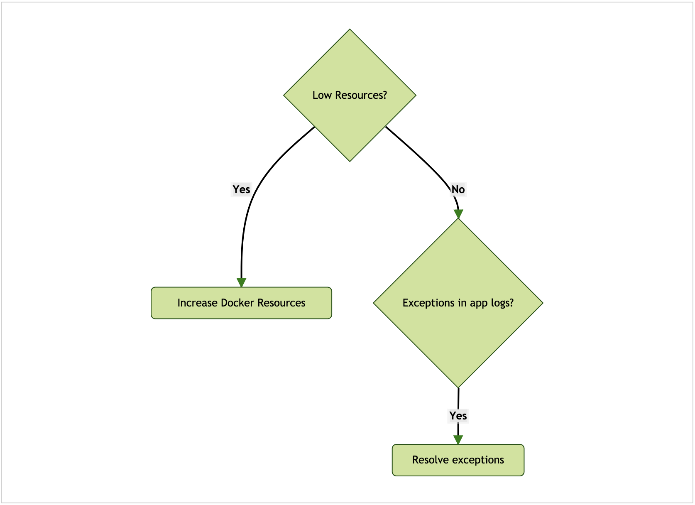
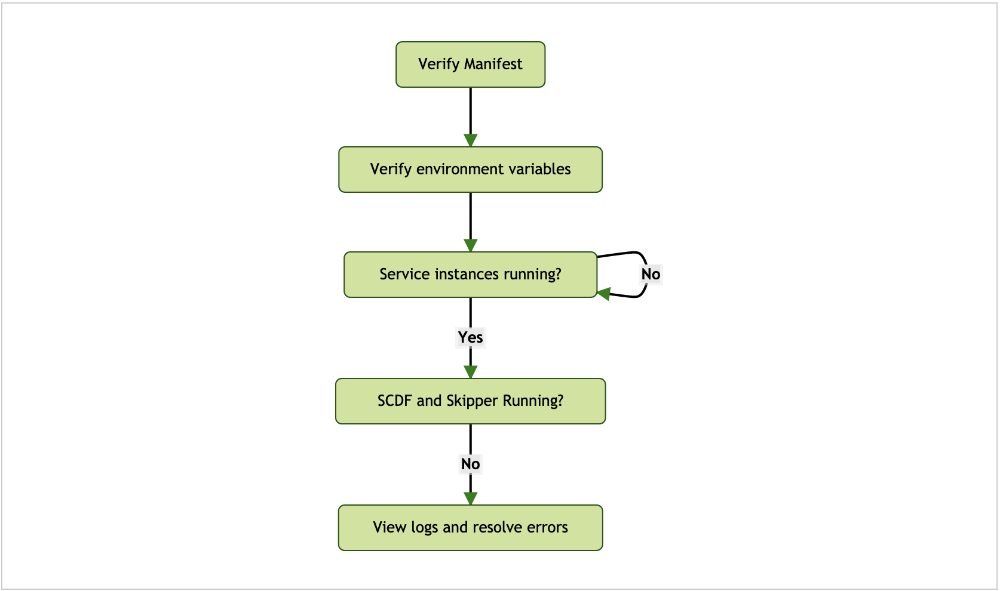
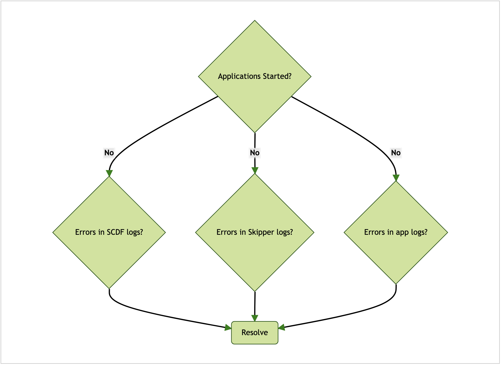
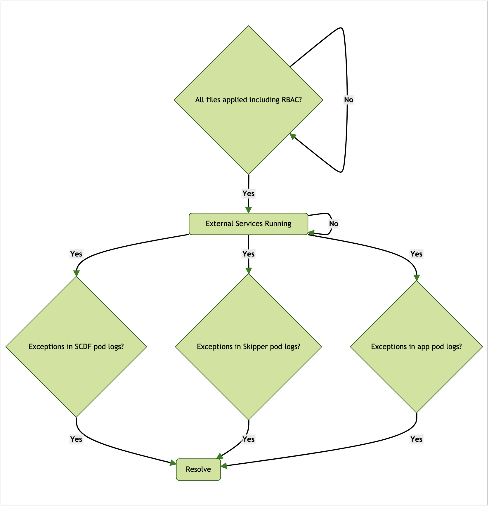
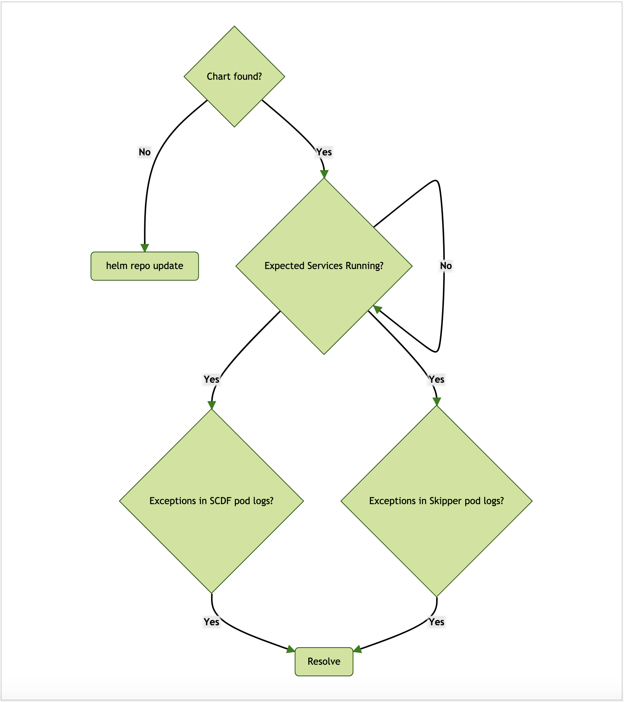
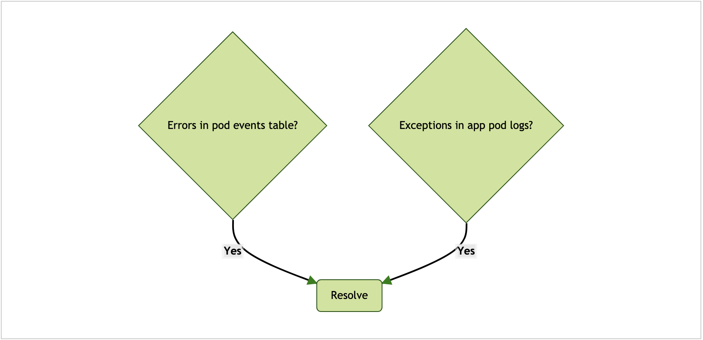

---

스트림이 배포되지 않을 때는:

- 특정 릴리스 버전의 최신 GA를 사용하고 있는지 확인해봐라.
- 선택한 플랫폼이 지원하는 최소 버전을 충족하는지 확인해봐라.
- 스트림 애플리케이션을 SCDF에 배포하기 전에 애플리케이션이 독립형으로는 잘 실행되는지 확인해봐라. 계속하기 전에 먼저 [스트림 애플리케이션 디버깅](../stream-developer-guides.troubleshooting.debugging-stream-applications)을 읽어봐라.

스트림 배포는 Skipper가 담당한다. 스트림 배포 실패 메세지는 보통 Skipper 애플리케이션 로그에서 찾을 수 있다.

지금부터는 각 플랫폼별로 나눠서 설명한다:

- [로컬](#local)
- [클라우드 파운드리](#cloud-foundry)
- [쿠버네티스](#kubernetes)

### 목차

- [Local](#local)
  + [Docker Compose - Startup](#docker-compose---startup)
  + [Docker Compose - Runtime](#docker-compose---runtime)
- [Cloud Foundry](#cloud-foundry)
  + [Startup Failures](#startup-failures)
  + [Application Failures](#application-failures)
- [Kubernetes](#kubernetes)
  + [Distributed Deployment Files](#distributed-deployment-files)
  + [Helm Chart](#helm-chart)
  + [General](#general)
- [Troubleshooting Help](#troubleshooting-help)

---

## Local

이 섹션에선 로컬 환경에서 흔히 발생할 수 있는 배포 문제를 디버깅하는 방법을 설명한다.

다음은 로컬 환경 배포 과정에서 필요한 전형적인 디버깅 프로세스를 나타낸 다이어그램이다:


애플리케이션 로그 파일은 애플리케이션별로 검사할 수 있다. 모든 애플리케이션 로그를 하나로 집계하려면 deployer 프로퍼티 `inheritLogging=true`를 설정하면 된다. 자세한 내용은 ["로컬 배포 내역을 단일 로그로 집계할 수 있나요?"](https://dataflow.spring.io/docs/resources/faq/#aggregatelogs)를 참고하고, 더 많은 로그를 활성화하는 방법은 ["플랫폼 배포 로그를 DEBUG 레벨로 바꾸려면 어떻게 해야 하나요?"](https://dataflow.spring.io/docs/resources/faq/#debuglogs)를 참고해라.

deployer 프로퍼티 `debugPort`를 설정하면 애플리케이션을 JDWP로 디버깅할 수 있다. 자세한 내용은 ["배포된 애플리케이션을 원격에서 디버깅하려면 어떻게 해야 하나요?"](https://dataflow.spring.io/docs/resources/faq/#remotedebug)를 참고해라.

### Docker Compose - Startup

다음은 로컬 환경에서 Docker compose 기동에 실패했을 때 필요한 전형적인 디버깅 프로세스를 나타낸 다이어그램이다:



환경 변수 `DATAFLOW_VERSION`과 `SKIPPER_VERSION`은 `export`하거나 `docker-compose` 명령어 뒤에 명시하는 식으로, 현재 터미널 환경에서 사용할 수 있게 만들어야 한다. 자세한 내용은 [Docker Compose 시작하기](../installation.local-machine.docker-compose)를 참고해라.

### Docker Compose - Runtime

다음은 로컬 환경에서의 Docker compose 런타임 이슈에 필요한 전형적인 디버깅 프로세스를 나타낸 다이어그램이다:



기본적으로 도커에 할당되는 메모리로는 부족할 수도 있다. 권장 할당량은 8GB다. `docker stats` 명령어는 리소스 사용과 관련해서 유용한 정보를 제공해줄 거다. 리소스 제약으로 인해 애플리케이션 배포에 실패했다면 리소스 할당을 늘려라. [도커 문서](https://docs.docker.com/)에서 사용하는 플랫폼에 대한 설명을 읽어봐라.

Skipper를 통해 스트림을 배포하면, 해당 스트림에 속해있는 애플리케이션들은 Skipper 컨테이너에서 자바 프로세스로 기동된다. 스트림을 구성하는 요소마다 애플리케이션이 하나씩 배포된다. 도커에 제공하는 전체적인 리소스 할당량(메모리, CPU 등)은 배포하는 애플리케이션 수를 고려해야 한다. 로그 파일을 추적하는 방법에 대한 자세한 내용은 [스트림 로그 조회하기](https://docs.spring.io/spring-cloud-dataflow/docs/current/reference/htmlsingle/#getting-started-local-deploying-spring-cloud-dataflow-docker-viewing-stream-logs)를 참고해라.

---

## Cloud Foundry

이 섹션에선 클라우드 파운드리 환경에서 흔히 발생할 수 있는 배포 문제를 디버깅하는 방법을 설명한다.

### Startup Failures

다음은 클라우드 파운드리 환경에서 기동에 실패했을 때 필요한 전형적인 디버깅 프로세스를 나타낸 다이어그램이다:



### Application Failures

다음은 클라우드 파운드리 환경에서 애플리케이션이 실패할 때를 위한 전형적인 디버깅 프로세스를 나타낸 다이어그램이다:



배포 이슈를 디버깅할 때는 deployer와 클라우드 파운드리 관련 로그 레벨을 높이는 것도 도움이 될 수 있다. 자세한 내용은  ["플랫폼 배포 로그를 DEBUG 레벨로 바꾸려면 어떻게 해야 하나요?"](https://dataflow.spring.io/docs/resources/faq/#debuglogs)를 참고해라.

---

## Kubernetes

이 섹션에선 쿠버네티스 환경에서 흔히 발생할 수 있는 배포 문제를 디버깅하는 방법을 설명한다.

### Distributed Deployment Files

다음은 쿠버네티스 환경에서 분산 deployment 파일과 관련한 전형적인 디버깅 프로세스를 나타낸 다이어그램이다:



### Helm Chart

다음은 쿠버네티스 환경에서 헬름 차트와 관련한 전형적인 디버깅 프로세스를 나타낸 다이어그램이다:



### General

다음은 쿠버네티스의 전반적인 이슈에서 필요한 전형적인 디버깅 프로세스를 나타낸 다이어그램이다:



포드의 세부 정보를 조회할 때는 `events` 테이블 섹션이 디버깅에 유용한 정보를 제공하며, 다음과 같이 실행할 수 있다:

```sh
kubectl describe po/pod_name
```

예를 들어 정상적으로 배포된 `time` 애플리케이션의 이벤트는 다음과 같이 조회된다:

```sh
Events:
  Type    Reason     Age   From               Message
  ----    ------     ----  ----               -------
  Normal  Scheduled  2m    default-scheduler  Successfully assigned default/ticktock-time-v16-869947b6b9-brfc4 to minikube
  Normal  Pulled     2m    kubelet, minikube  Container image "springcloudstream/time-source-rabbit:2.1.0.RELEASE" already present on machine
  Normal  Created    2m    kubelet, minikube  Created container
  Normal  Started    2m    kubelet, minikube  Started container
```

애플리케이션 로그는 다음 명령어를 사용하면 로그가 도착하는 즉시 확인할 수 있다 (이때 `pod_name`은 포드의 이름이다).

```sh
kubectl logs -f po/pod_name
```

---

## Troubleshooting Help

여기 있는 트러블슈팅 테크닉으로는 해결되지 않아 여전히 도움이 필요하다면, [StackOverflow](https://stackoverflow.com/tags/spring-cloud-dataflow/)에 관련 세부 정보와 함께 올려달라 ([Wiki](https://github.com/spring-cloud/spring-cloud-dataflow/wiki/Reporting-Issues) 참고). 우리는 포럼 스레드를 활발하게 모니터링하고 있다.