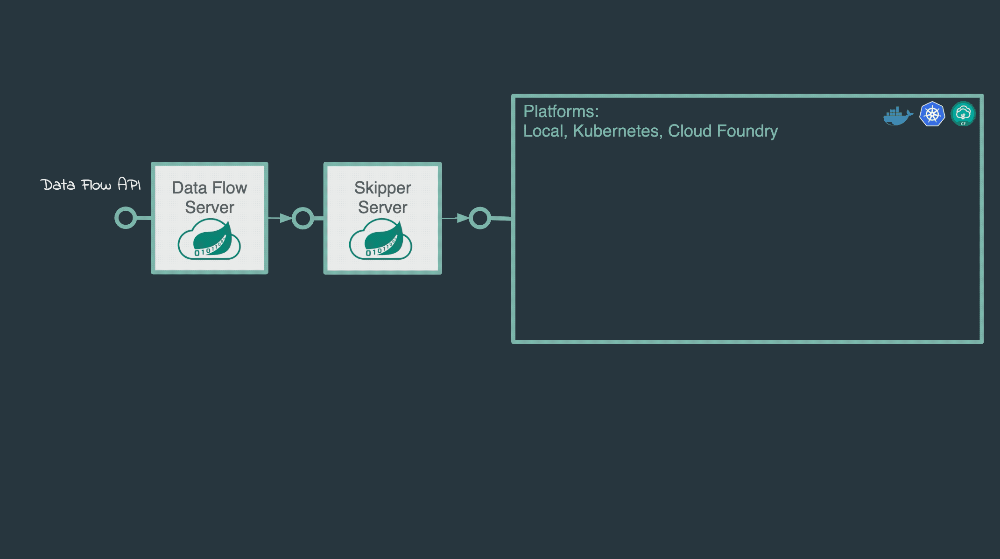

---

앞에서도 설명했던적 있는 Stream Pipeline DSL은 자동으로 각 Spring Cloud Stream 애플리케이션의 입출력 바인딩 프로퍼티를 설정해준다. 이게 가능한 이유는 Spring Cloud Stream 애플리케이션에 입력 목적지나 출력 목적지가 하나씩만 존재해서, 기본 제공하는 `Source`나, `Processor`, `Sink`의 바인딩 인터페이스를 사용할 수 있기 때문이다. 하지만 Spring Cloud Stream 애플리케이션은 다음과 같은 커스텀 바인딩 인터페이스를 정의할 수도 있다:

```java
public interface Barista {

    @Input
    SubscribableChannel orders();

    @Output
    MessageChannel hotDrinks();

    @Output
    MessageChannel coldDrinks();
}
```

다음은 Kafka Streams 애플리케이션을 위한 커스텀 인터페이스 예시다:

```java
interface KStreamKTableBinding {

    @Input
    KStream<?, ?> inputStream();

    @Input
    KTable<?, ?> inputTable();
}
```

Data Flow는 입출력 바인딩이 여러 개 있을 때는 데이터가 어떤 애플리케이션에서 어떤 애플리케이션으로 흐르는지를 가정할 수 없다. 따라서 애플리케이션을 "연결"할 수 있는 바인딩 프로퍼티를 따로 설정줘야 한다. Data Flow가 애플리케이션의 바인딩 프로퍼티를 설정하면 안 될 때는 *Stream Application DSL*을 이용해 "파이프 기호"가 아닌 "이중 파이프"를 표기한다. `||`가 "병렬"을 의미한다고 생각해봐라.

아래 예시에선 이중 파이프 기호를 사용해 4개의 스트림을 병렬로 실행해야 함을 나타내고 있다:

```sh
stream create --definition "orderGeneratorApp || baristaApp || hotDrinkDeliveryApp || coldDrinkDeliveryApp" --name myCafeStream
```

이 스트림을 그래픽으로 표현하면 다음과 같다:


이 스트림에는 4개의 애플리케이션이 있다. `baristaApp`은 출력 목적지를 2개 가지며 (`hotDrinks`와 `coldDrinks`), 각각은 `hotDrinkDeliveryApp`과 `coldDrinkDeliveryApp`에서 컨슘하기 위한 용도다. 이 스트림을 배포할 땐 `baristaApp`이 hot drink 메세지는 `hotDrinkDeliveryApp` 목적지로, cold drink 메세지는 `coldDrinkDeliveryApp` 목적지로 전송할 수 있게끔 바인딩 프로퍼티를 설정해야 한다.

그 방법은 아래 예시를 참고하면 된다:

```properties
app.baristaApp.spring.cloud.stream.bindings.hotDrinks.destination=hotDrinksDest
app.baristaApp.spring.cloud.stream.bindings.coldDrinks.destination=coldDrinksDest
app.hotDrinkDeliveryApp.spring.cloud.stream.bindings.input.destination=hotDrinksDest
app.coldDrinkDeliveryApp.spring.cloud.stream.bindings.input.destination=coldDrinksDest
```

다음은 바인딩 프로퍼티를 사용해서 애플리케이션과 채널 목적지를 연결하는 방법을 보여주는 다이어그램이다:



프로듀서와 컨슈머를 위한 다른 Spring Cloud Stream 프로퍼티도 같은 바인딩 프로퍼티로 구성할 수 있다. 예를 들어서 컨슈머 그룹을 사용하고 싶다면 프로듀서와 컨슈머 애플리케이션에 각각 Spring Cloud Stream 애플리케이션 프로퍼티 `spring.cloud.stream.bindings.<channelName>.producer.requiredGroups`와 `spring.cloud.stream.bindings.<channelName>.group`을 설정해주면 된다.


Stream Application DSL은 카프카/RabbitMQ 애플리케이션에 동기식 요청 메세지나 응답 메시지를 전송하는 HTTP 게이트웨이 애플리케이션을 배포할 때도 흔히 사용하곤 한다. 이때 HTTP 게이트웨이 애플리케이션과 카프카/RabbitMQ 애플리케이션은 모두 Spring Cloud Stream 라이브러리를 사용하지 않는 Spring Integration 애플리케이션일 수도 있다.

Stream application DSL을 이용해 한 가지 애플리케이션만 배포하는 것도 가능하다.