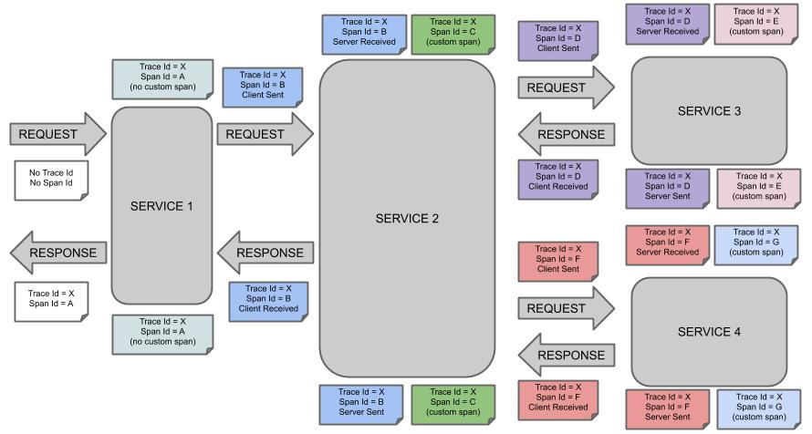

### 목차

- [2.1. Introducing Spring Cloud Sleuth](#21-introducing-spring-cloud-sleuth)
  + [2.1.1. Terminology](#211-terminology)
- [2.2. Developing Your First Spring Cloud sleuth-based Application](#22-developing-your-first-spring-cloud-sleuth-based-application)
  + [2.2.1. Creating the POM](#221-creating-the-pom)
  + [2.2.2. Adding Classpath Dependencies](#222-adding-classpath-dependencies)
  + [2.2.3. Writing the Code](#223-writing-the-code)
    * [The @RestController and @RequestMapping Annotations](#the-restcontroller-and-requestmapping-annotations)
  + [2.2.4. Running the Example](#224-running-the-example)
- [2.3. Next Steps](#23-next-steps)

---

Spring Cloud Sleuth가 처음이거나, 스프링에 전반적으로 익숙하지 않다면 이 섹션부터 시작하는 게 좋다. 이 문서는 가장 기본적인, "무엇을?", "어떻게?", "왜?"라는 질문에 답해줄 거다. 이 문서에선 Spring Cloud Sleuth에 대한 소개부터 시작해, 설치 가이드도 찾아볼 수 있다. 그런 다음, 몇 가지 핵심 원칙에 대해 설명하면서 첫 번째 Spring Cloud Sleuth 애플리케이션을 구축하는 과정을 안내한다.

---

## 2.1. Introducing Spring Cloud Sleuth

Spring Cloud Sleuth API는 [스프링 클라우드](https://cloud.spring.io/) 환경을 위한 분산 트레이싱<sup>distributed tracing</sup> 솔루션을 제공한다. Spring Cloud Sleuth API는 [OpenZipkin Brave](https://github.com/openzipkin/brave)와 통합된다. 

Spring Cloud Sleuth는 사용자의 요청과 메시지를 추적해서, 통신 내역과 그에 맞는 로그 항목을 연계할 수 있게 도와준다. 뿐만 아니라, 트레이싱<sup>tracing</sup> 정보를 외부 시스템으로 내보내 지연 시간을 시각화할 수도 있다. 무엇보다 Spring Cloud Sleuth는 [OpenZipkin](https://zipkin.io/) 호환 시스템을 직접 지원한다.

### 2.1.1. Terminology

Spring Cloud Sleuth에서 사용하는 용어들은 [Dapper](https://research.google.com/pubs/pub36356.html)에서 빌려왔다.

**Span**: 작업의 기본 단위를 의미한다. 예를 들어, RPC를 전송하는 것은 하나의 새로운 span으로 볼 수 있으며, 마찬가지로 RPC에 응답을 전송하는 것 또한 하나의 새로운 span이다. span은 다른 데이터들도 가지고 있는데, 단순한 설명부터, 시간별 이벤트, 키-값 애노테이션(tag), 해당 span을 발생시킨 span의 ID, 프로세스 ID(보통은 IP 주소) 등이 있다.

span은 시작하고 중단할 수 있으며, span은 시간별 정보를 지속적으로 추적한다. span을 하나 생성했다면, 이후 어느 시점에는 반드시 종료해줘야 한다.

**Trace:** 트리와 유사한 구조를 이루고 있는 일련의 span들. 예를 들어, 분산형 빅데이터 저장소를 운영하고 있다면, PUT 요청에 의해 트레이스가 하나 만들어질 수 있다.

**Annotation/Event:** 어떠한 시간에 어떠한 이벤트가 있었음을 기록하는 데 사용한다.

일반적인 RPC 시나리오라면, 이런 이벤트들을 표시해 어떤 작업이 수행됐는지 표시하는 개념이라고 볼 수 있다 (이러한 이벤트가 물리적으로 span에 설정된다는 의미는 아니다).

- **cs**: 클라이언트 전송<sup>Client Sent</sup>. 클라이언트가 요청을 만든 상태로, span의 시작을 나타내는 애노테이션이다.
- **sr**: 서버 수신<sup>Server Received</sup>. 서버 측에서 요청을 받고 처리를 시작했다는 뜻이다. `sr` 타임스탬프 값에서 `cs` 타임스탬프 값을 빼면 네트워크 지연 시간을 구할 수 있다.
- **ss**: 서버 전송<sup>Server Sent</sup>. 요청을 다 처리하고 나면 (클라이언트로 응답을 돌려준 시점) 이 애노테이션이 추가된다. `ss` 타임스탬프 값에서 `sr` 타임스탬프 값을 빼면 서버 측에서 요청을 처리하는 데 필요한 시간을 구할 수 있다.
- **cr**: 클라이언트 수신<sup>Client Received</sup>. span의 끝을 의미한다. 서버 측에서 보낸 응답을 클라이언트가 성공적으로 수신했다는 뜻이다. `cr` 타임스탬프 값에서 `cs` 타임스탭프 값을 빼면 클라이언트가 서버의 응답을 수신하는데 필요한 전체 시간을 구할 수 있다.

다음 이미지는 시스템 상에서 **Span**과 **Trace**가 어떻게 구성되어 있는지를 보여준다.



메모지(각진 네모 모양)는 각 색깔별로 하나의 span을 나타낸다 (**A**부터 **G**까지 총 7가지 span이 있다). 다음 메모를 한 번 살펴보자:

```
Trace Id = X
Span Id = D
Client Sent
```

이 메모는 현재 span의 **Trace Id**는 **X**로, **Span Id**는 **D**로 설정되어 있음을 의미한다. 동시에 RPC 관점에서는 `Client Sent` 이벤트가 발생했음을 의미한다.

다른 노트들도 살펴보자:

```
Trace Id = X
Span Id = A
(no custom span)

Trace Id = X
Span Id = C
(custom span)
```

여기에는 두 가지 선택이 있는데, 만들어뒀던 span을 계속해서 사용하거나 (`no custom span`이라고 적어둔 예시), 수동으로 하위<sup>child</sup> span을 만들 수 있다 (`custom span`이라고 적어둔 예시).

다음 이미지는 span의 부모-자식 관계를 보여주고 있다:


---

## 2.2. Developing Your First Spring Cloud sleuth-based Application

이번 섹션에선 Spring Cloud Sleuth의 몇 가지 핵심 기능을 알아볼 수 있는 간단한 "Hello World!" 웹 애플리케이션을 만드는 방법을 설명한다. 여기서 만드는 프로젝트는 대부분의 IDE가 지원하는 메이븐<sup>Maven</sup>을 통해 빌드한다. 트레이서<sup>tracer</sup> 구현체로는 [OpenZipkin Brave](https://github.com/openzipkin/brave)를 사용한다.

> [start.spring.io](https://start.spring.io/)에 접속하고 의존성 검색기에서 "Web"과 "Spring Cloud Sleuth" 스타터를 선택하면 아래에서 설명하는 단계들을 건너뛸 수 있다. 이렇게 하면 새 프로젝트 구조가 단번에 만들어지므로 [바로 코딩을 시작할 수 있다](#223-writing-the-code).

### 2.2.1. Creating the POM

가장 먼저 메이븐 `pom.xml` 파일을 만들어야 한다. `pom.xml`은 프로젝트를 빌드하는 데 사용하는 일종의 레시피라고 보면 된다. 자주 사용하는 텍스트 편집기를 열고 아래 내용을 추가해라:

```xml
<?xml version="1.0" encoding="UTF-8"?>
<project xmlns="http://maven.apache.org/POM/4.0.0" xmlns:xsi="http://www.w3.org/2001/XMLSchema-instance"
    xsi:schemaLocation="http://maven.apache.org/POM/4.0.0 https://maven.apache.org/xsd/maven-4.0.0.xsd">
    <modelVersion>4.0.0</modelVersion>

    <groupId>com.example</groupId>
    <artifactId>myproject</artifactId>
    <version>0.0.1-SNAPSHOT</version>

    <parent>
        <groupId>org.springframework.boot</groupId>
        <artifactId>spring-boot-starter-parent</artifactId>
        <!-- Use the latest compatible Spring Boot version. You can check https://spring.io/projects/spring-cloud for more information -->
        <version>$2.6.15</version>
    </parent>

    <!-- Spring Cloud Sleuth requires a Spring Cloud BOM -->
    <dependencyManagement>
        <dependencies>
            <dependency>
                <groupId>org.springframework.cloud</groupId>
                <artifactId>spring-cloud-dependencies</artifactId>
                <!-- Provide the latest stable Spring Cloud release train version (e.g. 2020.0.0) -->
                <version>${release.train.version}</version>
                <type>pom</type>
                <scope>import</scope>
            </dependency>
        </dependencies>
    </dependencyManagement>

    <!-- (you don't need this if you are using a GA version) -->
    <repositories>
        <repository>
            <id>spring-snapshots</id>
            <url>https://repo.spring.io/snapshot</url>
            <snapshots><enabled>true</enabled></snapshots>
        </repository>
        <repository>
            <id>spring-milestones</id>
            <url>https://repo.spring.io/milestone</url>
        </repository>
    </repositories>
    <pluginRepositories>
        <pluginRepository>
            <id>spring-snapshots</id>
            <url>https://repo.spring.io/snapshot</url>
        </pluginRepository>
        <pluginRepository>
            <id>spring-milestones</id>
            <url>https://repo.spring.io/milestone</url>
        </pluginRepository>
    </pluginRepositories>
</project>
```

위 코드는 실제로 빌드되는 코드다. `mvn package` 명령어를 실행하면 테스트해볼 수 있다 (지금은 “jar will be empty - no content was marked for inclusion!”라는 경고가 보일텐데, 일단은 무시해도 좋다).

> 원한다면 이 시점에서 프로젝트를 IDE로 임포트해도 좋다 (최신 Java IDE는 대부분 메이븐을 기본으로 지원한다). 누구나 쉽게 따라할 수 있도록 이 예제에선 계속해서 일반 텍스트 편집기를 사용한다.

### 2.2.2. Adding Classpath Dependencies

`pom.xml`을 열고 `parent` 섹션 바로 아래에 `spring-boot-starter-web` 의존성을 넣어, 필요한 의존성들을 추가해라:

```xml
<dependencies>
    <!-- Boot's Web support -->
    <dependency>
        <groupId>org.springframework.boot</groupId>
        <artifactId>spring-boot-starter-web</artifactId>
    </dependency>
    <!-- Sleuth with Brave tracer implementation -->
    <dependency>
        <groupId>org.springframework.cloud</groupId>
        <artifactId>spring-cloud-starter-sleuth</artifactId>
    </dependency>
</dependencies>
```

---

## 2.2.3. Writing the Code

이 애플리케이션을 완성하려면 Java 파일을 하나 만들어야 한다. 메이븐은 기본적으로  `src/main/java`에 있는 소스 코드를 컴파일하므로, 이대로 디렉토리를 생성한 다음, `src/main/java/Example.java`라는 이름의 파일을 추가하고 아래 코드를 채워넣어라:

```java
@RestController
@EnableAutoConfiguration
public class Example {

    private static final Logger log = LoggerFactory.getLogger(Example.class);

    @RequestMapping("/")
    String home() {
        log.info("Hello world!");
        return "Hello World!";
    }

    public static void main(String[] args) {
        SpringApplication.run(Example.class, args);
    }

}
```

코드량은 얼마 안 되지만, 여기에선 꽤나 많은 일이 일어나고 있다. 이어지는 섹션에선 단계별로 중요한 부분들을 살펴본다.

#### The @RestController and @RequestMapping Annotations

스프링 부트는 Rest Controller를 세팅하면서 이 애플리케이션이 톰캣 포트에 바인딩되도록 만들어준다. Spring Cloud Sleuth는 Brave tracer가 포함돼있어서, 들어오는 요청을 계측<sup>instrumentation</sup>할 수 있게 해준다.

### 2.2.4. Running the Example

여기까지 왔다면 이제 애플리케이션을 작동시켜볼 수 있다. `spring-boot-starter-parent` POM을 사용했기 때문에, `run` goal을 사용해 애플리케이션을 쉽게 기동시킬 수 있다. 프로젝트의 루트 디렉토리에서 `SPRING_APPLICATION_NAME=backend mvn spring-boot:run` 명령어를 입력해 애플리케이션을 시작해봐라. 그러면 다음과 같은 로그가 출력될 거다:

```sh
$ mvn spring-boot:run

  .   ____          _            __ _ _
 /\\ / ___'_ __ _ _(_)_ __  __ _ \ \ \ \
( ( )\___ | '_ | '_| | '_ \/ _` | \ \ \ \
 \\/  ___)| |_)| | | | | || (_| |  ) ) ) )
  '  |____| .__|_| |_|_| |_\__, | / / / /
 =========|_|==============|___/=/_/_/_/
 ...
....... . . .
....... . . . (log output here)
....... . . .
........ Started Example in 2.222 seconds (JVM running for 6.514)
```

웹 브라우저를 열고 `localhost:8080`에 접속하면 아래 문구를 볼 수 있다:

```
Hello World!
```

로그를 확인해보면 다음과 같은 내용이 출력된 걸 알 수 있다:

```java
2020-10-21 12:01:16.285  INFO [backend,0b6aaf642574edd3,0b6aaf642574edd3] 289589 --- [nio-9000-exec-1] Example              : Hello world!
```

로그 포맷이 `[backend,0b6aaf642574edd3,0b6aaf642574edd3]` 형태로 업데이트되었음을 알 수 있는데, 각 항목은  `[애플리케이션 이름,trace id,span id]`를 의미한다. 이때 애플리케이션 이름은 환경변수 `SPRING_APPLICATION_NAME`에서 가져온다.

> 핸들러에서 직접 로그를 남기는 대신 `logging.level.org.springframework.web.servlet.DispatcherServlet=DEBUG`를 설정해도 된다.

애플리케이션을 graceful하게 종료하려면 `ctrl-c`를 입력하면 된다.

---

## 2.3. Next Steps

이번 섹션을 통해 Spring Cloud Sleuth의 기본기를 다지고 나만의 애플리케이션을 만들어보는 기회가 되었기를 바란다. 과제를 직접 해결해보는 것을 선호한다면 곧장 [spring.io](https://spring.io/)로 넘어가 [getting started](https://spring.io/guides/) 가이드를 확인해봐라. "Spring으로 어떻게 해결할 수 있나요?" 같은 류의 구체적인 문제를 해결하는데 도움이 될 거다. 그외 스프링 클라우드 슬루스 전용 “[how-to](../howto)” 레퍼런스 문서도 제공하고 있다.

과제를 해결해보기 앞서 조금 더 깊게 알아보고 싶다면, [Spring Cloud Sleuth 사용하기](../using-spring-cloud-sleuth)를 읽어봐라. 시간이 많지 않다면 [Spring Cloud Sleuth 기능들](../features)로 넘어가도 좋다.

기본 프로젝트 샘플은 [samples 레포지토리](https://github.com/spring-cloud-samples/spring-cloud-sleuth-samples/)에서 확인할 수 있다.